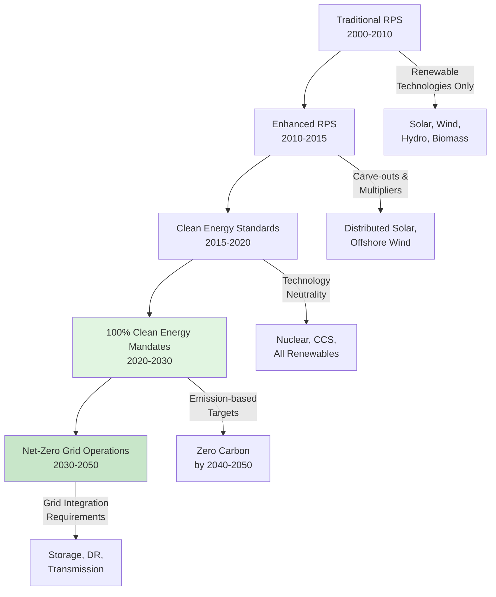

Clean Energy Standards (CES) represent an evolution beyond traditional Renewable Portfolio Standards (RPS), establishing technology-neutral frameworks that recognize all zero-carbon electricity sources. While RPS policies mandate specific percentages of renewable generation, CES policies focus on emission outcomes, allowing nuclear power, carbon capture and storage, renewable energy, and other low-carbon technologies to compete on equal footing. This approach provides greater flexibility for achieving deep decarbonization targets while maintaining grid reliability and cost-effectiveness.

## Policy Evolution from RPS to CES

## RPS vs CES: Key Differences

| Parameter | Renewable Portfolio Standard | Clean Energy Standard |
|-----------|------------------------------|----------------------|
| **Eligible Technologies** | Solar, wind, biomass, geothermal, hydro (restrictions vary) | All zero-carbon sources including nuclear, CCS, hydrogen |
| **Policy Metric** | Renewable energy percentage | Carbon intensity (g CO₂/kWh) or zero-emission percentage |
| **Nuclear Energy** | Generally excluded | Included as clean energy |
| **Existing Resources** | New renewable capacity only | Existing zero-carbon generation counts |
| **Technology Neutrality** | Limited to renewable subset | Fully technology-neutral |
| **Compliance Flexibility** | Renewable Energy Certificates (RECs) | Clean Energy Credits (CECs) or emission performance |
| **Grid Reliability** | May require additional firm capacity | Allows diverse zero-carbon portfolio |
| **Cost Implications** | Can be higher due to technology limits | Potentially lower through competition |

## State Clean Energy Targets

### 100% Clean Energy Goals

**California (SB 100)**
- 60% renewable by 2030
- 100% zero-carbon electricity by 2045
- Building electrification mandates for new construction
- Diablo Canyon nuclear extension consideration for reliability

**Washington (SB 5116)**
- 100% carbon-neutral electricity by 2030
- 100% carbon-free electricity by 2045
- Recognizes existing hydroelectric and nuclear as clean energy
- Building performance standards for existing structures

**New York (Climate Leadership and Community Protection Act)**
- 70% renewable by 2030
- 100% zero-emission electricity by 2040
- Nuclear generation explicitly counted toward clean energy targets
- Major building electrification initiatives in New York City

**Virginia (VCEA)**
- 100% carbon-free electricity by 2050 (investor-owned utilities)
- 100% renewable by 2045 (co-ops and municipal utilities)
- Energy efficiency targets integrated with supply-side mandates

**New Mexico (Energy Transition Act)**
- 50% renewable by 2030
- 80% renewable by 2040
- 100% zero-carbon by 2045
- Just transition provisions for affected communities

## Technology Neutrality Advantages

Technology-neutral CES policies deliver multiple benefits for grid decarbonization and HVAC electrification pathways.

**Reliability Enhancement**
Nuclear baseload power and dispatchable hydroelectric generation provide firm capacity that complements variable renewable resources. This reliability supports confident electrification of heating loads without requiring excessive generation overcapacity. Grid operators can maintain voltage and frequency stability while integrating high penetrations of heat pump loads.

**Cost Optimization**
Allowing competition among all zero-carbon technologies drives innovation and cost reduction across the clean energy sector. States with existing nuclear fleets avoid premature retirement of low-carbon assets, preventing unnecessary cost increases. Competitive procurement ensures building electrification occurs at lowest societal cost.

**Flexibility for Grid Integration**
CES frameworks accommodate diverse resource portfolios optimized for regional characteristics. Pacific Northwest states leverage hydroelectric resources. Midwest states maintain nuclear capacity. Southwest states maximize solar deployment. This geographic diversity strengthens interregional transmission benefits.

## Building Electrification Implications

Clean energy standards create policy certainty necessary for large-scale building electrification investments.

### Load Growth Accommodation

100% clean energy mandates require planning for substantial electricity demand increases as heating, water heating, and cooking shift from fossil fuels to electricity. Load forecasts must account for:

- Heat pump space heating: 2-4 kW per residential unit, 10-50+ kW per commercial building
- Heat pump water heating: 1.5-5 kW per unit
- Electric cooking: 3-8 kW peak demand
- EV charging: 7-19 kW residential, 50-350 kW commercial

**Peak Demand Management**
Winter heating electrification creates new seasonal peak demands in cold climates. CES policies must coordinate with demand response programs, thermal energy storage incentives, and time-of-use rates to manage peak loads efficiently.

**Grid Infrastructure Investment**
Distribution system upgrades, transmission expansion, and substation capacity additions require multi-year lead times. Clean energy procurement schedules must align with infrastructure development to support building electrification timelines.

### Emissions Accounting Methods

**Annual Matching**
Traditional approach credits clean energy generation occurring anytime during the year against building loads. Simple to administer but allows temporal mismatch between clean generation and consumption.

**Hourly Matching (24/7 Carbon-Free Energy)**
Advanced approach requiring clean energy supply to match consumption on hourly basis. Google, Microsoft, and other large users pursuing this standard to ensure electrified HVAC loads truly operate on zero-carbon electricity.

## Zero Emission Credits

Many CES policies establish Zero Emission Credit (ZEC) programs to maintain existing nuclear generation while transitioning to higher renewable penetrations.

**ZEC Mechanics**
State regulators determine the environmental value of existing nuclear plants through avoided carbon emissions calculations. Nuclear plant owners receive ZEC payments based on MWh generation, compensating for market revenues insufficient to cover operating costs. These programs prevent premature nuclear retirements that would increase grid carbon intensity and complicate achievement of 100% clean energy targets.

**HVAC Impact**
Maintaining nuclear baseload capacity provides reliable zero-carbon electricity for building electrification without requiring massive renewable overbuild. A single 1,000 MW nuclear plant operating at 90% capacity factor produces 7.9 million MWh annually—equivalent to powering approximately 2.5 million electric heat pumps during shoulder seasons.

## Carbon-Free Energy Targets

States increasingly express clean energy goals as carbon intensity targets rather than technology-specific mandates.

| State | 2030 Target | 2040 Target | 2050 Target | Metric |
|-------|-------------|-------------|-------------|--------|
| California | 60% RPS | - | 100% zero-carbon | Supply mix |
| New York | 70% renewable | 100% zero-emission | - | Supply mix |
| Washington | 100% carbon-neutral | - | 100% carbon-free | Supply mix |
| Colorado | 80% carbon reduction | - | 100% carbon-free | Carbon intensity |
| Nevada | 50% RPS | - | 100% zero-carbon (2050) | Supply mix |

**Carbon Intensity Approach**
Colorado measures utility performance in carbon emissions per MWh. This metric allows flexible compliance strategies including renewable generation, nuclear power, carbon capture, renewable natural gas, and demand-side efficiency. HVAC electrification becomes increasingly attractive as grid carbon intensity declines.

## Implementation Challenges

**Seasonal Generation-Load Mismatch**
Solar generation peaks in summer while building heating loads concentrate in winter. Achieving true 100% clean energy operation requires substantial seasonal energy storage, demand flexibility, or interregional transmission diversity. Hydrogen production during high renewable generation periods represents one emerging solution.

**Capacity Adequacy**
Ensuring sufficient firm capacity to meet peak heating and cooling demands during low renewable generation periods. Resource adequacy requirements must evolve beyond energy-only targets to guarantee reliability during extreme weather events when building HVAC systems face maximum stress.

**Equity Considerations**
Transition costs disproportionately affect low-income households and renters who cannot access building electrification incentives or benefit from rooftop solar. CES policies increasingly incorporate equity provisions, workforce development programs, and enhanced support for disadvantaged communities.

Clean Energy Standards provide comprehensive policy frameworks enabling deep grid decarbonization essential for beneficial building electrification. Technology-neutral approaches maximize flexibility, minimize costs, and maintain reliability throughout the transition to 100% clean electricity systems.
