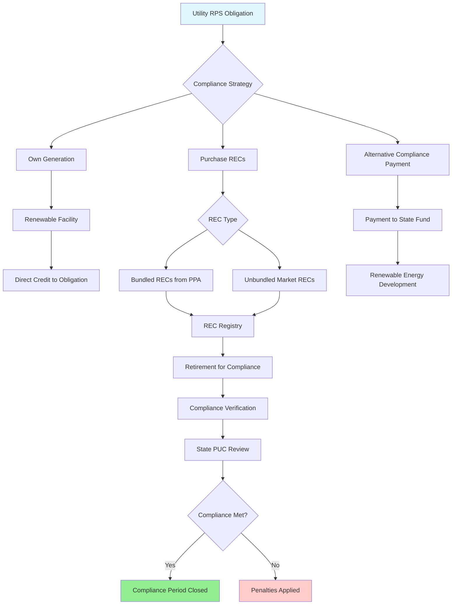

## Overview of State RPS Programs

Renewable Portfolio Standards (RPS) represent state-level mandates requiring utilities to obtain a specified percentage of electricity from renewable energy sources by established target dates. These regulations directly impact HVAC systems through the composition of grid electricity, influencing the carbon intensity of electric heating and cooling systems. As of January 2025, 30 states plus the District of Columbia maintain active RPS programs, with targets ranging from 10% to 100% renewable energy.

RPS programs establish legally binding requirements that electric utilities must meet through renewable energy generation, Renewable Energy Certificates (RECs), or alternative compliance payments. The Database of State Incentives for Renewables & Efficiency (DSIRE) maintains comprehensive tracking of these programs across all jurisdictions.

## State RPS Targets and Deadlines

The following table presents major state RPS targets and compliance deadlines:

| State | RPS Target | Target Year | Solar Carve-Out | Notes |
|-------|------------|-------------|-----------------|-------|
| California | 100% | 2045 | Yes | 60% by 2030, zero-carbon by 2045 |
| New York | 70% | 2030 | Yes | 100% zero-emission by 2040 |
| Massachusetts | 35% | 2030 | 3,500 MW solar | Annual 1% increase beyond 2020 |
| New Jersey | 50% | 2030 | 5,316 MW solar | Class I renewables emphasis |
| Illinois | 50% | 2040 | 3,000 MW solar | Coal-to-solar program included |
| Maryland | 50% | 2030 | 14.5% solar | Offshore wind carve-out |
| Connecticut | 48% | 2030 | Yes | Zero-carbon by 2040 |
| Nevada | 50% | 2030 | Yes | Previously voluntary, now mandatory |
| Virginia | 100% | 2050 | Yes | Investor-owned utilities |
| Washington | 100% | 2045 | Yes | Zero-carbon electricity requirement |
| Colorado | 100% | 2050 | Yes | Investor-owned utilities, 80% by 2030 |
| Maine | 80% | 2030 | Yes | 100% by 2050 |
| Oregon | 50% | 2040 | Yes | 100% clean energy by 2040 |
| Arizona | 15% | 2025 | 30% distributed | Voluntary clean energy goal |
| Pennsylvania | 18% | 2021 | 0.5% solar | Non-solar Tier I and Tier II |

## Renewable Energy Certificates (RECs)

RECs represent the environmental attributes of one megawatt-hour (MWh) of renewable electricity generation. This unbundling separates the environmental benefit from the physical electricity, creating a tradable commodity for RPS compliance.

**REC Characteristics:**
- **Generation**: One REC = 1 MWh renewable generation
- **Tracking**: Centralized electronic registries (NEPOOL GIS, PJM-GATS, WREGIS, M-RETS)
- **Vintage**: Year of generation affects value and eligibility
- **Geography**: Multi-state trading permitted in some regions
- **Retirement**: RECs used for compliance are permanently retired

### Solar Renewable Energy Certificates (SRECs)

States with solar carve-outs create separate markets for Solar Renewable Energy Certificates:

| State | SREC Market Value Range | Compliance Period | Alternative Compliance Payment |
|-------|------------------------|-------------------|-------------------------------|
| Massachusetts | $250-320/MWh | June-May | $339/MWh (2024) |
| New Jersey | $85-95/MWh | June-May | $91.72/MWh (2024) |
| Maryland | $70-85/MWh | June-May | $95/MWh (2024) |
| Pennsylvania | $30-40/MWh | June-May | $45/MWh (2024) |
| District of Columbia | $350-400/MWh | Jan-Dec | $500/MWh (2024) |

SREC values fluctuate based on solar generation supply versus mandated demand. Oversupply drives prices toward the Alternative Compliance Payment (ACP) floor, while shortage conditions maintain prices near ACP caps.

## Compliance Mechanisms

Utilities demonstrate RPS compliance through three primary pathways:

### 1. Direct Renewable Generation

Utilities own and operate renewable energy facilities, with generation automatically credited toward RPS obligations. This approach provides:
- Long-term cost certainty
- Direct operational control
- Hedge against REC market volatility
- Asset ownership benefits

### 2. REC Procurement

Purchasing RECs from third-party generators provides flexibility:
- **Bundled RECs**: Purchased with underlying electricity through Power Purchase Agreements (PPAs)
- **Unbundled RECs**: Environmental attributes only, separated from electricity
- **Bilateral contracts**: Direct agreements between parties
- **Market purchases**: Spot market transactions through brokers

### 3. Alternative Compliance Payments (ACPs)

When renewable generation or REC procurement proves insufficient, utilities pay ACPs as the compliance mechanism of last resort:

ACP rates establish price ceilings for REC markets. Rational utilities will not pay more for RECs than the ACP alternative penalty.

## Impact on HVAC Systems

RPS programs influence HVAC system selection and operation through multiple channels:

**Electric Heat Pump Economics**: As grid renewable percentages increase, electric heat pumps demonstrate improved environmental performance compared to fossil fuel systems. States approaching 50%+ renewable electricity show carbon emissions from heat pumps declining below natural gas furnaces, even accounting for generation losses.

**Time-of-Use Optimization**: RPS compliance often coincides with time-of-use electricity rates. Solar carve-outs create midday generation surpluses, favoring thermal energy storage systems that can shift cooling loads to align with renewable generation periods.

**Combined Heat and Power (CHP)**: RPS policies may include or exclude CHP from renewable energy definitions. In states excluding CHP from RPS compliance, the economic advantage of efficient cogeneration systems diminishes relative to renewable alternatives.

**Demand Response Integration**: Utilities managing RPS compliance increasingly value demand response capabilities. Variable refrigerant flow (VRF) systems and smart thermostats enabling load shedding provide grid flexibility during renewable generation intermittency.

## Banking and Borrowing Provisions

Many states permit temporal flexibility in RPS compliance:

**Banking**: Excess RECs generated beyond current year requirements can be saved for future compliance periods. Typical banking periods range from 1-4 years, providing utilities with compliance flexibility and market stability.

**Borrowing**: Some jurisdictions allow utilities to count future-year RECs toward current obligations, usually limited to 10-15% of annual requirements. This mechanism prevents short-term market shocks from causing widespread non-compliance.

## Verification and Enforcement

State Public Utility Commissions (PUCs) administer RPS programs through:

1. **Annual Compliance Filings**: Utilities submit documentation demonstrating renewable energy procurement
2. **REC Retirement Verification**: Registry confirmation that RECs were permanently retired
3. **Generation Attestation**: Renewable facility certification and meter verification
4. **Penalty Assessment**: Non-compliance penalties ranging from ACPs to additional fines
5. **Cost Recovery Review**: Examination of RPS compliance cost pass-through to ratepayers

DSIRE maintains current state-by-state program details, including recent amendments, enforcement actions, and compliance statistics. HVAC professionals designing systems for commercial and institutional clients should consult DSIRE data when evaluating long-term electricity costs and carbon reduction strategies.

## Future Trends

RPS programs continue evolving toward more ambitious targets. The trend toward 100% clean energy requirements by 2040-2050 fundamentally alters long-term HVAC system planning. Designers must consider the declining carbon intensity of grid electricity when performing lifecycle cost analyses and environmental impact assessments for major heating and cooling systems with 20-30 year operating lifespans.
