# Coal Characteristics for HVAC Heating Applications

Coal remains a significant fuel source for industrial heating and power generation systems. Understanding coal properties is essential for proper boiler design, combustion control, and emissions management in HVAC applications.

## Coal Classification and Rank

Coal classification follows a rank system based on carbon content, volatile matter, and heating value. The American Society for Testing and Materials (ASTM) D388 standard defines four primary coal ranks, each with distinct combustion characteristics.

```mermaid
graph TD
    A[Coal Formation Process] --> B[Peat]
    B --> C[Lignite]
    C --> D[Sub-Bituminous]
    D --> E[Bituminous]
    E --> F[Anthracite]

    G[Increasing Properties] --> H[Carbon Content]
    G --> I[Heating Value]
    G --> J[Fixed Carbon]

    K[Decreasing Properties] --> L[Moisture Content]
    K --> M[Volatile Matter]
    K --> N[Oxygen Content]

    style F fill:#2c3e50
    style E fill:#34495e
    style D fill:#7f8c8d
    style C fill:#95a5a6
```

## Proximate Analysis

Proximate analysis determines four key components that govern combustion behavior:

**Moisture (M)** - Water content affects heating value and handling characteristics. High moisture coals require additional energy for water evaporation before combustion occurs.

**Volatile Matter (VM)** - Gaseous hydrocarbons released during heating. Higher volatile content promotes easier ignition but requires longer combustion chambers.

**Fixed Carbon (FC)** - Solid carbon remaining after volatile matter release. This fraction burns at the grate or in the char bed.

**Ash (A)** - Inorganic residue that does not combust. Ash affects heat transfer surfaces, requires disposal, and influences emissions.

The relationship between these components:

$$M + VM + FC + A = 100\%$$

## Heating Value Calculations

The higher heating value (HHV) represents total heat release including water vapor condensation. The lower heating value (LHV) excludes condensation energy and better represents actual usable heat in most HVAC systems.

The Dulong formula estimates HHV from ultimate analysis (mass fractions):

$$HHV = 14544C + 62028\left(H - \frac{O}{8}\right) + 4050S \text{ [Btu/lb]}$$

Where C, H, O, and S represent carbon, hydrogen, oxygen, and sulfur mass fractions respectively.

Converting HHV to LHV accounts for moisture formed during hydrogen combustion:

$$LHV = HHV - 1050 \times \left(9H + M\right) \text{ [Btu/lb]}$$

The factor 1050 Btu/lb represents the latent heat of vaporization for water at atmospheric pressure.

## Combustion Air Requirements

Stoichiometric air requirement depends on fuel composition. For coal, the theoretical air requirement per pound of fuel:

$$A_{theo} = 11.5C + 34.5\left(H - \frac{O}{8}\right) + 4.3S \text{ [lb air/lb fuel]}$$

Actual air supplied includes excess air to ensure complete combustion:

$$A_{actual} = A_{theo} \times (1 + EA)$$

Where EA represents excess air as a decimal fraction (typically 0.15-0.30 for coal-fired systems).

Excess air affects efficiency through stack losses. Optimal excess air balances complete combustion against heat loss in flue gases.

## Coal Type Comparison

| Property | Anthracite | Bituminous | Sub-Bituminous | Lignite |
|----------|-----------|------------|----------------|---------|
| **Fixed Carbon (%)** | 86-98 | 45-86 | 35-45 | 25-35 |
| **Volatile Matter (%)** | 2-14 | 14-45 | 45-55 | 55-65 |
| **Moisture (%)** | 2-5 | 2-8 | 10-25 | 30-40 |
| **HHV (Btu/lb)** | 12,500-15,000 | 11,000-14,000 | 8,500-11,500 | 6,000-8,500 |
| **Ash (%)** | 6-12 | 4-12 | 4-10 | 6-15 |
| **Ignition Temperature (°F)** | 925-970 | 840-900 | 750-840 | 660-750 |
| **Typical Use** | Space heating | Power generation | Industrial boilers | Power plants near mines |
| **Sulfur Content (%)** | 0.5-1.5 | 0.7-4.0 | 0.3-1.0 | 0.4-1.0 |

## Ash Properties and Slagging

Ash fusion temperature determines slagging tendency in furnaces. ASTM D1857 defines four characteristic temperatures:

1. **Initial Deformation Temperature (IDT)** - First evidence of rounding at ash cone edges
2. **Softening Temperature (ST)** - Ash forms a spherical lump
3. **Hemispherical Temperature (HT)** - Ash spreads to half the original cone height
4. **Fluid Temperature (FT)** - Ash flows as a molten liquid

Combustion chamber temperatures must remain below the softening temperature to prevent clinker formation on heat transfer surfaces. High-ash coals require mechanical ash removal systems and larger ash hoppers.

## HVAC System Considerations

**Boiler Selection** - Coal-fired boilers for HVAC applications typically employ stoker firing (traveling grate, spreader stoker) for smaller installations or pulverized coal systems for large facilities.

**Combustion Control** - Higher volatile coals require careful air distribution to prevent flame impingement on furnace walls. Low volatile fuels need higher combustion chamber temperatures for complete burnout.

**Heat Transfer** - Ash deposition on boiler tubes reduces heat transfer coefficients. Soot blowing systems maintain efficiency by periodically cleaning heat exchange surfaces.

**Emissions** - Sulfur content directly correlates with SO₂ emissions. Particulate emissions depend on ash content and collection system efficiency. Modern systems require electrostatic precipitators or baghouses to meet regulatory standards.

**Fuel Handling** - Moisture content affects storage requirements, conveying systems, and freeze protection. High-moisture coals may require covered storage and heated bunkers in cold climates.

## ASTM Standards Reference

- **ASTM D388** - Standard Classification of Coals by Rank
- **ASTM D3172** - Proximate Analysis of Coal
- **ASTM D3286** - Gross Calorific Value by the Isoperibol Bomb Calorimeter
- **ASTM D1857** - Fusibility of Coal and Coke Ash
- **ASTM D4239** - Sulfur in Analysis Sample of Coal Using High-Temperature Combustion

Understanding these coal characteristics enables proper fuel selection, efficient combustion system design, and reliable operation of coal-fired HVAC heating systems.
