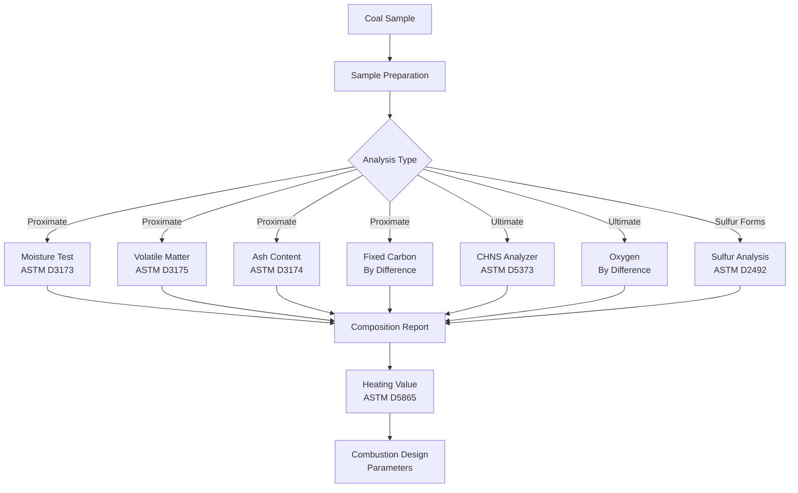

## Overview

Coal composition determines combustion efficiency, emissions characteristics, and heating value in boiler applications. Understanding both proximate and ultimate analysis methods enables proper fuel selection and system design for coal-fired HVAC equipment.

## Proximate Analysis

Proximate analysis provides practical fuel characteristics through standardized laboratory tests per ASTM D3172. This method quantifies four fundamental parameters:

**Moisture Content (M):** Water present in coal, reported on as-received or dry basis. Excessive moisture reduces heating value and increases handling costs.

$$Q_{\text{net,ar}} = Q_{\text{net,dry}} \times \left(1 - \frac{M}{100}\right)$$

**Volatile Matter (VM):** Components released as gas when coal is heated without air. Higher volatiles indicate easier ignition but potential for incomplete combustion.

**Fixed Carbon (FC):** Solid combustible residue remaining after volatile matter release. Calculated by difference:

$$\text{FC} = 100 - (M + VM + A)$$

**Ash Content (A):** Noncombustible mineral residue remaining after complete combustion. High ash reduces heating value and increases disposal requirements.

The mass balance relationship for proximate analysis:

$$M + VM + FC + A = 100\%$$

## Ultimate Analysis

Ultimate analysis determines elemental composition per ASTM D3176, critical for combustion calculations and emissions prediction:

| Element | Typical Range (wt%, dry basis) | Combustion Significance |
|---------|--------------------------------|------------------------|
| Carbon (C) | 65-95% | Primary heat source |
| Hydrogen (H) | 2-6% | Secondary heat, water formation |
| Oxygen (O) | 2-25% | Reduces heating value |
| Nitrogen (N) | 0.5-2% | Forms NOx emissions |
| Sulfur (S) | 0.3-8% | Forms SO₂, corrosion risk |

The stoichiometric air requirement calculation uses ultimate analysis data:

$$A_0 = 11.5C + 34.5\left(H - \frac{O}{8}\right) + 4.3S \quad \text{(kg air/kg fuel)}$$

## Composition by Coal Rank

Coal rank significantly affects composition and combustion properties:

| Coal Rank | Fixed Carbon (%) | Volatile Matter (%) | Moisture (%) | Heating Value (MJ/kg) |
|-----------|------------------|---------------------|--------------|----------------------|
| Anthracite | 86-92 | 3-8 | 2-4 | 30-34 |
| Bituminous | 45-86 | 20-40 | 2-10 | 24-32 |
| Sub-bituminous | 35-50 | 40-50 | 15-30 | 18-26 |
| Lignite | 25-35 | 40-50 | 30-45 | 10-20 |

## Sulfur Content and Classification

Sulfur exists in three forms in coal:

1. **Pyritic Sulfur:** Iron sulfide minerals (FeS₂), partially removable by physical cleaning
2. **Organic Sulfur:** Chemically bonded to coal structure, not removable by cleaning
3. **Sulfate Sulfur:** Negligible in fresh coal, forms during weathering

Classification by total sulfur content:

- **Low Sulfur:** < 1.0%
- **Medium Sulfur:** 1.0-3.0%
- **High Sulfur:** > 3.0%

Sulfur dioxide emissions calculation:

$$\dot{m}_{\text{SO}_2} = \dot{m}_{\text{coal}} \times \frac{S}{100} \times \frac{64}{32} \times (1 - \eta_{\text{FGD}})$$

where η_FGD represents flue gas desulfurization efficiency.

## Analysis Methods Overview

## Ash Properties

Ash composition affects fouling, slagging, and corrosion in boiler systems:

**Ash Fusion Temperature:** Temperature at which ash begins to soften and flow, critical for preventing clinker formation. ASTM D1857 defines four characteristic temperatures:

- Initial deformation temperature (IDT)
- Softening temperature (ST)
- Hemispherical temperature (HT)
- Fluid temperature (FT)

**Silica Ratio:** Predicts slagging tendency:

$$R_s = \frac{\text{SiO}_2}{\text{SiO}_2 + \text{Fe}_2\text{O}_3 + \text{CaO} + \text{MgO}}$$

Values Rs < 0.6 indicate high slagging potential.

## Trace Elements

Coal contains trace elements with environmental and operational significance:

- **Mercury (Hg):** 0.01-1.5 ppm, requires emission controls per MACT standards
- **Arsenic (As):** 0.5-80 ppm, toxic emissions concern
- **Chlorine (Cl):** 50-5000 ppm, causes high-temperature corrosion
- **Selenium (Se):** 0.5-10 ppm, environmental regulation target

## HVAC Application Considerations

Coal composition directly impacts boiler design and operation:

**High Fixed Carbon Coals (Anthracite):** Require higher combustion air temperatures and longer residence times. Lower fouling rates but slower ignition.

**High Volatile Coals (Sub-bituminous, Lignite):** Easier ignition, shorter flame length, higher reactivity. Increased moisture necessitates larger pulverizers and higher auxiliary power.

**High Sulfur Coals:** Mandate acid dewpoint consideration for air preheater design and flue gas desulfurization systems.

**High Ash Coals:** Require larger ash handling systems, increased tube spacing, and more frequent cleaning cycles.

The heating value on an as-received basis incorporates all composition effects:

$$\text{HHV}_{\text{ar}} = \text{HHV}_{\text{daf}} \times \left(1 - \frac{M + A}{100}\right)$$

where HHV_daf represents higher heating value on a dry, ash-free basis.

## Standards Reference

- **ASTM D3172:** Standard Practice for Proximate Analysis of Coal and Coke
- **ASTM D3176:** Standard Practice for Ultimate Analysis of Coal and Coke
- **ASTM D3174:** Standard Test Method for Ash in the Analysis Sample of Coal
- **ASTM D3175:** Standard Test Method for Volatile Matter in the Analysis Sample of Coal
- **ASTM D2492:** Standard Test Method for Forms of Sulfur in Coal
- **ASTM D5865:** Standard Test Method for Gross Calorific Value of Coal and Coke
- **ASTM D1857:** Standard Test Method for Fusibility of Coal and Coke Ash

Understanding coal composition through standardized analysis methods enables accurate boiler sizing, fuel procurement decisions, and emissions compliance for coal-fired HVAC systems.
