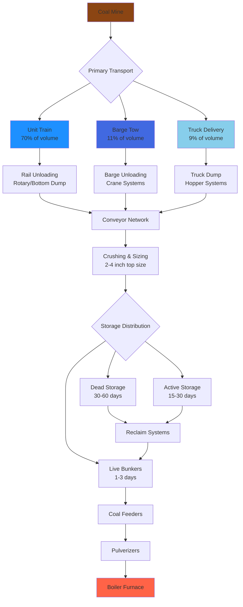

## Transportation Mode Overview

Coal distribution infrastructure represents a critical component in the fuel supply chain for coal-fired boilers and combined heat and power systems. The transportation network moves approximately 1 billion tons of coal annually in the United States, with rail transport dominating long-haul movements and barge systems serving waterway-accessible facilities.

The selection of transportation mode depends on distance, available infrastructure, delivery volume requirements, and economic factors including fuel costs and capital investment in handling equipment.

## Rail Transport Systems

Rail transport accounts for approximately 70% of coal movements in the United States according to EIA data. Unit trains—dedicated trains of 100-120 hopper cars carrying 10,000-15,000 tons per trainload—provide the most economical long-distance coal delivery method.

**Unit Train Characteristics:**

| Parameter | Value | Notes |
|-----------|-------|-------|
| Train Length | 100-120 cars | Typical unit train configuration |
| Car Capacity | 100-120 tons | Modern aluminum hopper cars |
| Total Load | 10,000-15,000 tons | Per train delivery |
| Delivery Frequency | 1-3 trains/day | Large power plants |
| Travel Speed | 25-50 mph | Loaded train average |
| Turnaround Time | 3-5 days | Round trip cycle |

Rail infrastructure at the receiving facility requires loop tracks for continuous train movement during unloading, bottom-discharge or rotary dump systems, and conveyor networks to transfer coal to storage or directly to the boiler bunkers.

**Unloading Systems:**

| System Type | Capacity | Application | Capital Cost |
|-------------|----------|-------------|--------------|
| Bottom Discharge | 3,000-4,000 ton/hr | Unit trains, continuous | Moderate |
| Rotary Dump | 4,000-6,000 ton/hr | High-volume facilities | High |
| Thaw Shed | Required in cold climates | Frozen coal treatment | Moderate |
| Dust Suppression | Water spray, enclosures | Environmental control | Low-Moderate |

## Barge Transportation

Barge transport serves facilities located on navigable waterways, offering the lowest ton-mile cost for coal movement. A single 15-barge tow can transport 22,500 tons of coal, equivalent to 225 rail cars or 900 truck loads.

**Barge Fleet Specifications:**

| Component | Specification | Details |
|-----------|---------------|---------|
| Standard Barge | 1,500 tons capacity | 195 ft × 35 ft × 12 ft |
| Jumbo Barge | 2,000 tons capacity | 200 ft × 35 ft × 13 ft |
| Tow Configuration | 15-40 barges | River-dependent |
| Transit Speed | 4-8 mph | Current-dependent |
| Delivery Cost | $0.005-0.015/ton-mile | Lowest transport cost |

Barge unloading facilities require river access, docking infrastructure, and material handling equipment including clamshell cranes or continuous bucket systems. Unloading rates of 500-2,000 tons per hour are typical, with weather and river conditions affecting operations.

## Truck Delivery Systems

Truck transport serves short-haul applications (under 50 miles), small facilities, and backup delivery during rail or barge disruptions. Individual truck capacities of 20-25 tons limit economic transport distances.

**Truck Transport Parameters:**

| Factor | Value | Application |
|--------|-------|-------------|
| Payload Capacity | 20-25 tons | Standard coal hauler |
| Economic Range | 0-50 miles | Variable by fuel cost |
| Delivery Rate | 100-400 tons/day | Small facilities |
| Cost per Ton-Mile | $0.10-0.30 | Highest transport cost |
| Infrastructure | Dump hoppers, scales | Minimal facility requirements |

## Storage Facilities

Coal storage provides inventory management, delivery schedule flexibility, and emergency fuel reserves. Storage design must address coal quality degradation, spontaneous combustion risk, and material handling efficiency.

**Storage System Design:**

| Storage Type | Capacity Range | Application | Considerations |
|--------------|----------------|-------------|----------------|
| Dead Storage | 30-60 days | Emergency reserve | Compaction, degradation |
| Active Storage | 15-30 days | Operating inventory | Reclaim equipment |
| Live Storage | 1-3 days | Boiler bunkers | Continuous feed systems |
| Covered Storage | Climate-dependent | Moisture control | Capital intensive |
| Open Stockpiles | Most common | Large facilities | Wind/water erosion |

Stockpile geometry affects reclaim operations and spontaneous combustion risk. Maximum pile heights of 40-60 feet and compaction through bulldozer traffic reduce air infiltration that drives oxidation reactions.

## Material Handling Systems

Conveyor systems transfer coal from unloading points through crushing and sizing operations to storage or direct feed to boilers. Belt conveyors operating at 400-800 feet per minute with capacities of 500-3,000 tons per hour serve most large facilities.

**Conveyor System Components:**

- Belt conveyors with troughing idlers for horizontal and inclined transport
- Crushers reducing top size to 2-4 inches for pulverizer feed
- Magnetic separators removing tramp metal
- Dust collection systems at transfer points
- Freeze protection in cold climates

## Distribution Logistics Network

## Infrastructure Planning Considerations

Facility design must accommodate maximum delivery rates while maintaining operational flexibility:

**Key Design Parameters:**

- Unloading capacity exceeding average consumption rate by 25-50%
- Storage capacity providing 30-90 days supply depending on delivery reliability
- Redundant material handling paths for maintenance and failure scenarios
- Weather protection for coal quality maintenance in high-rainfall regions
- Dust control systems meeting air quality regulations
- Stormwater management for coal pile runoff

The economic optimization of coal distribution infrastructure balances capital investment in high-capacity systems against operating costs for fuel transportation and inventory carrying costs. Large baseload facilities justify unit train loops and rotary dumps, while smaller installations use truck delivery and minimal storage infrastructure.

Environmental regulations increasingly drive covered storage, dust suppression systems, and runoff treatment facilities, adding 15-30% to infrastructure capital costs but reducing fugitive emissions and water quality impacts.
