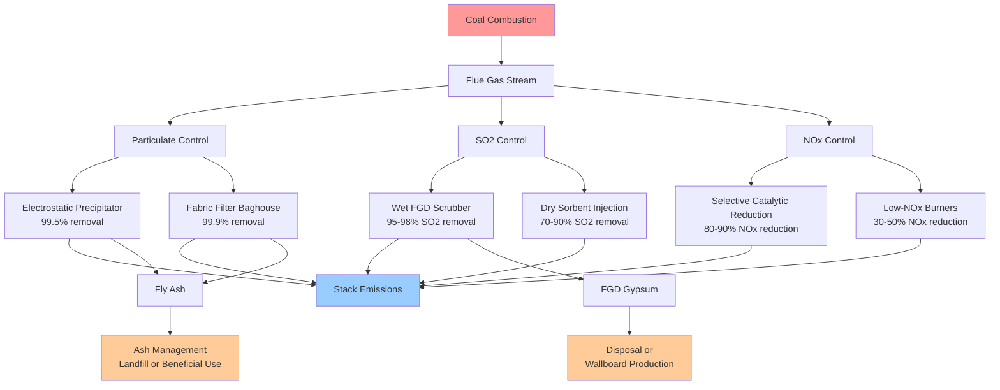

Coal combustion in heating systems produces significant environmental emissions that must be controlled and managed. The combustion process releases multiple pollutants including carbon dioxide, sulfur dioxide, nitrogen oxides, particulate matter, and heavy metals. Understanding emission rates and control requirements is essential for system design and regulatory compliance.

## Carbon Dioxide Emissions

Coal produces the highest CO2 emissions per unit energy among fossil fuels due to its high carbon-to-hydrogen ratio. The carbon content varies by coal rank from approximately 70% for lignite to 95% for anthracite.

The CO2 emission rate for complete combustion is calculated from carbon balance:

$$E_{CO_2} = \frac{44}{12} \times C \times \eta_c$$

where:
- $E_{CO_2}$ = CO2 emissions (lb/MMBtu or kg/GJ)
- $C$ = carbon content fraction (mass basis)
- $\eta_c$ = carbon oxidation efficiency (typically 0.99)
- 44/12 = molecular weight ratio CO2/C

For bituminous coal with 75% carbon content:

$$E_{CO_2} = \frac{44}{12} \times 0.75 \times 0.99 = 2.72 \text{ lb CO}_2\text{/lb coal}$$

## Sulfur Dioxide Emissions

Sulfur in coal oxidizes during combustion to form SO2, a primary contributor to acid rain and respiratory problems. Sulfur content ranges from 0.3% to 5% by weight depending on coal source and preparation.

The theoretical SO2 emission rate:

$$E_{SO_2} = \frac{64}{32} \times S \times (1 - \eta_{FGD})$$

where:
- $E_{SO_2}$ = SO2 emissions (lb/lb coal)
- $S$ = sulfur content fraction
- $\eta_{FGD}$ = flue gas desulfurization removal efficiency
- 64/32 = molecular weight ratio SO2/S

For coal with 2.5% sulfur and no controls:

$$E_{SO_2} = 2 \times 0.025 = 0.050 \text{ lb SO}_2\text{/lb coal}$$

This corresponds to approximately 4.0 lb SO2/MMBtu for typical bituminous coal (12,500 Btu/lb).

## Nitrogen Oxides Formation

NOx forms through two primary mechanisms: thermal NOx from nitrogen in combustion air at high temperatures and fuel NOx from nitrogen compounds in coal (typically 1-2% by weight).

The formation rate follows Zeldovich mechanism kinetics for thermal NOx:

$$\frac{d[NO]}{dt} = k_f \sqrt{\frac{T}{1000}} e^{-\frac{69090}{T}} [O_2]^{0.5} [N_2]$$

where $T$ is flame temperature (K) and $k_f$ is the forward rate constant.

Fuel NOx dominates in coal combustion, with conversion efficiency:

$$\eta_{fuel-NOx} = 0.20 \text{ to } 0.40$$

Uncontrolled emissions range from 0.4 to 1.2 lb NOx/MMBtu depending on combustion conditions and nitrogen content.

## Particulate Matter Emissions

Particulate emissions include fly ash from mineral matter and unburned carbon. The ash content typically ranges from 5% to 35% by weight, with 70-90% becoming fly ash in pulverized coal systems.

$$E_{PM} = A \times f_{fly} \times (1 - \eta_{control})$$

where:
- $E_{PM}$ = particulate emissions (lb/lb coal)
- $A$ = ash content fraction
- $f_{fly}$ = fly ash fraction (0.70-0.90)
- $\eta_{control}$ = collection efficiency

Modern fabric filters achieve 99.9% removal, reducing emissions to 0.01-0.03 lb/MMBtu.

## EPA Emission Factors

| Pollutant | Uncontrolled (lb/ton) | Uncontrolled (lb/MMBtu) | Controlled (lb/MMBtu) | Control Technology |
|-----------|----------------------|------------------------|---------------------|-------------------|
| CO2 | 4,200-4,800 | 200-215 | 200-215 | None applicable |
| SO2 | 38×S | 1.5-5.0 | 0.10-0.60 | FGD (95-98%) |
| NOx | 20-50 | 0.6-1.2 | 0.10-0.25 | SCR/SNCR |
| PM-10 | 10-30 | 0.4-1.0 | 0.01-0.03 | Baghouse/ESP |
| PM-2.5 | 2-8 | 0.08-0.30 | 0.005-0.015 | Baghouse |
| Mercury | 0.00002-0.00015 | 8-12 μg/MJ | 1-3 μg/MJ | ACI + Baghouse |

Note: S = sulfur content (%), typical bituminous coal = 12,500 Btu/lb

## Coal Combustion Residuals Management

Coal ash includes bottom ash (10-30% of total), fly ash (70-90%), and flue gas desulfurization gypsum. Annual ash production:

$$M_{ash} = \dot{m}_{coal} \times A \times t_{operation}$$

where $\dot{m}_{coal}$ is coal feed rate and $t_{operation}$ is annual operating hours.

For a 100 MMBtu/hr boiler (12,500 Btu/lb coal, 10% ash):

$$\dot{m}_{coal} = \frac{100 \times 10^6}{12,500} = 8,000 \text{ lb/hr}$$

$$M_{ash} = 8,000 \times 0.10 \times 6,000 = 4,800,000 \text{ lb/year (2,400 tons/year)}$$

Ash disposal requires lined landfills meeting EPA Coal Combustion Residuals (CCR) Rule requirements for groundwater monitoring and structural stability.

## Environmental Control Systems

## Heavy Metal Emissions

Coal contains trace elements including mercury (0.05-1.0 ppm), arsenic, selenium, chromium, and lead. During combustion, mercury partitions into three forms:

- Elemental mercury (Hg°): 40-70%, difficult to capture
- Oxidized mercury (Hg²⁺): 20-50%, water-soluble
- Particulate-bound mercury: 5-20%, removed with fly ash

Total mercury emissions without controls:

$$E_{Hg} = [Hg]_{coal} \times (1 - f_{ash-retention})$$

where $[Hg]_{coal}$ is mercury concentration and $f_{ash-retention}$ is the fraction captured with ash (typically 0.10-0.30).

Activated carbon injection combined with particulate control achieves 70-90% mercury removal.

## Acid Deposition Impacts

SO2 and NOx react in the atmosphere to form sulfuric and nitric acids:

$$\text{SO}_2 + \text{OH} + \text{O}_2 \rightarrow \text{H}_2\text{SO}_4$$

$$2\text{NO}_2 + \text{H}_2\text{O} \rightarrow \text{HNO}_3 + \text{HNO}_2$$

Acid deposition damages ecosystems, building materials, and water quality. The acid neutralizing capacity of receiving environments determines impact severity.

## Regulatory Framework

EPA regulations under the Clean Air Act establish emission limits:

- National Ambient Air Quality Standards (NAAQS) for criteria pollutants
- Mercury and Air Toxics Standards (MATS) for hazardous air pollutants
- Regional Haze Rule for visibility protection
- Cross-State Air Pollution Rule (CSAPR) for interstate transport

New coal-fired boilers face stringent New Source Performance Standards (NSPS):
- SO2: 0.10 lb/MMBtu (30-day average)
- NOx: 0.07 lb/MMBtu (30-day average)
- PM: 0.015 lb/MMBtu

These requirements effectively mandate multi-pollutant control systems for new installations, significantly increasing capital costs by $200-400/kW of generating capacity.

## Emission Monitoring Requirements

Continuous emission monitoring systems (CEMS) measure:

- SO2, NOx, CO2 concentrations (ppmv)
- Opacity (% light blocked)
- Volumetric flow rate (scfm)
- O2 concentration for conversion to standard conditions

Data recording at 15-minute averages with quarterly reporting to EPA demonstrates compliance with permitted emission limits.
