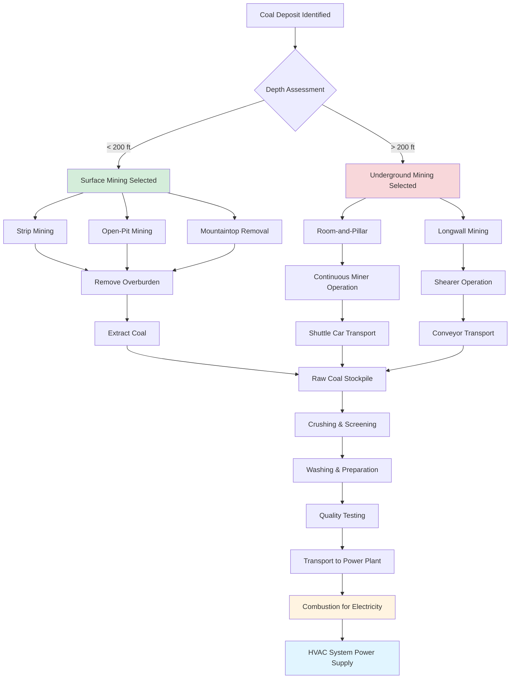

Coal extraction methods directly influence the cost, availability, and quality of coal used in power generation systems that supply electricity to HVAC equipment. Understanding mining techniques provides insight into the energy supply chain that powers building climate control systems.

## Surface Mining Operations

Surface mining accounts for approximately 65% of U.S. coal production (EIA data). This method removes overburden—soil and rock above the coal seam—to access coal deposits near the surface.

### Strip Mining

Strip mining operates in flat or gently rolling terrain where coal seams lie within 200 feet of the surface. Large draglines and excavators remove overburden in parallel strips, exposing coal seams for extraction. Each strip typically measures 100-150 feet wide.

**Process sequence:**
1. Clear vegetation and topsoil (stored separately for reclamation)
2. Drill and blast overburden rock
3. Remove overburden with draglines (buckets up to 220 cubic yards)
4. Extract exposed coal with hydraulic shovels
5. Backfill with overburden from adjacent strip
6. Grade and revegetate disturbed areas

### Mountaintop Removal Mining

Used in Appalachian regions, this method removes mountaintops to access multiple coal seams. Explosives blast away 400-800 feet of overburden, which is placed in adjacent valleys. While highly productive, this technique generates significant environmental controversy due to landscape alteration and stream burial.

### Open-Pit Mining

Applied to thick coal deposits (>100 feet), open-pit mining creates terraced excavations resembling inverted pyramids. Multiple benches allow simultaneous coal extraction at different depths. This method achieves high productivity in western U.S. coal basins where seams exceed 70 feet thick.

## Underground Mining Methods

Underground mining extracts coal from seams deeper than 200 feet below surface. This approach accesses 35% of U.S. coal production but involves greater complexity, cost, and safety considerations.

### Room-and-Pillar Mining

This traditional method creates a network of "rooms" (mined areas) separated by "pillars" (unmined coal columns) that support the mine roof.

**Key parameters:**
- Room width: 18-22 feet
- Pillar dimensions: 40-60 feet square
- Extraction ratio: 50-60% of coal seam
- Mining height: follows seam thickness (3-12 feet typical)

Continuous miners—machines with rotating drums and tungsten carbide teeth—cut coal from the working face. The cut coal loads onto shuttle cars or conveyor systems for transport to the surface.

**Pillar recovery:** After initial mining, operators may conduct "retreat mining," systematically removing pillars while withdrawing equipment. This increases extraction to 75-85% but allows controlled roof collapse behind the mining area.

### Longwall Mining

Longwall mining achieves the highest underground productivity through mechanized extraction along panels 800-1,500 feet wide and up to 3 miles long.

**System components:**
- Shearer: 500-1,000 HP machine travels along coal face on armored conveyor
- Hydraulic shields: 150-200 self-advancing roof supports (200-ton capacity each)
- Armored face conveyor: transports coal from shearer to panel conveyor
- Panel conveyor: delivers coal to main haulage system

The shearer makes repeated passes along the coal face, cutting 3-foot-deep slices. Hydraulic shields advance automatically, and the roof behind deliberately collapses (controlled subsidence). This method extracts 75-90% of the coal seam.

## Mining Method Comparison

| Parameter | Surface Mining | Room-and-Pillar | Longwall Mining |
|-----------|----------------|-----------------|-----------------|
| **Typical depth** | 0-200 ft | 200-1,000 ft | 300-1,500 ft |
| **Coal recovery** | 90-95% | 50-75% | 75-90% |
| **Production rate** | 10-30 tons/worker-hour | 3-6 tons/worker-hour | 8-15 tons/worker-hour |
| **Capital investment** | $50-150 million | $20-40 million | $150-300 million |
| **Operating cost** | $15-30/ton | $30-50/ton | $25-40/ton |
| **Safety (incidents/200k hours)** | 2.5-3.5 | 3.5-5.0 | 2.0-3.0 |
| **Methane liberation** | Minimal | Moderate | High |
| **Surface disturbance** | 100% mined area | 5-10% (subsidence zones) | 30-50% (subsidence) |

## Productivity and Safety Metrics

Coal mining productivity has increased dramatically due to mechanization and advanced techniques. According to EIA data, U.S. coal mining productivity reached 6.2 tons per worker-hour in 2022, compared to 2.0 tons per worker-hour in 1980.

**Productivity factors:**
- Equipment size and automation level
- Coal seam thickness and continuity
- Roof and floor stability
- Methane concentration (affects ventilation requirements)
- Haulage distance and system capacity

**Safety considerations:**
Modern coal mining emphasizes multiple safety systems:

- **Ventilation:** Delivers 9,000+ CFM per working section to dilute methane and dust
- **Roof control:** Systematic bolting patterns (4-6 foot spacing) using tensioned rock bolts
- **Methane monitoring:** Continuous sensors with automatic equipment shutoff at 1% CH₄
- **Dust suppression:** Water sprays at cutting points, maintaining <2.0 mg/m³ respirable dust
- **Ground control:** Real-time roof stress monitoring and support design
- **Emergency response:** Self-contained self-rescuers (SCSR) provide 1-hour emergency oxygen

Mine Safety and Health Administration (MSHA) regulations mandate comprehensive safety programs, reducing mining fatalities from 242 in 1978 to fewer than 20 annually in recent years.

## Coal Extraction Process Flow

## Environmental and Regulatory Considerations

Coal extraction faces stringent environmental regulations affecting mine design and operation:

**Surface Mining Control and Reclamation Act (SMCRA):** Requires operators to restore mined land to original contour and establish vegetation equivalent to pre-mining conditions. Performance bonds ensure compliance.

**Clean Water Act compliance:** Mine water discharge must meet pH (6.0-9.0), total suspended solids (<35 mg/L), and heavy metal limits. Treatment systems use settling ponds, chemical precipitation, and filtration.

**Air quality standards:** Control fugitive dust through water sprays, chemical stabilizers, and covering haul roads. Large operations require air quality permits.

**Methane emissions:** Underground mines vent methane to atmosphere or capture for power generation. Gob wells extract methane from collapsed areas behind longwall panels.

## Impact on HVAC Energy Supply

Coal extraction methods influence electricity costs and availability for HVAC systems:

- **Mining costs:** Determine delivered coal price to power plants ($30-60/ton typical)
- **Coal quality:** Extraction method affects coal contamination and heating value
- **Production consistency:** Mechanized methods provide reliable fuel supply
- **Regional variations:** Western surface mines produce lower-cost, lower-sulfur coal
- **Environmental compliance:** Adds $5-15/ton to mining costs, reflected in electricity rates

Understanding these extraction methods provides context for the energy infrastructure supporting modern HVAC systems and the economic and environmental factors affecting operational costs.

## Components

- Surface Mining Strip Mining
- Underground Mining Deep Mining
- Mountaintop Removal
- Longwall Mining
- Room And Pillar Mining
