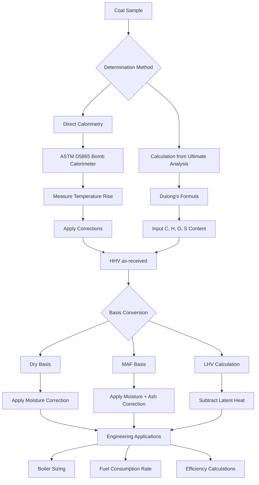

## Heating Values of Coal

The heating value of coal represents the total thermal energy released per unit mass during complete combustion. This fundamental property determines boiler sizing, fuel consumption rates, and overall system efficiency in coal-fired HVAC applications. Heating values vary significantly with coal rank, moisture content, and mineral matter, making accurate determination essential for combustion system design.

## Higher Heating Value vs Lower Heating Value

Coal heating values are expressed in two distinct forms:

**Higher Heating Value (HHV)** quantifies the total heat released when coal burns completely and all combustion products cool to the initial temperature, with water vapor condensing to liquid. This value includes latent heat of vaporization from moisture in the fuel and hydrogen combustion.

**Lower Heating Value (LHV)** excludes the latent heat of water vaporization, representing the actual usable heat in most combustion systems where exhaust gases remain above the dew point. The relationship between HHV and LHV is:

$$\text{LHV} = \text{HHV} - h_{fg} \left( W + 9H \right)$$

Where:
- $h_{fg}$ = latent heat of vaporization of water (1050 Btu/lb or 2.44 MJ/kg)
- $W$ = moisture content of coal (mass fraction)
- $H$ = hydrogen content of coal (mass fraction)
- The factor 9 accounts for water produced from hydrogen combustion (H₂ + ½O₂ → H₂O)

## Dulong's Formula for Heating Value Estimation

Dulong's formula provides a rapid estimation of coal HHV based on ultimate analysis. This empirical relationship correlates heating value with elemental composition:

$$\text{HHV} = 14544C + 62028\left(H - \frac{O}{8}\right) + 4050S$$

Where (all values as mass fractions):
- $C$ = carbon content
- $H$ = hydrogen content
- $O$ = oxygen content
- $S$ = sulfur content
- HHV units: Btu/lb

For SI units (MJ/kg):

$$\text{HHV} = 33.83C + 144.4\left(H - \frac{O}{8}\right) + 9.42S$$

The oxygen correction term $(O/8)$ accounts for hydrogen already combined with oxygen in the coal structure, which does not contribute to heating value.

## ASTM D5865 Calorimetric Determination

ASTM D5865 standardizes bomb calorimetry for precise heating value measurement. The procedure involves:

1. **Sample Preparation**: Crush coal to 60-mesh (250 μm) particle size
2. **Combustion**: Burn 1-gram sample in oxygen-pressurized bomb (30 atm)
3. **Temperature Measurement**: Record water bath temperature rise with ±0.001°C precision
4. **Calculation**: Apply corrections for fuse wire, acid formation, and heat capacity

The gross calorific value (HHV) is calculated:

$$\text{HHV} = \frac{(T_f - T_i) \times W - e_1 - e_2 - e_3}{m}$$

Where:
- $T_f, T_i$ = final and initial water temperatures (°C)
- $W$ = water equivalent of calorimeter (cal/°C)
- $e_1$ = correction for fuse wire combustion
- $e_2$ = correction for nitric acid formation
- $e_3$ = correction for sulfuric acid formation
- $m$ = sample mass (grams)

## Heating Value Basis Definitions

Coal heating values are reported on different moisture and ash bases:

**As-Received Basis**: Includes all moisture and ash present in delivered coal. This represents actual fuel performance in combustion systems.

**Dry Basis**: Calculated by removing total moisture content, providing comparison independent of moisture variability:

$$\text{HHV}_{\text{dry}} = \frac{\text{HHV}_{\text{ar}}}{1 - M}$$

Where $M$ = total moisture content (mass fraction)

**Moisture-Ash-Free (MAF) Basis**: Represents pure organic coal substance, useful for rank classification and geochemical studies:

$$\text{HHV}_{\text{maf}} = \frac{\text{HHV}_{\text{ar}}}{1 - M - A}$$

Where $A$ = ash content (mass fraction)

## Heating Values by Coal Rank

| Coal Rank | HHV (Btu/lb, as-received) | HHV (MJ/kg, as-received) | Moisture Content (%) | Typical Applications |
|-----------|---------------------------|--------------------------|----------------------|---------------------|
| Anthracite | 13,000 - 15,000 | 30.2 - 34.9 | 5 - 15 | Industrial boilers, high-efficiency systems |
| Bituminous | 12,000 - 15,000 | 27.9 - 34.9 | 5 - 15 | Large HVAC boilers, cogeneration |
| Sub-bituminous | 8,500 - 11,500 | 19.8 - 26.7 | 15 - 30 | Utility boilers, low-sulfur applications |
| Lignite | 6,500 - 8,500 | 15.1 - 19.8 | 30 - 45 | Mine-mouth power plants, district heating |

## Moisture Effects on Heating Value

Moisture reduces effective heating value through two mechanisms:

1. **Dilution Effect**: Water content displaces combustible material, reducing energy density per unit mass
2. **Vaporization Penalty**: Energy consumed vaporizing moisture is unavailable for useful heating

The combined effect on as-received heating value:

$$\text{HHV}_{\text{ar}} = \text{HHV}_{\text{dry}} \times (1 - M) - h_{fg} \times M$$

For high-moisture coals (lignite, sub-bituminous), moisture can reduce usable heating value by 20-35% compared to dry basis values.

## Heating Value Determination Methods

## Engineering Applications

In HVAC boiler design, heating value determines:

- **Fuel Feed Rate**: Mass flow required for specified thermal output
- **Combustion Air Requirements**: Stoichiometric air based on fuel composition
- **Flue Gas Volume**: Affects duct sizing and draft calculations
- **Efficiency Metrics**: Referenced to HHV or LHV depending on standard

For precise system design, use as-received heating values with site-specific moisture content. LHV basis more accurately represents achievable efficiency in non-condensing systems.

## Standards and References

- **ASTM D5865**: Standard test method for gross calorific value of coal and coke
- **ASTM D3172**: Standard practice for proximate analysis of coal and coke
- **ASTM D3176**: Standard practice for ultimate analysis of coal and coke
- **ISO 1928**: Solid mineral fuels - determination of gross calorific value by bomb calorimeter
- **ASME PTC 4**: Fired steam generators performance test codes
