Coal classification systems provide critical parameters for selecting appropriate fuels in industrial heating applications and power generation systems. The ASTM D388 standard establishes the primary classification framework based on fixed carbon content, volatile matter, and calorific value. Understanding coal rank progression from low-rank lignite to high-rank anthracite enables engineers to optimize combustion systems, predict performance characteristics, and design appropriate fuel handling infrastructure.

## ASTM Coal Rank Classification

The American Society for Testing and Materials (ASTM) D388 standard classifies coal into four primary ranks based on degree of metamorphism and energy content. This classification directly impacts combustion characteristics, including ignition temperature, flame stability, ash fusion temperature, and heat release rates.

The fundamental classification parameters include:

- **Fixed Carbon Content** (dry, mineral-matter-free basis)
- **Volatile Matter Content** (dry, mineral-matter-free basis)
- **Gross Calorific Value** (moist, mineral-matter-free basis)
- **Agglomerating Character** (caking properties during heating)

### Coalification Rank Progression

```mermaid
graph LR
    A[Peat<br/>Precursor] --> B[Lignite<br/>Rank 0.4]
    B --> C[Sub-Bituminous<br/>Rank 0.5-0.6]
    C --> D[Bituminous<br/>Rank 0.7-0.9]
    D --> E[Anthracite<br/>Rank 0.95+]

    style A fill:#8B4513
    style B fill:#654321
    style C fill:#4A4A4A
    style D fill:#2F2F2F
    style E fill:#1C1C1C

    F[Increasing Rank →] --> G[Higher Carbon %<br/>Lower Moisture<br/>Higher Heating Value]

    style F fill:#FFE6E6
    style G fill:#E6F3FF
```

## Coal Properties by Rank

The following table presents typical property ranges for each coal rank based on ASTM D388 classification standards:

| Coal Rank | Fixed Carbon (%, dmmf) | Volatile Matter (%, dmmf) | Heating Value (BTU/lb, moist) | Moisture (%, as-received) | Ash Fusion Temp (°F) |
|-----------|------------------------|---------------------------|-------------------------------|---------------------------|----------------------|
| Anthracite | 86-98 | 2-14 | 12,000-14,000 | 2-15 | 2,600-2,800 |
| Bituminous | 45-86 | 14-46 | 10,500-15,000 | 2-15 | 2,100-2,600 |
| Sub-Bituminous | 35-45 | 40-55 | 8,300-11,500 | 15-30 | 2,000-2,400 |
| Lignite | 25-35 | 40-70 | 5,500-8,300 | 30-45 | 2,000-2,200 |

*dmmf = dry, mineral-matter-free basis*

## Heating Value Calculations

The gross calorific value (higher heating value, HHV) varies significantly with coal rank and must be corrected for moisture and ash content. The Dulong formula provides an approximation based on ultimate analysis:

$$
HHV = 14,544C + 62,028\left(H - \frac{O}{8}\right) + 4,050S
$$

where:
- $HHV$ = Higher heating value (BTU/lb)
- $C$ = Carbon mass fraction (decimal)
- $H$ = Hydrogen mass fraction (decimal)
- $O$ = Oxygen mass fraction (decimal)
- $S$ = Sulfur mass fraction (decimal)

The net calorific value (lower heating value, LHV) accounts for latent heat of water vapor condensation:

$$
LHV = HHV - 1,050W - 9H_2(1,050)
$$

where:
- $W$ = Total moisture content (lb water/lb coal)
- $H_2$ = Hydrogen converted to water (lb/lb coal)
- $1,050$ = Latent heat of vaporization (BTU/lb) at atmospheric pressure

### Moist, Mineral-Matter-Free Basis Correction

The ASTM standard specifies heating values on a moist, mineral-matter-free (mmmf) basis for classification purposes:

$$
HHV_{mmmf} = HHV_{ar} \times \frac{100 - (M + 1.08A + 0.55S_p)}{100 - M}
$$

where:
- $HHV_{ar}$ = Heating value, as-received basis
- $M$ = Moisture percentage, as-received
- $A$ = Ash percentage, dry basis
- $S_p$ = Pyritic sulfur percentage, dry basis

## Anthracite Coal

Anthracite represents the highest coal rank with maximum carbon content (86-98% fixed carbon, dmmf basis). This hard, lustrous coal exhibits the following characteristics:

**Combustion Properties:**
- Ignition temperature: 800-900°F
- Low volatile matter (2-14%) requires preheated combustion air
- Clean-burning with minimal smoke production
- High flame temperature: 3,200-3,600°F
- Slow combustion rate necessitates specialized grate designs

**Applications in HVAC Systems:**
- Residential space heating (hand-fired stokers)
- Industrial process heating with precise temperature control
- Limited use in modern power generation due to ignition difficulties

**Handling Considerations:**
- Minimal moisture absorption and degradation during storage
- Low spontaneous combustion risk
- Hard material requiring robust crushing equipment

## Bituminous Coal

Bituminous coal encompasses a broad range of sub-classifications (low, medium, and high-volatile bituminous) and represents the most widely utilized coal rank for power generation and industrial heating.

**Combustion Properties:**
- Ignition temperature: 650-750°F
- Volatile matter: 14-46% (varies by sub-rank)
- Agglomerating properties in most grades
- Flame temperature: 2,800-3,200°F
- Moderate to high reactivity

**Applications in HVAC Systems:**
- Central heating plant boilers (institutional, industrial)
- Combined heat and power (CHP) systems
- District heating networks
- Industrial process steam generation

**Handling Considerations:**
- Moderate spontaneous combustion risk (particularly high-volatile grades)
- Dust generation during handling requires suppression measures
- Storage pile compaction reduces oxidation exposure

## Sub-Bituminous Coal

Sub-bituminous coal forms the transition between lignite and bituminous ranks, characterized by moderate heating values and higher moisture content.

**Combustion Properties:**
- Ignition temperature: 600-700°F
- Non-agglomerating character
- Higher oxygen content (15-25%) than bituminous
- Lower sulfur content (typically 0.3-1.0%)
- Flame temperature: 2,400-2,800°F

**Applications in HVAC Systems:**
- Power plant boilers with moisture removal systems
- Circulating fluidized bed combustion systems
- Pulverized coal firing with careful moisture management

**Handling Considerations:**
- High spontaneous combustion risk due to moisture and reactivity
- Significant moisture loss during storage (weathering)
- Friable nature leads to degradation and fines generation

## Lignite (Brown Coal)

Lignite represents the lowest coal rank with properties approaching those of peat. High moisture content and low heating value limit transportation economics and application range.

**Combustion Properties:**
- Ignition temperature: 500-600°F
- Very high oxygen content (25-40%)
- Non-agglomerating
- High moisture (30-45% as-received) reduces combustion efficiency
- Flame temperature: 2,000-2,400°F

**Applications in HVAC Systems:**
- Mine-mouth power generation facilities
- Limited use in industrial heating due to handling difficulties
- Primarily utilized where transportation costs prohibit higher ranks

**Handling Considerations:**
- Extreme spontaneous combustion susceptibility
- Rapid weathering and degradation upon exposure
- High moisture necessitates specialized storage and feeding systems

## Volatile Matter and Fixed Carbon Relationship

The inverse relationship between volatile matter and fixed carbon content defines coal rank progression:

$$
VM + FC = 100\% \quad \text{(dry, mineral-matter-free basis)}
$$

where:
- $VM$ = Volatile matter percentage
- $FC$ = Fixed carbon percentage

Higher rank coals exhibit lower volatile matter, requiring different combustion strategies. Volatile matter primarily determines ignition characteristics and flame stability, while fixed carbon controls char combustion duration and overall heat release.

## Agglomerating Character Classification

ASTM D388 incorporates agglomerating behavior as a classification criterion for bituminous coals. The Free Swelling Index (FSI) test quantifies this property:

**Classification by FSI:**
- Non-agglomerating: FSI = 0-1
- Weakly agglomerating: FSI = 2-4
- Strongly agglomerating: FSI = 5-9

Agglomerating coals form plastic masses during heating, affecting stoker design and combustion air distribution. Non-agglomerating coals (sub-bituminous, lignite, anthracite) permit simpler grate configurations but may produce excessive fines.

## Rank Classification Impact on System Design

Coal rank selection fundamentally influences combustion system design parameters:

**Fuel Handling Systems:**
- High-rank coals require more robust crushing and pulverizing equipment
- Low-rank coals necessitate moisture control and rapid consumption
- Storage capacity inversely proportional to spontaneous combustion risk

**Combustion Equipment:**
- Low-volatile anthracite demands specialized ignition systems and preheated air
- High-volatile bituminous coals support suspension firing (pulverized coal)
- High-moisture lignite requires drying before or during combustion

**Emission Control:**
- Sulfur content varies significantly within ranks, affecting desulfurization requirements
- Lower-rank coals generally produce less SOx but more particulates
- Ash characteristics influence electrostatic precipitator and baghouse design

Understanding these rank-based variations enables engineers to specify appropriate coal grades for specific heating applications while optimizing system performance and emissions compliance.
