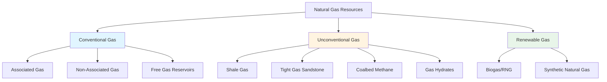

## Natural Gas Resource Types

Natural gas resources are classified based on geological formation characteristics, extraction methodologies, and reservoir properties. Understanding these distinctions is critical for HVAC professionals evaluating fuel supply reliability, composition variability, and heating value consistency for combustion equipment design.

### Classification Framework

Natural gas deposits are categorized into two primary groups: conventional and unconventional resources. Conventional gas accumulates in high-permeability reservoirs where vertical drilling and natural pressure enable economic extraction. Unconventional resources require enhanced recovery techniques such as hydraulic fracturing or horizontal drilling due to low-permeability formations.

### Conventional Natural Gas Resources

**Associated Gas** originates from crude oil reservoirs where dissolved hydrocarbons separate during pressure reduction. This gas emerges as a byproduct of petroleum extraction and typically contains higher concentrations of heavier hydrocarbons (ethane, propane, butane) compared to non-associated sources. Composition variability affects heating value and combustion characteristics.

The heating value of associated gas ranges from 1,050 to 1,150 BTU/ft³ due to C₂+ content:

$$HHV_{gas} = \sum_{i=1}^{n} y_i \cdot HHV_i$$

where $y_i$ represents the mole fraction of component $i$ and $HHV_i$ is the higher heating value of that component.

**Non-Associated Gas** accumulates in dedicated gas reservoirs independent of oil deposits. These formations yield gas with more consistent methane content (typically 85-95% CH₄) and predictable heating values near 1,030 BTU/ft³. Pipeline quality specifications (ASTM D3588) favor non-associated sources for residential and commercial HVAC applications.

### Unconventional Natural Gas Resources

**Shale Gas** is trapped within low-permeability sedimentary rock formations. Horizontal drilling and hydraulic fracturing enable commercial production. Shale gas typically exhibits high methane purity (90-95%) with minimal inert content. The Marcellus, Barnett, and Haynesville formations supply significant volumes to North American distribution networks.

**Tight Gas Sandstone** refers to gas contained in sandstone or carbonate formations with permeability less than 0.1 millidarcy. Enhanced recovery techniques are required. Composition mirrors conventional non-associated gas but extraction costs are higher, affecting long-term fuel pricing for large commercial HVAC installations.

**Coalbed Methane (CBM)** forms during coal maturation and adsorbs onto the coal matrix surface. Dewatering and depressurization release the gas. CBM contains 90-98% methane but may include elevated CO₂ levels (2-10%), requiring treatment before pipeline injection. Heating value ranges from 950 to 1,050 BTU/ft³.

The methane adsorption capacity follows the Langmuir isotherm:

$$V = \frac{V_L P}{P_L + P}$$

where $V$ is gas volume adsorbed, $V_L$ is Langmuir volume constant, $P$ is pressure, and $P_L$ is Langmuir pressure constant.

**Gas Hydrates** are crystalline solids formed when natural gas molecules occupy water lattices under high pressure and low temperature conditions. Extensive deposits exist in oceanic sediments and permafrost regions. Commercial extraction remains technically challenging and economically unviable as of 2024.

### Renewable Natural Gas

**Biogas** and **Renewable Natural Gas (RNG)** derive from anaerobic digestion of organic waste (agricultural residues, wastewater, landfills). Raw biogas contains 50-70% CH₄, 30-50% CO₂, plus trace H₂S and moisture. Upgrading to pipeline quality (>95% CH₄) produces RNG compatible with conventional HVAC combustion equipment. Heating value after processing approximates fossil natural gas at 1,000-1,030 BTU/ft³.

### Resource Comparison for HVAC Applications

| Resource Type | Methane Content | Heating Value (HHV) | Composition Stability | Pipeline Compatibility | Extraction Method |
|---------------|-----------------|---------------------|----------------------|------------------------|-------------------|
| Non-Associated Gas | 85-95% | 1,020-1,050 BTU/ft³ | High | Excellent | Conventional drilling |
| Associated Gas | 70-90% | 1,050-1,150 BTU/ft³ | Moderate | Good (requires processing) | Oil well byproduct |
| Shale Gas | 90-95% | 1,000-1,030 BTU/ft³ | High | Excellent | Hydraulic fracturing |
| Tight Gas | 85-95% | 1,020-1,050 BTU/ft³ | High | Excellent | Enhanced recovery |
| Coalbed Methane | 90-98% | 950-1,050 BTU/ft³ | Moderate (CO₂ variable) | Good (requires treatment) | Dewatering/depressurization |
| Biogas/RNG | 95-98% (processed) | 1,000-1,030 BTU/ft³ | High (post-treatment) | Excellent | Upgrading/purification |

### HVAC Design Considerations

Gas composition affects combustion air requirements and flame characteristics. Wobbe Index quantifies fuel interchangeability:

$$WI = \frac{HHV}{\sqrt{SG}}$$

where $HHV$ is higher heating value and $SG$ is specific gravity relative to air. Maintaining Wobbe Index within ±5% ensures consistent burner performance across resource types.

Modern condensing furnaces and boilers achieve 90-98% AFUE with pipeline-quality gas regardless of geological origin. Equipment manufacturers design for gas meeting ANSI Z223.1/NFPA 54 specifications, which establish acceptable ranges for heating value (980-1,150 BTU/ft³) and specific gravity (0.55-0.70).

### Standards and Specifications

Pipeline gas quality is governed by:
- **ASTM D3588**: Standard Practice for Calculating Heat Value, Compressibility Factor, and Relative Density of Gaseous Fuels
- **ISO 6976**: Natural Gas - Calculation of Calorific Values, Density, Relative Density and Wobbe Index
- **GPA 2145**: Table of Physical Properties for Hydrocarbons and Other Compounds
- **AGA Report No. 8**: Compressibility Factors of Natural Gas and Other Related Hydrocarbon Gases

Gas utilities blend supplies from multiple sources to maintain contractual heating value specifications, ensuring consistent HVAC system performance regardless of upstream resource type.
