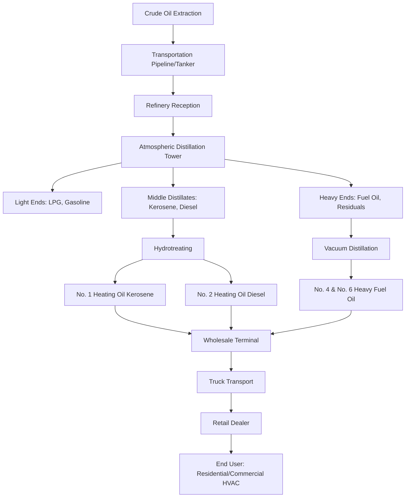

Petroleum remains a significant energy source for HVAC heating systems, particularly in regions where natural gas infrastructure is limited. Understanding petroleum resources, refining processes, and heating fuel products is fundamental for HVAC professionals working with oil-fired equipment.

## Crude Oil Classification

Crude oil varies in composition and properties based on its geological origin. The American Petroleum Institute (API) gravity scale classifies crude oil density, which directly affects refining yields and product characteristics.

**Crude Oil Types by API Gravity:**

| Crude Type | API Gravity | Specific Gravity | Characteristics | HVAC Relevance |
|------------|-------------|------------------|-----------------|----------------|
| Light crude | >31.1° | <0.87 | High gasoline/distillate yield | Produces quality heating oils |
| Medium crude | 22.3-31.1° | 0.87-0.92 | Balanced product yield | Standard heating oil source |
| Heavy crude | 10-22.3° | 0.92-1.0 | High residual fuel yield | Heavy fuel oil production |
| Extra heavy | <10° | >1.0 | Requires extensive processing | Limited HVAC applications |

Light and medium crudes produce higher yields of distillate fuels (diesel and heating oil) with less refining intensity, making them preferred feedstocks for HVAC heating fuel production.

## Petroleum Refining Process

Crude oil undergoes fractional distillation to separate components by boiling point. This process is critical for producing the middle distillates used in HVAC heating systems.

The atmospheric distillation column operates at 650-700°F at the bottom, separating crude into fractions based on boiling point ranges. Middle distillates boil between 350-650°F, producing the primary HVAC heating fuels.

**Distillation Temperature Ranges:**

- Light ends (gas/gasoline): <400°F
- Kerosene/No. 1 heating oil: 350-500°F
- Diesel/No. 2 heating oil: 400-650°F
- Heavy fuel oil: 650°F+ (requires vacuum distillation)

## Heating Oil Products

The ASTM D396 standard defines heating oil grades used in HVAC systems. Each grade has distinct properties affecting burner design, storage, and system performance.

**ASTM Heating Oil Grades:**

| Grade | Common Name | Viscosity (cSt @ 40°C) | Pour Point | BTU/gal | Primary HVAC Application |
|-------|-------------|------------------------|------------|---------|--------------------------|
| No. 1 | Kerosene | 1.3-2.2 | -40°F | 135,000 | Cold climate residential, portable heaters |
| No. 2 | Heating Oil | 2.0-3.6 | -6 to +20°F | 140,000 | Residential/commercial furnaces, boilers |
| No. 4 (Light) | Distillate-residual blend | 5.8-24 | -6 to +20°F | 145,000 | Large commercial/industrial |
| No. 4 (Heavy) | Residual blend | 12-24 | +10 to +30°F | 148,000 | Industrial boilers (preheating required) |
| No. 6 | Bunker C / Residual | 900+ | +30 to +60°F | 152,000 | Large industrial (extensive preheating) |

No. 2 heating oil dominates residential and commercial HVAC applications, accounting for approximately 85% of heating oil consumption according to EIA data. Its viscosity and pour point allow year-round use without preheating in most climates.

## Fuel Properties and Performance

Heating value, viscosity, and sulfur content directly impact HVAC system efficiency and emissions.

**Energy Content:** No. 2 heating oil delivers approximately 140,000 BTU/gallon (higher heating value). At 85% combustion efficiency, this provides 119,000 BTU/gallon net usable heat. For comparison, natural gas at 1,030 BTU/ft³ and 95% efficiency delivers equivalent heat from approximately 122 ft³.

**Viscosity:** No. 2 heating oil viscosity of 2.0-3.6 cSt (centistokes) at 40°C ensures proper atomization in pressure-atomizing burners. Cold weather increases viscosity, potentially affecting spray patterns. Indoor tank storage maintains adequate fluidity in most climates.

**Sulfur Content:** EPA regulations limit residential heating oil to 15 ppm sulfur (ultra-low sulfur heating oil - ULSHO) in most areas, reducing SO₂ emissions and enabling advanced combustion controls. Historical high-sulfur fuel (2,000-5,000 ppm) caused corrosion and air quality concerns.

## Distribution Infrastructure

Petroleum products reach HVAC end-users through a multi-stage distribution network. According to EIA statistics, the United States maintains approximately 1,300 petroleum product terminals serving wholesale distribution.

**Distribution Chain:**

1. **Refinery output**: Middle distillates pumped to pipeline or loaded onto barges/tankers
2. **Pipeline transport**: Major product pipelines (Colonial, Plantation, Explorer) move fuel to regional terminals
3. **Wholesale terminals**: Bulk storage facilities (typical capacity: 50,000-500,000 barrels) near consumption centers
4. **Retail dealers**: Local fuel distributors operate truck fleets (typical capacity: 2,500-5,000 gallons per truck)
5. **End-user storage**: Residential tanks (275-1,000 gallons) or commercial tanks (1,000-20,000+ gallons)

The heating oil supply chain operates seasonally, with terminal inventories building during summer and depleting through winter heating season. EIA tracks weekly inventory levels, with total U.S. distillate stocks typically ranging from 110-180 million barrels depending on season and demand.

## Regional Considerations

Heating oil use concentrates in the Northeast United States, where approximately 5.5 million households rely on oil heat (about 80% of U.S. heating oil residential consumption). This regional concentration exists because:

- Earlier development predated natural gas pipeline expansion
- High cost of gas pipeline conversion in dense urban areas
- Geology limits local natural gas production in some regions

Cold climate formulations blend No. 1 (kerosene) with No. 2 heating oil to lower pour point and prevent gelling. Typical winter blends contain 10-50% kerosene depending on anticipated minimum temperatures.

## Supply and Pricing

EIA petroleum data indicates U.S. heating oil prices correlate closely with crude oil prices and refinery margins. Residential heating oil prices average $0.50-$1.50 per gallon above crude oil cost (on energy-equivalent basis), reflecting refining, distribution, and retail margins.

**Price Volatility Factors:**

- Crude oil price fluctuations (largest component)
- Refinery utilization and maintenance schedules
- Regional inventory levels
- Weather-driven demand spikes
- Diesel fuel competition (same distillate pool)

HVAC system designers in oil-heat regions must account for fuel cost variability when conducting lifecycle economic analyses, particularly when comparing oil-fired equipment to electric heat pumps or natural gas alternatives.

## Future Outlook

Renewable heating oil blends (Bioheat) incorporating biodiesel are gaining adoption, particularly in Northeast markets. These blends (B5, B10, B20 designating 5%, 10%, 20% biodiesel) reduce carbon intensity while maintaining compatibility with existing HVAC equipment and distribution infrastructure. However, petroleum-derived heating oil will remain significant in regions without natural gas access for the foreseeable future.
