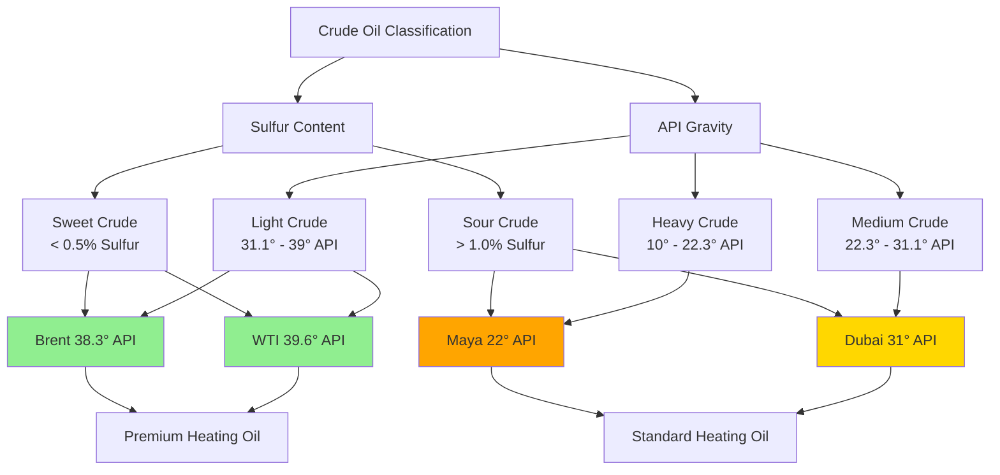

Crude oil classification systems define petroleum characteristics critical to refining efficiency, heating fuel production, and combustion equipment design. Understanding crude oil types enables proper fuel selection for oil-fired HVAC systems and accurate prediction of refinery product yields.

## API Gravity Classification

The American Petroleum Institute (API) gravity scale measures crude oil density relative to water at 60°F (15.6°C). This dimensionless scale inversely correlates with specific gravity—higher API gravity indicates lighter, less dense crude oil.

**API Gravity Formula:**

API Gravity = (141.5 / Specific Gravity at 60°F) - 131.5

### Density-Based Categories

| Classification | API Gravity | Specific Gravity | Characteristics |
|----------------|-------------|------------------|-----------------|
| Extra Heavy | < 10° | > 1.0 | Denser than water, flows poorly |
| Heavy | 10° - 22.3° | 0.920 - 1.0 | High viscosity, requires heating for transport |
| Medium | 22.3° - 31.1° | 0.870 - 0.920 | Moderate refining complexity |
| Light | 31.1° - 39° | 0.825 - 0.870 | Low viscosity, high gasoline yield |
| Super Light | > 39° | < 0.825 | Very low density, high value |

Light crude oils yield greater proportions of gasoline, diesel, and heating oil per barrel, making them more valuable feedstock for refineries producing HVAC heating fuels. Heavy crude requires more intensive processing, including catalytic cracking and coking, to produce usable distillate heating oils.

## Sulfur Content Classification

Sulfur content directly impacts combustion emissions, equipment corrosion rates, and refining costs. The classification distinguishes crude oils based on weight percentage of sulfur compounds.

### Sweet vs Sour Crude

| Classification | Sulfur Content | Characteristics |
|----------------|----------------|-----------------|
| Sweet | < 0.5% | Low corrosivity, minimal SO₂ emissions |
| Intermediate | 0.5% - 1.0% | Moderate processing requirements |
| Sour | > 1.0% | High corrosivity, requires desulfurization |
| High Sour | > 2.0% | Extensive refining needed |

**Sweet crude** oils produce cleaner-burning heating fuels with lower sulfur dioxide (SO₂) emissions. Equipment burning fuels from sweet crude experiences reduced corrosion in heat exchangers, combustion chambers, and exhaust systems. Refineries processing sweet crude require less hydrodesulfurization capacity.

**Sour crude** oils contain hydrogen sulfide (H₂S), mercaptans, and other sulfur compounds. While less expensive than sweet crude, sour grades require hydrodesulfurization units to meet EPA and state emission standards for heating oil (currently 15 ppm sulfur maximum for ultra-low sulfur heating oil).

## Benchmark Crude Standards

Global oil markets reference specific crude grades as pricing benchmarks. These standards provide quality baselines for international petroleum trade and derivative fuel pricing.

### Major Benchmark Crudes

| Benchmark | API Gravity | Sulfur Content | Classification | Production Region |
|-----------|-------------|----------------|----------------|-------------------|
| WTI (West Texas Intermediate) | 39.6° | 0.24% | Light Sweet | United States (Texas, Oklahoma) |
| Brent Blend | 38.3° | 0.37% | Light Sweet | North Sea (UK, Norway) |
| Dubai Crude | 31° | 2.0% | Medium Sour | United Arab Emirates |
| Urals | 32° | 1.3% | Medium Sour | Russia |
| Maya | 22° | 3.3% | Heavy Sour | Mexico (Gulf of Mexico) |

**West Texas Intermediate (WTI)** represents the highest quality benchmark—light and sweet with excellent refining economics for heating oil production. Its low sulfur content produces ultra-low sulfur heating oil (ULSHO) with minimal processing.

**Brent Blend** serves as the global pricing reference for Atlantic Basin crude oils. Slightly heavier and more sulfurous than WTI, Brent still produces high-quality distillate fuels suitable for residential and commercial heating systems.

**Heavier benchmarks** like Dubai and Maya require more extensive refining. While these crudes cost less per barrel, the additional processing to remove sulfur and crack heavy molecules into middle distillates increases the delivered cost of heating oil derivatives.

## Impact on Heating Fuel Quality

The crude oil source directly influences heating oil specifications:

**From Light Sweet Crude:**
- Higher cetane index (better ignition quality)
- Lower pour point (improved cold weather performance)
- Reduced sediment formation
- Minimal fuel system corrosion
- Lower particulate emissions

**From Heavy Sour Crude:**
- Requires hydroprocessing for sulfur removal
- Higher aromatic content
- Increased tendency for sludge formation
- Elevated NOₓ and particulate emissions without treatment
- May require fuel additives for stability

## Refinery Processing Implications

Light crude oils pass through atmospheric distillation with minimal secondary processing. The middle distillate cut (360°F - 640°F boiling range) yields heating oil directly. Heavy crude requires:

1. **Vacuum distillation** to recover additional distillates
2. **Catalytic cracking** to break heavy molecules
3. **Hydrodesulfurization** to meet emission standards
4. **Hydrotreating** to improve stability and color

These additional steps increase refining costs by $8-15 per barrel but enable utilization of less expensive crude feedstock while meeting ASTM D396 specifications for heating oil.

## Crude Selection for HVAC Applications

Heating equipment manufacturers design combustion systems around fuel properties derived from specific crude grades. Oil-fired boilers, furnaces, and water heaters perform optimally with No. 2 heating oil meeting these characteristics:

- API gravity: 30° - 38°
- Sulfur content: < 15 ppm (ULSHO standard)
- Flash point: > 100°F (safety requirement)
- Pour point: < 0°F (cold climate operation)

These specifications favor light sweet crude sources or properly refined products from medium crude oils. Equipment longevity, efficiency, and emission compliance depend on consistent fuel quality traceable to crude oil classification.
