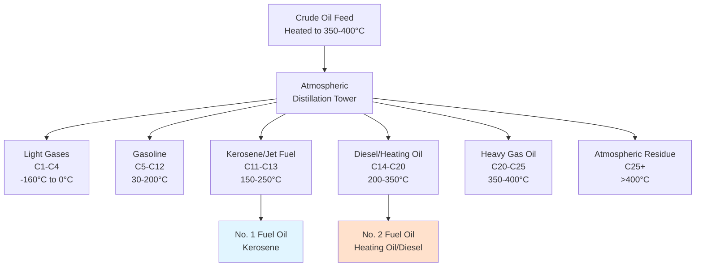

## Overview of Distillate Fuels

Distillate fuel oils represent the middle-range products obtained from petroleum fractional distillation, encompassing materials that vaporize between approximately 150°C and 400°C. For HVAC applications, the primary distillate products are kerosene (No. 1 fuel oil), diesel/heating oil (No. 2 fuel oil), and intermediate grades that serve space heating, water heating, and combined heat and power systems.

The term "distillate" distinguishes these fuels from residual oils, which remain after the distillation process removes lighter fractions. Distillate fuels exhibit superior combustion characteristics, lower viscosity, reduced ash content, and minimal sulfur compared to residual products, making them preferable for residential and commercial heating equipment.

## Fractional Distillation Process

Petroleum distillate separation relies on differences in boiling point ranges among hydrocarbon molecules of varying chain lengths. The process occurs in atmospheric distillation towers operating at near-atmospheric pressure.

The atmospheric tower operates with temperature gradients: hottest at the bottom (350-400°C) where heavy residues collect, coolest at the top (30-50°C) where light gases exit. Side-stream drawoffs at intermediate heights capture specific boiling ranges corresponding to desired distillate products.

## HVAC-Relevant Distillate Categories

### No. 1 Fuel Oil (Kerosene)

Kerosene represents the lightest distillate used for heating, with carbon chain lengths predominantly C₁₁-C₁₃. It exhibits excellent cold weather properties with pour points below -40°C and low viscosity enabling reliable atomization in vaporizing burners and wick-fed appliances.

Applications include portable heaters, airport terminal heating, and wick-type space heaters. The fuel's high volatility enables clean combustion with minimal soot formation but requires careful handling due to increased flammability compared to heavier grades.

### No. 2 Fuel Oil (Heating Oil/Diesel)

No. 2 fuel oil constitutes the dominant distillate for residential and commercial heating systems. The designation encompasses both heating oil (specification ASTM D396 Grade No. 2) and automotive diesel fuel (ASTM D975), which share similar distillation ranges (C₁₄-C₂₀) but differ in additive packages and regulatory requirements.

This grade offers optimal balance between energy density, viscosity for pump systems, and safety characteristics. Modern formulations incorporate ultra-low sulfur content (≤15 ppm) to meet air quality regulations while maintaining lubricity through additive packages.

### No. 1-D and No. 2-D Blends

Blended products combining No. 1 and No. 2 characteristics address seasonal requirements in cold climates. Winter blends increase the proportion of lighter kerosene-range material to improve cold flow properties while maintaining the energy density advantages of No. 2 fuel.

## Physical and Combustion Properties

| Property | No. 1 Fuel Oil | No. 2 Fuel Oil | Test Method | Specification |
|----------|----------------|----------------|-------------|---------------|
| **Distillation Range** | 150-250°C | 200-350°C | ASTM D86 | ASTM D396 |
| **Flash Point** | 38-72°C | >38°C (min) | ASTM D93 | Safety threshold |
| **Pour Point** | -40°C to -20°C | -6°C to -15°C | ASTM D97 | Cold flow limit |
| **Viscosity at 40°C** | 1.3-2.2 cSt | 2.0-3.6 cSt | ASTM D445 | Atomization quality |
| **Specific Gravity** | 0.78-0.81 | 0.82-0.86 | ASTM D4052 | Density measure |
| **Sulfur Content** | ≤15 ppm (ULSD) | ≤15 ppm (ULSD) | ASTM D5453 | Emissions control |
| **Cetane Number** | 40-45 | 40-55 | ASTM D613 | Ignition quality |
| **Carbon Residue** | <0.01% | <0.35% | ASTM D524 | Deposit tendency |

## Heating Value and Energy Content

The heating value represents the total thermal energy released during complete combustion per unit mass or volume of fuel. Two measures characterize fuel energy content:

**Higher Heating Value (HHV):** Includes latent heat of water vapor condensation:

$$
\text{HHV} = \text{LHV} + h_{fg} \times m_{H_2O}
$$

where:
- $h_{fg}$ = latent heat of vaporization for water (2257 kJ/kg at standard conditions)
- $m_{H_2O}$ = mass of water produced per unit fuel mass

**Lower Heating Value (LHV):** Excludes condensation energy (water vapor remains gaseous):

$$
\text{LHV} = \text{HHV} - h_{fg} \times (9 \times H)
$$

where:
- $H$ = hydrogen mass fraction in fuel (typically 0.12-0.14 for distillates)
- Factor of 9 represents mass of water produced per unit mass of hydrogen combusted

### Typical Heating Values

| Fuel Type | HHV (MJ/kg) | HHV (MJ/L) | LHV (MJ/kg) | LHV (MJ/L) | HHV (Btu/gal) |
|-----------|-------------|------------|-------------|------------|---------------|
| No. 1 Fuel Oil | 46.4 | 37.3 | 43.2 | 34.7 | 134,000 |
| No. 2 Fuel Oil | 45.5 | 38.7 | 42.5 | 36.2 | 140,000 |
| Diesel (On-road) | 45.8 | 38.6 | 43.0 | 36.3 | 139,000 |

The volumetric heating value (MJ/L or Btu/gal) proves more relevant for HVAC design since fuel storage and delivery occurs volumetrically. No. 2 fuel oil delivers approximately 4-5% more energy per gallon than No. 1, offsetting its slightly higher cost per gallon in many applications.

## Combustion Efficiency Calculations

The theoretical combustion efficiency for complete oxidation of a hydrocarbon fuel:

$$
\eta_{comb} = \frac{Q_{delivered}}{Q_{input}} = \frac{\text{LHV} \times \dot{m}_{fuel} - \dot{Q}_{stack} - \dot{Q}_{losses}}{\text{LHV} \times \dot{m}_{fuel}}
$$

where:
- $\dot{m}_{fuel}$ = fuel mass flow rate
- $\dot{Q}_{stack}$ = sensible energy lost in flue gases
- $\dot{Q}_{losses}$ = radiation and convection losses from equipment

Modern condensing boilers recover latent heat from water vapor, enabling effective efficiency exceeding 90% based on HHV (>95% based on LHV).

## Fuel Oil Grade Specifications

### ASTM D396 Standard Specification

ASTM D396 defines six grades of fuel oil (No. 1, No. 2, No. 4-Light, No. 4, No. 5-Light, No. 5-Heavy, No. 6) with grades 1-2 representing distillates and grades 4-6 representing increasingly viscous residual or blended fuels.

**Critical specification parameters for HVAC applications:**

- **Flash point:** Minimum 38°C (100°F) for safe handling and storage
- **Water and sediment:** Maximum 0.05% by volume to prevent injector fouling
- **Ash content:** Maximum 0.01-0.10% depending on grade
- **Carbon residue:** Indicates coking tendency on burner surfaces
- **Copper strip corrosion:** Maximum No. 3 rating after 3 hours at 50°C

### Ultra-Low Sulfur Distillate

Post-2006 regulations mandate ultra-low sulfur distillate (ULSD) containing ≤15 ppm sulfur for both on-road diesel and heating oil in many jurisdictions. This reduction minimizes SO₂ emissions but reduces natural lubricity, necessitating lubricity additives to prevent fuel system wear.

## Storage and Handling Considerations

**Tank materials:** Steel or fiberglass-reinforced plastic (FRP) tanks suitable for underground or above-ground installation. Steel tanks require cathodic protection for underground service.

**Venting requirements:** Atmospheric storage tanks require pressure/vacuum relief vents sized per NFPA 30 to accommodate thermal expansion and pump withdrawal rates.

**Water separation:** Distillate fuels can absorb minimal water (50-100 ppm solubility) with excess forming free water phase promoting microbial growth. Tank bottoms should slope to drain sumps for periodic water removal.

**Cold weather operation:** No. 2 fuel oil contains paraffin waxes that crystallize at temperatures approaching the cloud point (typically -3°C to +5°C). Winterization strategies include heated fuel lines, tank heating, or blending with No. 1 fuel oil to depress cloud and pour points.

## Fuel Quality Management

**Additive packages** enhance distillate fuel performance:

- **Biocides:** Control bacterial and fungal growth in water-contaminated fuel
- **Stabilizers:** Prevent oxidation and polymer formation during long-term storage
- **Combustion catalysts:** Reduce soot formation and improve efficiency
- **Pour point depressants:** Modify wax crystal structure to improve cold flow
- **Lubricity improvers:** Restore boundary lubrication lost with sulfur removal

**Testing protocols** verify fuel quality:

- Periodic sampling from tank bottom detects water accumulation and sediment
- Cloud point testing before heating season confirms cold flow adequacy
- Microbial testing (ATP or culture methods) identifies biological contamination
- Stability testing (ASTM D2274) for stored fuels exceeding one year

## Applications in Modern HVAC Systems

Distillate fuels serve multiple roles in contemporary heating systems:

**Residential heating:** Oil-fired boilers and furnaces predominantly use No. 2 fuel oil with conversion efficiencies reaching 85-95% (condensing designs).

**Commercial installations:** Larger buildings employ centralized boiler plants with capacities from 500,000 to 50,000,000 Btu/hr using No. 2 or blended fuels.

**Emergency backup:** Diesel generators providing emergency power for critical HVAC systems (hospitals, data centers) operate on No. 2-D fuel meeting dual specifications for heating and engine service.

**Combined heat and power:** Reciprocating engines or microturbines burning diesel or No. 2 fuel oil generate electricity while capturing waste heat for building thermal loads, achieving overall efficiencies exceeding 80%.

The future trajectory for distillate fuels in HVAC involves increasing biodiesel blending (B5-B20), renewable diesel adoption, and gradual transition to ultra-low-carbon alternatives while maintaining compatibility with existing infrastructure.

