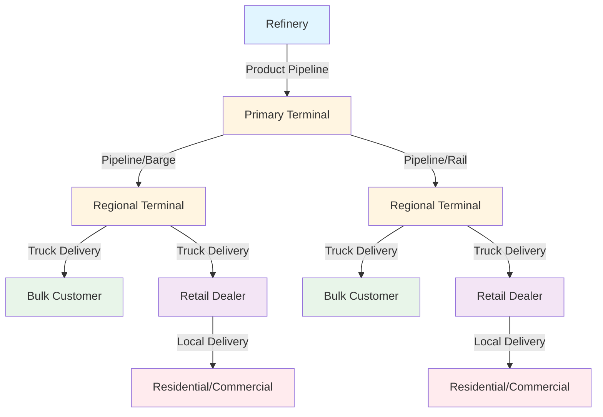

## Distribution Network Overview

Petroleum distribution infrastructure represents the critical link between refineries and end-use heating systems. The U.S. petroleum distribution network comprises approximately 200,000 miles of liquid petroleum pipelines, thousands of storage terminals, and extensive marine and ground transportation systems. For HVAC applications, this infrastructure ensures reliable delivery of heating oil (#2 fuel oil) and propane to residential, commercial, and industrial facilities.

The Energy Information Administration (EIA) reports that the petroleum supply chain moves over 18 million barrels per day of refined products across the United States, with heating oil representing a significant portion of winter demand in the Northeast and Mid-Atlantic regions.

## Pipeline Transportation

Pipeline systems form the backbone of petroleum product distribution, offering the most efficient and cost-effective method for long-distance transport.

### Product Pipelines

Product pipelines transport refined petroleum products from refineries to distribution terminals. These systems operate under pressure ranging from 400 to 1,200 psi and move products at velocities of 3-8 feet per second. Pipeline diameters vary from 8 to 40 inches, with larger diameter lines serving major demand centers.

Key pipeline characteristics:

- **Batch sequencing**: Multiple products move through the same pipeline in sequential batches
- **Interface management**: Controlled mixing zones between different products
- **Flow rate optimization**: Typically 50,000-300,000 barrels per day depending on diameter
- **Energy efficiency**: 0.03-0.04 kWh per barrel-mile, significantly lower than alternative transport modes

### Pipeline Infrastructure Components

Modern pipeline systems incorporate sophisticated monitoring and control technology:

- **SCADA systems**: Real-time monitoring of flow, pressure, and temperature
- **Leak detection**: Computational pipeline monitoring with 1% accuracy
- **Pump stations**: Located every 50-100 miles to maintain pressure
- **Valve stations**: Isolation capability every 10-20 miles for safety

## Transportation Modes Comparison

The petroleum distribution system utilizes multiple transportation modes, each optimized for specific distances and delivery requirements.

| Transportation Mode | Capacity | Range | Speed | Cost per Barrel-Mile | Typical Application |
|---------------------|----------|-------|-------|---------------------|---------------------|
| Pipeline | 50,000-300,000 bbl/day | 500-3,000 miles | 3-5 mph | $0.02-0.04 | Refinery to terminal |
| Marine Tanker (Coastal) | 80,000-500,000 barrels | 500-5,000 miles | 10-15 knots | $0.03-0.06 | Coastal distribution |
| Marine Barge (Inland) | 10,000-50,000 barrels | 100-2,000 miles | 5-8 mph | $0.04-0.08 | River/canal transport |
| Rail Tank Car | 25,000-30,000 gal/car | 500-3,000 miles | 25-40 mph | $0.10-0.20 | Terminal to terminal |
| Truck Transport | 8,000-11,000 gallons | 50-500 miles | 45-55 mph | $0.30-0.60 | Local delivery |

## Marine Transport

Marine transportation plays a crucial role in petroleum distribution, particularly for coastal markets and regions accessible via inland waterways.

### Coastal Tankers

Coastal tanker vessels transport petroleum products between refineries and coastal terminals. These vessels range from 5,000 to 50,000 deadweight tons, with heating oil shipments concentrated during the October-March heating season. Jones Act requirements mandate that vessels operating between U.S. ports must be U.S.-flagged, built, and crewed.

### Inland Waterway Barges

River barge systems utilize the Mississippi River system, Intracoastal Waterway, and Great Lakes to transport petroleum products. Standard barges carry 10,000-50,000 barrels and operate in tow configurations of 15-40 barges, making them highly efficient for bulk movements.

## Storage Infrastructure

Storage capacity throughout the distribution network ensures supply reliability during demand fluctuations and supply disruptions.

### Terminal Storage

Distribution terminals maintain 7-30 days of inventory based on seasonal demand patterns. Northeast heating oil terminals typically increase storage levels from 20 million barrels in summer to 50 million barrels before winter heating season.

| Storage Type | Capacity Range | Construction | Typical Use |
|--------------|----------------|--------------|-------------|
| Cone Roof Tank | 10,000-80,000 barrels | Carbon steel, fixed roof | Heating oil, diesel |
| Floating Roof Tank | 50,000-500,000 barrels | Carbon steel, floating roof | Gasoline, crude |
| Underground Tank | 10,000-50,000 gallons | Steel/fiberglass | Retail, commercial |
| Aboveground Residential | 275-1,000 gallons | Steel | Single-family heating |

### Storage Tank Design Considerations

Terminal storage tanks incorporate specific design features for petroleum products:

- **API 650 construction**: Industry standard for welded steel tanks
- **Secondary containment**: Dike walls containing 110% of tank volume
- **Vapor recovery systems**: Capture emissions during filling operations
- **Temperature maintenance**: Heating coils for heavy fuel oils in cold climates
- **Leak detection**: Interstitial monitoring and inventory reconciliation

## Local Delivery Systems

The final distribution stage involves truck delivery from terminals to end users.

### Delivery Truck Specifications

Modern heating oil delivery trucks range from 2,500-gallon local delivery vehicles to 8,000-gallon bulk transport units. Trucks feature:

- **Compartmentalized tanks**: Multiple compartments for mixed product delivery
- **Metered delivery**: Electronic flow meters with 0.5% accuracy
- **Spill prevention**: Overfill alarms and automatic shutoff systems
- **Remote monitoring**: GPS tracking and route optimization

### Delivery Efficiency Factors

Local delivery efficiency depends on several variables:

- **Customer density**: Urban routes deliver 8,000-12,000 gallons per day vs. 4,000-6,000 in rural areas
- **Seasonal demand**: Winter deliveries increase 300-400% in northern markets
- **Tank size distribution**: Residential tanks typically 275-500 gallons, requiring 150-300 gallon average deliveries
- **Degree day tracking**: Automated delivery scheduling based on heating degree days (HDD)

## Distribution System Reliability

The petroleum distribution infrastructure maintains high reliability through redundancy and strategic positioning.

Key reliability metrics:

- **Multiple supply sources**: Terminals receive product from 2-4 different pipelines or marine facilities
- **Strategic reserves**: Northeast Heating Oil Reserve provides 1 million barrels emergency supply
- **Seasonal inventory build**: Pre-winter storage increases mitigate supply disruptions
- **Alternative routing**: Pipeline interconnections allow rerouting during maintenance

Distribution system bottlenecks occur primarily during peak winter demand when multiple factors converge: extreme cold weather, increased consumption, and potential weather-related logistics disruptions. The industry addresses this through advance planning, inventory management, and coordinated supply chain operations.

## Infrastructure Maintenance

Ongoing maintenance ensures system integrity and safety:

- **Pipeline integrity programs**: In-line inspection tools (smart pigs) detect corrosion and defects
- **Cathodic protection**: Prevents external pipeline corrosion
- **Tank inspection**: API 653 requires internal inspection every 10-20 years
- **Vapor control systems**: Regular testing ensures emissions compliance
- **Emergency response**: Spill response equipment and trained personnel at all terminals

The petroleum distribution infrastructure represents a mature, highly efficient system optimized over decades of operation. Understanding this infrastructure is essential for HVAC professionals specifying heating systems, as distribution reliability and cost directly impact heating system design choices and operational economics.

