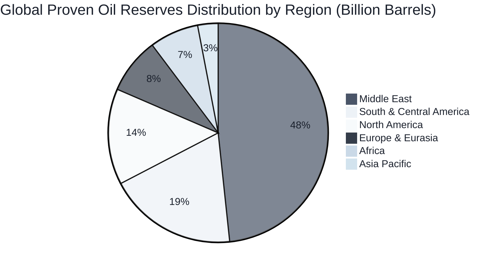

Global petroleum reserves represent the foundation of heating fuel supply for millions of residential, commercial, and industrial HVAC systems worldwide. Understanding reserve distribution, production rates, and depletion trajectories is fundamental to long-term energy planning and the economics of petroleum-based heating systems.

## Proven Reserves Overview

Proven oil reserves are quantities of petroleum that geological and engineering data demonstrate with reasonable certainty to be recoverable under existing economic and operational conditions. These reserves form the basis for global energy security assessments and influence heating fuel availability and pricing.

As of 2024, global proven oil reserves total approximately 1.73 trillion barrels. This represents a 53-year supply at current production rates, though this ratio varies dramatically by region and fails to account for future discovery, technological advancement, or demand changes.

## Regional Reserve Distribution

The geographic concentration of petroleum reserves has profound implications for heating oil markets and HVAC system fuel security.

| Region | Proven Reserves (Billion Barrels) | Percentage of Global Total | Reserve-to-Production Ratio (Years) |
|--------|-----------------------------------|----------------------------|-------------------------------------|
| Middle East | 836.0 | 48.3% | 79 |
| South & Central America | 329.0 | 19.0% | 134 |
| North America | 245.0 | 14.2% | 28 |
| Africa | 125.0 | 7.2% | 41 |
| Europe & Eurasia | 143.0 | 8.3% | 24 |
| Asia Pacific | 52.0 | 3.0% | 15 |

**Source: OPEC Annual Statistical Bulletin, EIA International Energy Statistics**

The Middle East's dominant position, holding nearly half of global reserves, creates supply concentration risk for heating fuel markets. Venezuela and Saudi Arabia alone account for approximately 35% of worldwide proven reserves.

## Production Rates and Depletion

Current global oil production averages 94 million barrels per day. The relationship between reserves and production determines resource longevity and influences heating fuel economics.

### Reserve-to-Production Ratios by Major Producers

| Country | Proven Reserves (Billion Barrels) | Daily Production (Million Barrels) | R/P Ratio (Years) |
|---------|-----------------------------------|-----------------------------------|-------------------|
| Venezuela | 303.8 | 0.76 | 1,095 |
| Saudi Arabia | 297.5 | 10.5 | 77.5 |
| Canada | 168.1 | 5.2 | 88.5 |
| Iran | 157.8 | 3.8 | 113.7 |
| Iraq | 145.0 | 4.5 | 88.2 |
| Russia | 107.8 | 10.9 | 27.1 |
| United States | 68.8 | 18.9 | 10.0 |

**Data: EIA Petroleum & Other Liquids, OPEC Production Reports**

The United States demonstrates a low R/P ratio despite substantial reserves, reflecting intensive production from unconventional sources including tight oil and shale formations. This production rate dependence on hydraulic fracturing technology introduces operational risks affecting heating oil supply stability.

## Reserve Categories and Quality

Not all reserves are equivalent from a heating fuel perspective. Classification by extraction method and crude quality affects refining economics and heating oil production costs.

### Conventional vs. Unconventional Reserves

**Conventional reserves** (approximately 70% of total):
- Traditional vertical wells
- Lower extraction costs
- Higher API gravity crude (lighter, easier to refine)
- Primary source for distillate heating oils

**Unconventional reserves** (approximately 30% of total):
- Oil sands (Canada: 168 billion barrels)
- Extra-heavy oil (Venezuela: 220 billion barrels)
- Tight oil/shale (USA: 45 billion barrels)
- Higher production costs ($40-80/barrel vs. $10-30/barrel conventional)
- Increased refining complexity

The shift toward unconventional reserves increases the break-even cost for heating oil production, affecting HVAC operating economics in petroleum-dependent systems.

## Global Reserve Distribution

## Depletion Projections

Reserve depletion rates vary substantially based on production intensity, discovery rates, and technological extraction improvements. For HVAC applications, three depletion scenarios warrant consideration:

**Base Case** (current production rates): Global reserves support 53 years of production, though regional disparities create supply disruptions independent of global totals.

**Accelerated Depletion** (2% annual production increase): Reduces reserve life to approximately 40 years, elevating heating fuel costs as production shifts to higher-cost unconventional sources.

**Technology-Enhanced Recovery** (improved extraction efficiency): Enhanced oil recovery (EOR) techniques potentially increase recoverable reserves by 15-30%, extending resource availability but at elevated production costs.

## Implications for HVAC Systems

Reserve distribution and depletion trajectories directly impact heating fuel availability and cost projections for petroleum-dependent HVAC systems:

**Price Volatility**: Geographic concentration in politically unstable regions creates supply disruption risk, causing heating fuel price spikes that affect operating costs.

**Long-Term Availability**: While global reserves appear adequate for decades, regional supply constraints affect specific markets. The northeastern United States, heavily dependent on heating oil, faces supply risks from Gulf Coast refinery disruptions.

**Economic Viability**: As production shifts toward unconventional reserves with higher extraction costs, heating oil becomes less economically competitive against natural gas and renewable alternatives.

**Infrastructure Planning**: New construction and HVAC system replacement decisions should incorporate 20-30 year fuel availability projections, considering regional reserve positions rather than global aggregates.

## Reserve Replacement and Discovery

Annual reserve replacement ratio measures new discoveries and reassessments against production volumes. Since 2010, global reserve replacement has averaged 0.85, indicating gradual depletion of proven reserves. This trend suggests heating fuel costs will increase as production shifts toward higher-cost sources.

Offshore deepwater discoveries and Arctic reserves offer future potential but require significant capital investment and extended development timelines. These sources will become economically viable only at sustained higher oil prices, affecting heating fuel economics.

## Peak Oil Considerations

Peak oil theory posits that global production will reach maximum output before declining as reserves deplete. While controversial, the concept influences long-term HVAC fuel planning. Whether peak occurs in 2030 or 2050, the trajectory toward production decline and higher extraction costs remains consistent.

For HVAC applications, peak oil considerations support fuel diversification strategies, reducing dependence on petroleum-based heating systems in favor of natural gas, heat pumps, or renewable alternatives in new construction and system replacement projects.
