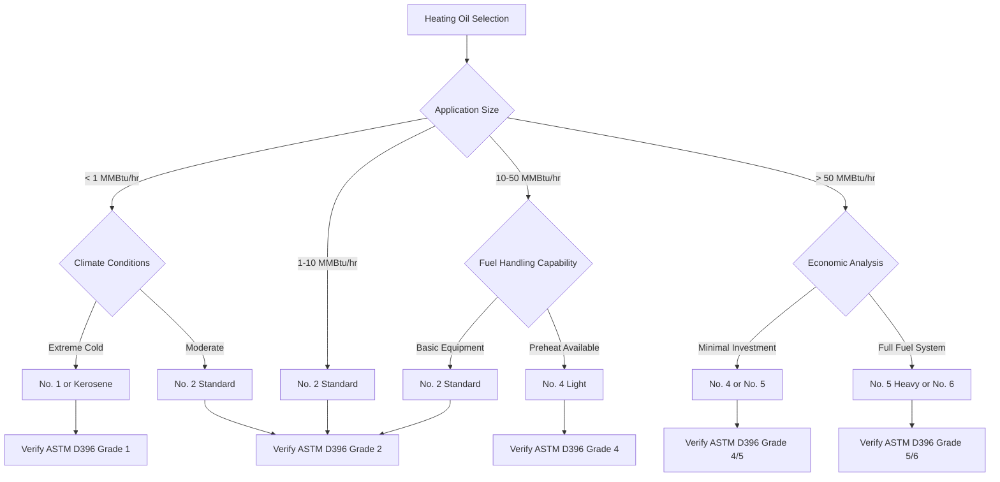

Heating oil grades represent distinct classifications of petroleum-based fuel oils defined primarily by viscosity, specific gravity, and distillation characteristics. The American Society for Testing and Materials (ASTM) D396 standard establishes the technical specifications that govern these fuel grades, ensuring consistent performance across heating applications.

## ASTM D396 Fuel Oil Classifications

ASTM D396 divides fuel oils into six primary grades: No. 1, No. 2, No. 4 (Light), No. 4, No. 5 (Light), No. 5 (Heavy), and No. 6. The numbering system correlates directly with increasing viscosity, density, and energy content per gallon.

Grades No. 1 and No. 2 are classified as distillate fuel oils—lighter fractions obtained during petroleum refining that vaporize readily and require minimal preheating. Grades No. 4 through No. 6 are residual fuel oils, heavier products remaining after distillate extraction that demand preheating and more sophisticated combustion equipment.

## Physical Properties by Grade

| Grade | Viscosity (SSU @ 100°F) | Specific Gravity | BTU/gal | Flash Point (°F) | Pour Point (°F) |
|-------|-------------------------|------------------|---------|------------------|-----------------|
| No. 1 | 32.6-37.9 | 0.825-0.850 | 137,000 | 100-162 | -40 to 0 |
| No. 2 | 32.6-40.1 | 0.850-0.880 | 140,000 | 126-204 | -6 to 20 |
| No. 4 | 45-125 | 0.880-0.950 | 145,000 | 142-240 | 10 to 30 |
| No. 5 Light | 125-300 | 0.920-0.980 | 148,000 | 160-250 | 20 to 40 |
| No. 5 Heavy | 300-750 | 0.950-1.000 | 150,000 | 160-250 | 30 to 50 |
| No. 6 | 900-9,000 | 0.970-1.050 | 152,000 | 150-270 | 30 to 60 |

**Note:** SSU = Saybolt Seconds Universal; BTU values are approximate heating values.

## Grade Applications and Equipment Requirements

**No. 1 Heating Oil (Kerosene)**

No. 1 fuel oil exhibits the lowest viscosity and cleanest combustion characteristics. Applications include:
- Residential space heaters and small furnaces
- Emergency backup heating systems
- Cold climate installations requiring reliable cold-weather starting
- Portable heating equipment

The fuel requires no preheating and atomizes effectively at ambient temperatures. Lower sulfur content (typically 0.04% max) reduces corrosion and emissions but yields slightly lower energy density than No. 2.

**No. 2 Heating Oil**

No. 2 represents the most common residential and light commercial heating fuel. This grade balances energy content, cost, and handling characteristics.

Primary applications:
- Residential oil-fired furnaces and boilers
- Commercial heating systems up to 10 million BTU/hr input
- Industrial space heating
- Diesel engine fuel (with appropriate specifications)

Standard burner equipment handles No. 2 without preheating in ambient temperatures above 20°F. Below this threshold, fuel line heaters prevent wax formation and flow restriction.

**No. 4 Heating Oil**

No. 4 grades bridge distillate and residual fuels. Two subgrades exist: No. 4 (Light) contains predominantly distillate with residual blend, while standard No. 4 increases residual content.

Applications demand:
- Preheating to 100-120°F for proper atomization
- Specialized burner nozzles designed for higher-viscosity fuels
- Tank heating systems in cold climates
- Commercial and industrial boilers 10-50 million BTU/hr

**No. 5 and No. 6 Heating Oil (Residual Oils)**

Heavy residual oils serve large industrial, institutional, and utility applications where equipment investment justifies lower fuel costs.

No. 5 (Light and Heavy) requires:
- Preheat to 150-220°F for pumping and atomization
- Steam or electric heating coils in storage tanks
- Insulated fuel lines with trace heating
- High-pressure steam or air-atomizing burners

No. 6 (Bunker C) demands:
- Preheat to 180-260°F minimum for flow
- Storage tank heating to 120-150°F
- Complex fuel handling systems with multiple heating stages
- Centrifugal purification to remove water and sediment
- Applications in power generation, large process boilers, and marine propulsion

## Selection Criteria

## Chemical Composition Considerations

Sulfur content varies significantly across grades. Low-sulfur specifications (≤ 0.05% sulfur) apply increasingly to residential grades No. 1 and No. 2 due to emissions regulations. Heavier grades historically contained 1-3% sulfur, though environmental regulations now mandate reductions in many jurisdictions.

Ash content increases with grade number, representing inorganic compounds that form combustion deposits. No. 1 contains negligible ash (< 0.01%), while No. 6 may reach 0.10%, necessitating periodic boiler tube cleaning.

Carbon residue—the material remaining after distillation—correlates with incomplete combustion potential. Distillate fuels exhibit < 0.15% carbon residue, while No. 6 may exceed 15%, requiring advanced burner technology for complete oxidation.

## Storage and Handling

Distillate fuels (No. 1 and No. 2) remain stable in unheated aboveground or underground storage tanks. Tank materials include steel, fiberglass, or polyethylene for aboveground installations.

Residual fuels demand heated storage. No. 4 requires heating only in cold weather, while No. 5 and No. 6 need continuous heating to maintain pumpability. Storage temperatures typically run 15-20°F above the fuel's pour point.

Water separation presents concerns across all grades. Distillates separate water readily through settling or filtration. Residual fuels require centrifugal purification or coalescing filters to achieve acceptable water content (< 0.5% by volume).

## Operational Considerations

Fuel switching capability allows some systems to operate on multiple grades, providing economic flexibility. Multi-fuel burners accommodate No. 2 through No. 6 with appropriate preheat adjustments, though optimal efficiency requires matching burner configuration to primary fuel grade.

Maintenance intervals decrease with heavier grades. No. 2 systems typically require annual servicing, while No. 6 installations demand monthly inspection and cleaning cycles to maintain efficiency and reliability.

Environmental compliance increasingly influences grade selection. Ultra-low-sulfur heating oil (ULSHO) at ≤ 15 ppm sulfur now serves as the standard for residential No. 2 in many regions, virtually eliminating sulfur dioxide emissions while enabling condensing boiler technology.
