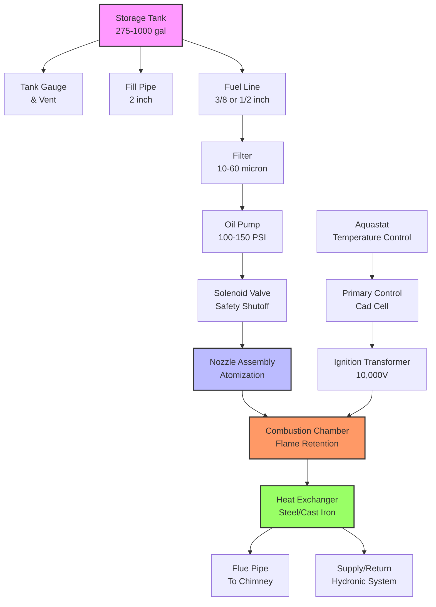

No. 2 heating oil represents the most widely used grade of fuel oil for residential and light commercial heating applications in North America. This middle distillate petroleum product provides an optimal balance of energy density, flow characteristics, and combustion efficiency for oil-fired heating systems.

## ASTM D396 Specifications

No. 2 fuel oil must meet specifications outlined in ASTM D396, which defines critical physical and chemical properties for consistent performance across varying climatic conditions.

| Property | No. 2 Specification | Test Method |
|----------|---------------------|-------------|
| Flash Point | ≥ 100°F (38°C) | ASTM D93 |
| Pour Point | ≤ 20°F (-6°C) | ASTM D97 |
| Viscosity @ 40°C | 1.9 - 3.0 cSt | ASTM D445 |
| Sulfur Content (ULSD) | ≤ 15 ppm | ASTM D5453 |
| Sulfur Content (Standard) | ≤ 0.5% (5,000 ppm) | ASTM D5453 |
| Distillation 90% Point | ≤ 640°F (338°C) | ASTM D86 |
| Carbon Residue | ≤ 0.35% | ASTM D524 |
| Ash Content | ≤ 0.01% | ASTM D482 |
| Copper Strip Corrosion | No. 3 maximum | ASTM D130 |
| Cetane Number | ≥ 40 | ASTM D613 |

## Physical Properties

**Heating Value:**
The gross heating value of No. 2 fuel oil ranges from 138,000 to 141,000 Btu/gal (38.4 to 39.2 MJ/L), with a typical value of 139,600 Btu/gal. Net heating value averages 131,890 Btu/gal when accounting for latent heat of water vapor in combustion products.

**Density:**
Specific gravity ranges from 0.845 to 0.870 at 60°F (15.6°C), corresponding to a density of 7.05 to 7.25 lb/gal. This density provides adequate atomization characteristics in pressure atomizing burners while maintaining reasonable pumping requirements.

**Viscosity:**
The kinematic viscosity specification of 1.9 to 3.0 centistokes at 40°C ensures proper atomization in residential burners without requiring fuel preheating. This viscosity range maintains adequate spray formation across typical ambient storage temperatures.

**Low Sulfur Grades:**
Ultra-low sulfur heating oil (ULSHO) contains ≤15 ppm sulfur, matching on-road diesel specifications. This grade reduces SO₂ emissions by 99.7% compared to traditional heating oil, improves indoor air quality, and extends equipment life by minimizing corrosive combustion byproducts.

## Combustion Characteristics

The complete combustion of No. 2 heating oil follows the stoichiometric relationship:

$$C_{n}H_{m} + \left(n + \frac{m}{4}\right)O_2 \rightarrow nCO_2 + \frac{m}{2}H_2O$$

For a representative composition with empirical formula C₁₂H₂₃:

$$C_{12}H_{23} + 17.75O_2 \rightarrow 12CO_2 + 11.5H_2O$$

**Theoretical Air Requirement:**

$$A_{th} = \left(n + \frac{m}{4}\right) \times \frac{1}{0.21} \times \frac{28.97}{32} = 17.75 \times 4.76 \times 0.906 = 76.6 \text{ lb air/lb fuel}$$

**Excess Air Combustion:**

Practical residential oil burners operate with 25-50% excess air to ensure complete combustion:

$$\dot{m}_{air} = A_{th}(1 + EA) \times \dot{m}_{fuel}$$

where EA represents excess air fraction (0.25-0.50).

**Combustion Efficiency:**

$$\eta_{comb} = \frac{Q_{in} - Q_{losses}}{Q_{in}} \times 100\%$$

$$Q_{losses} = Q_{stack} + Q_{jacket} + Q_{incomplete}$$

Stack loss, the dominant efficiency reduction factor:

$$Q_{stack} = \dot{m}_{flue} \times c_p \times (T_{stack} - T_{ambient})$$

Modern residential oil burners achieve steady-state combustion efficiencies of 80-87%, with condensing oil boilers reaching 90-95% by recovering latent heat from water vapor.

## Oil Heating System Components

## Storage Requirements

**Tank Selection:**
Residential installations typically utilize 275-gallon above-ground steel tanks or 550-1,000 gallon underground tanks. Above-ground tanks must be UL-142 listed for indoor installation or protected from the elements when installed outdoors.

**Tank Location Criteria:**
- Minimum 5 feet from heat sources or open flames
- Maximum 6 feet from fill connection to tank
- Adequate ventilation for above-ground indoor tanks
- Level support surface capable of supporting filled tank weight (2,000+ lbs)

**Corrosion Protection:**
Underground tanks require dielectric coating or cathodic protection to prevent corrosion. Double-wall tanks with interstitial monitoring provide leak detection capability required by many jurisdictions.

**Fill and Vent Piping:**
Fill pipes must be 2-inch minimum diameter terminating outside the building. Vent pipes (1.25-inch minimum) prevent tank pressurization during filling and allow thermal expansion. Vent termination must be 2 feet minimum from building openings.

## Cold Weather Performance

**Pour Point Considerations:**
The 20°F maximum pour point specification ensures fuel fluidity in most climatic zones. In extremely cold regions, kerosene blending (10-50%) lowers pour point and improves cold flow properties.

**Wax Formation:**
Paraffin wax crystals precipitate from solution as temperature approaches the cloud point (typically 10-15°F above pour point). These crystals can plug fuel filters, requiring heated fuel lines or anti-gel additives in severe climates.

**Cold Start Reliability:**
Modern residential burners incorporate delayed-opening solenoid valves allowing pump pressure buildup before nozzle delivery. This design ensures adequate atomization even when fuel viscosity increases due to cold storage temperatures.

## Efficiency Optimization

**Annual Fuel Utilization Efficiency (AFUE):**

$$AFUE = \frac{E_{out,annual}}{E_{in,annual}} \times 100\%$$

Modern non-condensing oil boilers achieve 82-86% AFUE, while condensing models reach 90-95%. Efficiency improvements relative to older equipment (60-70% AFUE) reduce fuel consumption by 20-35%.

**Combustion Tuning:**
Optimal efficiency requires proper excess air adjustment verified through flue gas analysis:
- CO₂: 10-12% (optimal combustion)
- O₂: 3-6% (corresponding excess air)
- CO: <100 ppm (complete combustion)
- Smoke: 0-1 on Bacharach scale
- Net stack temperature: <500°F

**Maintenance Impact:**
Annual professional cleaning and tuning maintains peak efficiency. Sooted heat exchangers reduce heat transfer effectiveness, increasing stack temperatures and reducing efficiency by 3-5% per 1/16 inch soot accumulation.

## Environmental Considerations

**Emissions Profile:**
Ultra-low sulfur heating oil dramatically reduces SO₂ emissions while maintaining NOₓ emissions in the 40-100 ppm range depending on burner design. Particulate matter emissions decrease with improved atomization and combustion air control.

**Biofuel Blending:**
Bioheat blends incorporate biodiesel (typically B5 to B20) into petroleum heating oil, reducing net CO₂ emissions. ASTM D396 Appendix X1 provides guidance for blends up to B20, requiring consideration of cold flow properties and storage stability.

**Spill Prevention:**
Overfill protection devices, leak detection systems, and secondary containment reduce environmental risk. Many jurisdictions mandate these protections for underground storage tanks and tanks exceeding specific capacities.

No. 2 heating oil remains the dominant residential and light commercial heating fuel in regions lacking natural gas infrastructure, providing reliable, efficient space heating and domestic hot water production when properly maintained and combusted.
