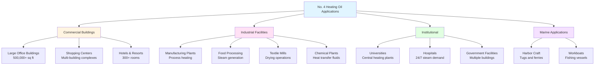

No. 4 heating oil represents a transitional grade between distillate fuels (No. 2) and heavy residual fuels (No. 5, No. 6). This light residual fuel oil consists of blends of distillate and residual components, designed for commercial and industrial heating applications where higher energy density justifies the additional handling complexity.

## Physical and Chemical Properties

No. 4 fuel oil exhibits characteristics intermediate between light distillates and heavy residuals. The specific gravity ranges from 0.87 to 0.95 at 60°F, corresponding to a density of 7.8 to 8.2 lb/gal. This higher density compared to No. 2 oil reflects the presence of heavier hydrocarbon fractions and results in greater heat content per gallon.

The kinematic viscosity of No. 4 oil typically ranges from 5.8 to 26.4 centistokes at 40°C (104°F) per ASTM D396 specifications. This higher viscosity necessitates preheating for proper atomization in burner nozzles. Without adequate preheating, the fuel cannot achieve the fine spray pattern required for complete combustion, leading to efficiency losses and increased emissions.

## Heating Value and Energy Content

No. 4 heating oil delivers higher volumetric energy density than lighter distillate fuels. The gross heating value ranges from 143,000 to 148,000 Btu/gal, with typical values around 145,000 Btu/gal.

The net heating value, accounting for latent heat of water vapor in combustion products, is calculated:

$$
HHV_{net} = HHV_{gross} - h_{fg} \times m_{H_2O}
$$

where:
- $HHV_{net}$ = net heating value (Btu/gal)
- $HHV_{gross}$ = gross heating value (Btu/gal)
- $h_{fg}$ = latent heat of vaporization of water at stack temperature (≈1050 Btu/lb)
- $m_{H_2O}$ = mass of water formed per gallon of fuel (lb/gal)

For No. 4 oil with typical hydrogen content of 11-12% by mass:

$$
HHV_{net} = 145,000 - 1050 \times (9 \times 0.115 \times 8.0) = 136,300 \text{ Btu/gal}
$$

The combustion efficiency for No. 4 oil in properly maintained equipment typically ranges from 80-84%, accounting for stack losses and incomplete combustion:

$$
\eta_{combustion} = \frac{Q_{useful}}{Q_{input}} = \frac{HHV_{net} - Q_{stack} - Q_{incomplete}}{HHV_{net}}
$$

## ASTM D396 Specifications

ASTM D396 defines the standard specification for fuel oils, including No. 4 grade. The key parameters distinguish No. 4 from both lighter and heavier grades.

| Property | ASTM Method | No. 4 Light | No. 4 Heavy | Units |
|----------|-------------|-------------|-------------|-------|
| Flash Point (min) | D93 | 130 | 130 | °F |
| Pour Point (max) | D97 | 20 | 20 | °F |
| Kinematic Viscosity @ 40°C | D445 | 5.8-26.4 | 26.4-60.7 | cSt |
| Water & Sediment (max) | D1796 | 0.50 | 0.50 | % vol |
| Carbon Residue (max) | D524 | 0.10 | - | % mass |
| Ash (max) | D482 | 0.10 | - | % mass |
| Sulfur Content | D129/D1552 | Varies by region | Varies by region | % mass |
| Copper Strip Corrosion (max) | D130 | No. 3 | No. 3 | - |
| Cetane Index (min) | D976 | - | - | - |

The distinction between No. 4 Light and No. 4 Heavy primarily relates to viscosity, with the heavy grade approaching No. 5 characteristics.

## Preheating Requirements

The elevated viscosity of No. 4 oil mandates preheating before combustion. Proper fuel temperature at the burner nozzle ensures adequate atomization and complete combustion.

**Recommended Preheat Temperatures:**
- Storage tank heating: 75-85°F (prevents wax formation and ensures pumpability)
- Transfer line heating: 90-110°F (maintains flowability)
- Burner inlet temperature: 100-130°F (achieves target viscosity for atomization)

The target viscosity at the burner nozzle is typically 15-25 SSU (Saybolt Seconds Universal) or approximately 2-4 centistokes. The relationship between temperature and viscosity follows the Walther equation:

$$
\log \log(\nu + 0.7) = A - B \log(T)
$$

where:
- $\nu$ = kinematic viscosity (cSt)
- $T$ = absolute temperature (K)
- $A$, $B$ = fuel-specific constants

For a No. 4 oil with viscosity of 20 cSt at 40°C, achieving 3 cSt requires heating to approximately 115-120°F.

## Storage and Handling

No. 4 oil storage systems require more sophisticated infrastructure than No. 2 systems due to viscosity and potential for wax formation.

**Storage Tank Design:**
- Internal heating coils or electric immersion heaters
- Insulation to minimize heat loss
- Recirculation systems to prevent stratification
- High-level alarms and overflow protection
- Tank materials: carbon steel (suitable for residual oils)

**Tank Heating Load Calculation:**

The heat input required to maintain storage temperature is:

$$
Q_{tank} = UA(T_{oil} - T_{ambient}) + Q_{makeup}
$$

where:
- $Q_{tank}$ = total heating load (Btu/hr)
- $U$ = overall heat transfer coefficient (Btu/hr·ft²·°F)
- $A$ = tank surface area (ft²)
- $T_{oil}$ = desired oil temperature (°F)
- $T_{ambient}$ = ambient temperature (°F)
- $Q_{makeup}$ = heat required for fresh fuel addition (Btu/hr)

## Commercial and Industrial Applications

No. 4 heating oil serves applications where high energy demand justifies the additional infrastructure for fuel handling and preheating.

**Typical Installation Capacities:**
- Small commercial: 2-5 million Btu/hr (≤35 GPH)
- Medium commercial: 5-15 million Btu/hr (35-105 GPH)
- Large commercial: 15-50 million Btu/hr (105-350 GPH)
- Industrial: 50+ million Btu/hr (>350 GPH)

## Economic Considerations

The selection of No. 4 oil involves balancing fuel cost savings against infrastructure requirements.

**Cost Factors:**
- Fuel price: typically $0.20-0.40/gal less than No. 2 oil
- Heating system capital cost: $15,000-75,000 additional for preheating infrastructure
- Operating costs: electricity for heating, increased maintenance
- Efficiency penalty: 2-5% lower efficiency than No. 2 systems

**Break-even Analysis:**

For a facility consuming 100,000 gallons annually, the fuel cost savings with No. 4 oil at $0.30/gal differential:

$$
\text{Annual Savings} = 100,000 \times 0.30 = \$30,000
$$

With $50,000 additional capital cost and $5,000 annual operating costs:

$$
\text{Simple Payback} = \frac{50,000}{30,000 - 5,000} = 2.0 \text{ years}
$$

## Combustion System Design

Burners for No. 4 oil require specific design features to handle the fuel's characteristics.

**Burner Requirements:**
- Steam or air atomization (mechanical atomization insufficient)
- Fuel heating capacity to 120-130°F
- Larger fuel pump capacity to overcome viscosity
- Preheater interlocks preventing burner operation below minimum temperature
- Flame monitoring systems rated for heavier fuels

The atomization quality parameter determines combustion efficiency:

$$
SMD = K \times \frac{\sigma^{0.6} \times \mu^{0.2}}{\Delta P^{0.4} \times \dot{m}^{0.2}}
$$

where:
- $SMD$ = Sauter Mean Diameter (microns)
- $K$ = burner-specific constant
- $\sigma$ = surface tension (dyne/cm)
- $\mu$ = dynamic viscosity (cP)
- $\Delta P$ = atomizing air/steam pressure differential (psi)
- $\dot{m}$ = fuel mass flow rate (lb/hr)

Target SMD for complete combustion is typically <100 microns.

## Environmental and Regulatory Aspects

No. 4 oil contains higher sulfur and ash content than distillate fuels, requiring consideration of emissions and regulatory compliance.

**Emissions Characteristics:**
- SO₂: proportional to fuel sulfur content (typically 0.3-2.0% sulfur)
- NOx: 150-250 ppm @ 3% O₂ (depending on burner design)
- Particulate Matter: 0.05-0.15 lb/million Btu
- CO: <100 ppm with proper combustion

Many jurisdictions now restrict or prohibit No. 4 oil in favor of lower-sulfur alternatives. Ultra-low sulfur No. 4 oil (<15 ppm S) is available in some markets but at significantly higher cost.

## Maintenance Considerations

Systems burning No. 4 oil require more intensive maintenance than distillate fuel systems.

**Maintenance Schedule:**
- Daily: verify preheat temperatures, check for leaks
- Weekly: inspect burner flame quality, check fuel filters
- Monthly: test safety controls, inspect heating elements
- Quarterly: clean burner components, test fuel quality
- Annually: complete combustion system tune-up, tank inspection

**Common Issues:**
- Fuel strainer plugging from sediment
- Heating element failure in tanks or preheaters
- Pump wear from abrasive contaminants
- Nozzle tip carbonization requiring frequent replacement
- Control valve sticking from fuel deposits

No. 4 heating oil serves a specific market niche for large commercial and industrial facilities seeking lower fuel costs and accepting the operational complexity. Proper system design, adequate preheating, and rigorous maintenance ensure reliable operation and acceptable efficiency.
