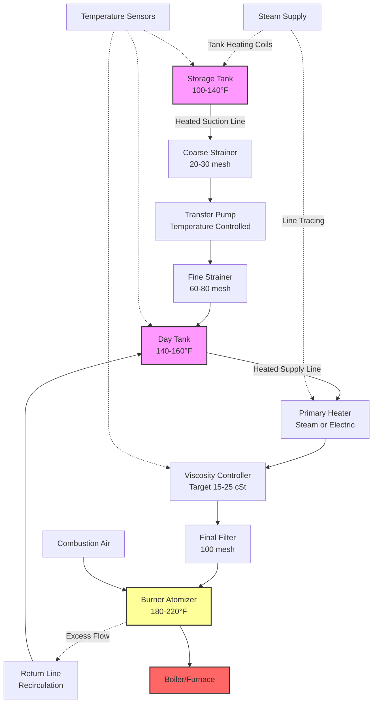

## Overview

No. 6 heating oil, also known as Bunker C or residual fuel oil, represents the heaviest grade of commercial heating oil derived from petroleum refining. This high-viscosity fuel consists primarily of residual components remaining after lighter fractions have been distilled. No. 6 fuel oil requires extensive preheating for storage, pumping, and atomization, making it suitable only for large industrial facilities, utility power plants, and marine applications where economies of scale justify the infrastructure requirements.

The fuel's low cost per unit of energy, combined with high energy density, makes it economically attractive for large-scale heating and power generation operations despite the complexity of handling systems required.

## Physical and Chemical Properties

### Specification Standards

ASTM D396 Standard Specification for Fuel Oils defines six grades of fuel oil, with Grade No. 6 representing the heaviest category. The specification establishes requirements for properties critical to combustion performance and system compatibility.

| Property | No. 6 Specification | Test Method |
|----------|-------------------|-------------|
| Flash Point | Min 60°C (140°F) | ASTM D93 |
| Pour Point | Max 24°C (75°F) | ASTM D97 |
| Water and Sediment | Max 1.0% volume | ASTM D2709 |
| Carbon Residue | Max 15% mass | ASTM D524 |
| Ash | Max 0.10% mass | ASTM D482 |
| Kinematic Viscosity at 50°C | 42-162 mm²/s (194-750 SSU) | ASTM D445 |
| Kinematic Viscosity at 100°C | 5.5-26.4 mm²/s (37-125 SSU) | ASTM D445 |

### Heating Value and Density

No. 6 fuel oil delivers higher energy content per gallon than lighter fuel oils:

| Parameter | Value Range | Units |
|-----------|-------------|-------|
| Gross Heating Value | 150,000-152,000 | Btu/gal |
| Net Heating Value | 143,000-145,000 | Btu/gal |
| Density at 60°F | 8.2-8.5 | lb/gal |
| Specific Gravity | 0.98-1.02 | - |
| API Gravity | 7-15 | °API |

The energy required to heat No. 6 fuel oil for pumping and atomization is calculated:

$$Q_{\text{heating}} = \dot{m} \cdot c_p \cdot (T_{\text{final}} - T_{\text{initial}})$$

Where:
- $Q_{\text{heating}}$ = heating power required (Btu/hr or kW)
- $\dot{m}$ = fuel oil mass flow rate (lb/hr or kg/hr)
- $c_p$ = specific heat capacity ≈ 0.45 Btu/(lb·°F) or 1.9 kJ/(kg·K)
- $T_{\text{final}}$ = target temperature for pumping or atomization (°F or °C)
- $T_{\text{initial}}$ = initial storage temperature (°F or °C)

## Viscosity and Temperature Relationship

The viscosity of No. 6 fuel oil varies dramatically with temperature, directly affecting pumpability and atomization quality. The relationship follows the Walther equation:

$$\log\log(\nu + 0.7) = A - B \log(T)$$

Where:
- $\nu$ = kinematic viscosity (cSt or mm²/s)
- $T$ = absolute temperature (K)
- $A$, $B$ = empirical constants specific to the fuel sample

For practical applications, target viscosities are:

| Application | Target Viscosity | Typical Temperature |
|-------------|-----------------|-------------------|
| Storage | 750-2000 cSt | 100-140°F (38-60°C) |
| Pumping | 200-400 cSt | 140-180°F (60-82°C) |
| Atomization | 15-25 cSt | 180-220°F (82-104°C) |

The Reynolds number for fuel oil flow determines the flow regime:

$$Re = \frac{\rho \cdot v \cdot D}{\mu} = \frac{v \cdot D}{\nu}$$

Where:
- $Re$ = Reynolds number (dimensionless)
- $\rho$ = fuel density (lb/ft³ or kg/m³)
- $v$ = flow velocity (ft/s or m/s)
- $D$ = pipe diameter (ft or m)
- $\mu$ = dynamic viscosity (lb/(ft·s) or Pa·s)
- $\nu$ = kinematic viscosity (ft²/s or m²/s)

## Preheating System Requirements

### Storage Tank Heating

No. 6 fuel oil storage tanks require continuous heating to maintain pumpable viscosity. Heating is typically provided by steam coils, electric immersion heaters, or hot oil circulation systems.

Heat loss from storage tanks follows:

$$Q_{\text{loss}} = U \cdot A \cdot (T_{\text{tank}} - T_{\text{ambient}})$$

Where:
- $Q_{\text{loss}}$ = heat loss rate (Btu/hr or W)
- $U$ = overall heat transfer coefficient (Btu/(hr·ft²·°F) or W/(m²·K))
- $A$ = tank surface area (ft² or m²)
- $T_{\text{tank}}$ = maintained tank temperature (°F or °C)
- $T_{\text{ambient}}$ = ambient temperature (°F or °C)

For insulated outdoor tanks, typical U-values range from 0.08-0.15 Btu/(hr·ft²·°F).

### Line Heating and Tracing

All piping systems handling No. 6 fuel oil require heat tracing to prevent solidification and maintain flow. Common methods include:

- **Steam tracing**: Copper or stainless steel tubing carrying low-pressure steam attached to fuel lines
- **Electric heat tracing**: Self-regulating or constant-wattage heating cables
- **Hot oil jacketing**: Concentric pipe design with hot oil circulation in annular space

## Heavy Fuel Oil System Architecture

The following diagram illustrates a complete No. 6 fuel oil handling system for an industrial boiler:

## Combustion Characteristics

### Air-Fuel Ratio Requirements

No. 6 fuel oil requires precise air-fuel ratios for complete combustion. The stoichiometric air requirement is:

$$\text{Air}_{\text{stoich}} = 11.5 \times \frac{\%C}{12} + 34.3 \times \left(\frac{\%H - \frac{\%O}{8}}{1}\right) + 4.3 \times \frac{\%S}{32}$$

Where percentages represent mass fractions of carbon (C), hydrogen (H), oxygen (O), and sulfur (S).

For typical No. 6 fuel oil (85% C, 11% H, 0.5% S), theoretical air requirement is approximately 13.5-14.0 lb air/lb fuel. Practical excess air ranges from 15-25% to ensure complete combustion.

### Sulfur Content and Emissions

No. 6 fuel oil historically contained high sulfur levels (up to 3% by mass), though low-sulfur grades (0.5-1.0% sulfur) are increasingly mandated by environmental regulations. Sulfur dioxide emissions are directly proportional:

$$\text{SO}_2 = 19,300 \times \%S \times \dot{m}_{\text{fuel}}$$

Where SO₂ is in lb/hr, %S is sulfur mass fraction, and fuel flow rate is in lb/hr.

## Applications and Facility Requirements

### Large Industrial Boilers

No. 6 fuel oil serves as the primary fuel for industrial steam generation in facilities requiring:

- Continuous steam demand exceeding 100,000 lb/hr
- Capital investment justification for fuel handling infrastructure
- Environmental permits for heavy fuel combustion
- Technical staff for system operation and maintenance

Industries include pulp and paper mills, chemical processing plants, refineries, and manufacturing facilities with cogeneration systems.

### Utility Power Generation

Coal-alternative firing in utility boilers uses No. 6 fuel for:

- Base-load power generation in regions with limited natural gas access
- Dual-fuel capability with coal or natural gas
- Peak demand supplementation
- Grid stability and fuel diversity

### Marine Applications

Bunker C fuel powers large marine vessels, though shore-based heating oil and marine bunker fuel specifications differ slightly in allowable contaminants.

## Storage and Handling Considerations

### Tank Design Requirements

Storage tanks for No. 6 fuel oil incorporate:

- **Heating systems**: Internal coil design providing 1-2 Btu/(hr·gal) heating capacity
- **Insulation**: Minimum R-10 for outdoor tanks, R-5 for indoor installations
- **Recirculation systems**: Maintain temperature uniformity throughout tank volume
- **Temperature monitoring**: Multiple sensors to detect stratification
- **Level gauging**: Compensated for temperature-dependent density variation

### Safety Systems

Heavy fuel oil handling requires specialized safety measures:

- High-temperature limit controls preventing overheating (typically 250°F max)
- Low-temperature alarms indicating inadequate heating
- Leak detection for heated lines and tanks
- Fire suppression systems rated for Class B fires
- Spill containment with heated collection systems

## Economic Considerations

No. 6 fuel oil pricing is typically 60-75% of No. 2 fuel oil on a per-gallon basis, but energy content differences narrow the cost advantage to 50-60% on a Btu basis. Economic viability depends on:

| Factor | Impact on Viability |
|--------|-------------------|
| Annual fuel consumption | Must exceed 500,000-1,000,000 gallons |
| Infrastructure investment | $500,000-$2,000,000+ for complete system |
| Availability of natural gas | Direct competition affects economics |
| Environmental compliance costs | SOx controls may be required |
| Operating labor | Requires trained operating staff |

## Conversion and Alternatives

Many facilities have converted from No. 6 to No. 2 fuel oil or natural gas due to:

- Stringent air quality regulations
- Reduced cost differential
- Simplified operations
- Lower maintenance requirements

Conversion requires burner replacement, elimination of preheating systems, and often boiler retuning to accommodate different flame characteristics and heat release patterns.

---

*Note: Always consult ASTM D396, local air quality regulations, and manufacturer specifications when designing or operating No. 6 fuel oil systems. The complexity and environmental impact of heavy fuel oil require careful consideration of alternatives.*
