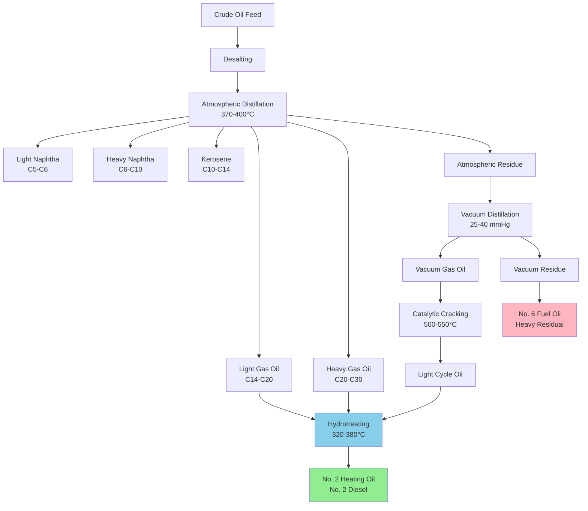

Petroleum refining transforms crude oil into usable heating fuels through a series of physical separation and chemical conversion processes. Understanding refinery operations is fundamental to comprehending heating fuel quality, availability, and specifications for HVAC combustion equipment.

## Atmospheric Distillation

Atmospheric distillation is the primary separation process in petroleum refining. Crude oil is heated to approximately 370-400°C in a furnace and introduced into a fractionating tower where separation occurs based on boiling point ranges.

The tower operates at near-atmospheric pressure with temperatures decreasing from bottom to top. Hydrocarbon fractions condense at different heights based on their molecular weight and volatility. Heating oil and diesel fuel typically condense at the middle distillate section between 180-360°C.

**Temperature-Yield Relationship:**

The volumetric yield of a specific cut depends on crude oil composition and distillation temperature range:

$$Y_{\text{fraction}} = \frac{V_{\text{fraction}}}{V_{\text{crude}}} \times 100\%$$

where $Y_{\text{fraction}}$ is the percentage yield, $V_{\text{fraction}}$ is the volume of distillate collected, and $V_{\text{crude}}$ is the volume of crude oil processed.

For middle distillates used in heating applications:

$$Y_{\text{heating oil}} = \int_{T_1}^{T_2} \frac{dV}{dT} \, dT$$

where $T_1$ and $T_2$ define the boiling range (typically 180-360°C), and $\frac{dV}{dT}$ represents the distillation curve slope.

## Vacuum Distillation

Heavy residual fractions from atmospheric distillation undergo vacuum distillation at reduced pressure (25-40 mmHg absolute) to prevent thermal cracking. This process recovers additional distillates and produces heavy fuel oil feedstocks suitable for No. 4 and No. 6 heating oils.

Operating under vacuum lowers effective boiling points by 40-60°C, allowing separation of heavier molecules without decomposition. Vacuum gas oils can be further processed or blended into heavier heating fuel grades.

## Catalytic Cracking

Fluid catalytic cracking (FCC) converts heavy petroleum fractions into lighter, more valuable products including heating oil components. The process breaks long-chain hydrocarbons (C20-C40) into shorter molecules (C10-C20) suitable for distillate fuels.

The cracking reaction follows first-order kinetics:

$$-\frac{dC_A}{dt} = k \cdot C_A$$

where $C_A$ is the concentration of heavy feedstock, $t$ is residence time, and $k$ is the temperature-dependent rate constant:

$$k = A \cdot e^{-E_a/(RT)}$$

Typical FCC operating conditions:
- Temperature: 500-550°C
- Pressure: 1.7-2.8 bar
- Catalyst: Zeolite-based
- Contact time: 2-4 seconds

**Conversion Efficiency:**

$$\text{Conversion} = \frac{m_{\text{feed}} - m_{\text{unconverted}}}{m_{\text{feed}}} \times 100\%$$

Modern FCC units achieve 70-80% conversion of heavy feedstock into lighter products, with 15-25% of output as heating oil range material.

## Hydrocracking

Hydrocracking combines catalytic cracking with hydrogenation, producing high-quality distillate fuels with low sulfur content. The process operates at elevated pressure (100-200 bar) and temperature (350-450°C) in the presence of hydrogen.

The dual-function catalyst both cracks heavy molecules and saturates aromatic compounds, resulting in heating oils with excellent combustion characteristics and low emissions.

## Hydrotreating

Hydrotreating removes sulfur, nitrogen, and metal contaminants from heating oil fractions. This process is critical for meeting ultra-low sulfur diesel (ULSD) specifications and low-sulfur heating oil standards.

**Desulfurization Reaction:**

$$\text{R-SH} + \text{H}_2 \xrightarrow{\text{catalyst}} \text{R-H} + \text{H}_2\text{S}$$

The hydrogen reacts with organic sulfur compounds, converting them to hydrogen sulfide which is subsequently removed. Sulfur reduction typically exceeds 99%, achieving final sulfur levels below 15 ppm for ULSD and 500 ppm for No. 2 heating oil.

Operating parameters:
- Temperature: 320-380°C
- Pressure: 30-130 bar
- Catalyst: CoMo or NiMo on alumina support
- H₂/oil ratio: 300-1500 SCF/bbl

## Refinery Process Flow

## Product Yield Distribution

Typical product yields from refining 100 barrels of medium-gravity crude oil (32-35°API):

| Product Fraction | Boiling Range (°C) | Yield (%) | Primary Use |
|-----------------|-------------------|-----------|-------------|
| Refinery gas | <40 | 3-5 | Fuel gas |
| Light naphtha | 40-100 | 8-12 | Gasoline blending |
| Heavy naphtha | 100-180 | 10-15 | Gasoline blending |
| Kerosene/Jet fuel | 180-240 | 8-12 | Aviation, heating |
| **Heating oil/Diesel** | **240-360** | **18-25** | **Space heating, transport** |
| Heavy gas oil | 360-500 | 12-18 | FCC feedstock |
| Vacuum gas oil | 500-600 | 10-15 | Cracking feedstock |
| Residual fuel | >600 | 15-25 | No. 6 fuel oil, asphalt |

## Heating Oil Specifications by Process

Different refining processes produce heating oils with varying characteristics:

| Process | Sulfur Content | Cetane Number | Pour Point (°C) | Application |
|---------|---------------|---------------|-----------------|-------------|
| Straight-run distillation | 2000-5000 ppm | 35-45 | -10 to 0 | No. 2 heating oil (legacy) |
| Hydrotreatment | <500 ppm | 40-50 | -15 to -5 | No. 2 heating oil (current) |
| Deep hydrotreatment | <15 ppm | 45-55 | -20 to -10 | ULSD, premium heating oil |
| Cracked distillate | 500-2000 ppm | 30-40 | 0 to +10 | Blending component |

## Refinery Configuration Impact

Modern refineries optimized for distillate production employ deep conversion processes to maximize middle distillate yield at the expense of residual fuel oil. The refinery complexity factor affects heating oil availability:

$$\text{Nelson Complexity} = \sum_{i=1}^{n} C_i \times \frac{F_i}{F_{\text{crude}}}$$

where $C_i$ is the complexity factor for process unit $i$, $F_i$ is the feedstock flow rate to that unit, and $F_{\text{crude}}$ is the crude throughput.

High-complexity refineries (complexity >10) produce 30-40% distillates, while low-complexity refineries (complexity <6) yield only 15-25%. This directly impacts regional heating oil availability and pricing.

## Quality Control Parameters

Refined heating oil must meet strict specifications before distribution:

- **Viscosity**: Kinematic viscosity at 40°C determines flow characteristics and atomization quality in burners
- **Flash point**: Minimum 38°C for safe handling and storage
- **Pour point**: Maximum temperature at which fuel remains pourable, critical for cold climate operation
- **Sulfur content**: Regulated to minimize SOₓ emissions
- **Cetane index**: Indicates ignition quality, with higher values providing better cold starting

The relationship between sulfur content and hydrotreating severity follows:

$$S_{\text{product}} = S_{\text{feed}} \times e^{-k \cdot \text{LHSV}^{-1} \cdot T \cdot P_{\text{H}_2}}$$

where LHSV is liquid hourly space velocity, $T$ is temperature, and $P_{\text{H}_2}$ is hydrogen partial pressure.

## Energy Efficiency Considerations

Refinery operations consume 5-7% of the energy content of crude oil processed. Heat integration through process-to-process heat exchange and combined heat and power generation improves overall thermal efficiency.

Modern refineries achieve energy intensities of 0.5-0.8 GJ per barrel of crude processed, with distillation and hydrotreating representing the largest energy consumers. Energy-efficient refinery design directly impacts the environmental footprint of heating fuels used in HVAC systems.

## Components

- Crude Distillation Atmospheric
- Vacuum Distillation
- Catalytic Cracking Fcc
- Hydrocracking Processes
- Reforming Processes
- Desulfurization Hydrotreating
- Blending Final Products

## Conclusion

Petroleum refining employs sophisticated unit operations to transform crude oil into heating fuels meeting stringent combustion and environmental specifications. The combination of distillation for physical separation, catalytic processes for molecular conversion, and treating operations for contaminant removal ensures reliable production of heating oil grades from No. 2 through No. 6. Understanding these processes provides essential context for evaluating heating fuel quality, availability, and the technical requirements of oil-fired HVAC equipment.
