Renewable energy resources provide sustainable alternatives to fossil fuel-based HVAC systems. These technologies convert naturally replenishing energy sources into thermal or electrical energy for heating, cooling, and ventilation applications. Understanding their characteristics, performance metrics, and integration methods is essential for designing high-efficiency building systems.

## Renewable Energy Classification

Renewable energy sources differ fundamentally in their availability patterns, energy density, and conversion mechanisms. The primary renewable resources applicable to HVAC systems include solar radiation, wind kinetic energy, hydroelectric potential, geothermal heat, and biomass chemical energy.

```mermaid
graph TD
    A[Renewable Energy Resources] --> B[Solar Energy]
    A --> C[Wind Energy]
    A --> D[Hydroelectric]
    A --> E[Geothermal]
    A --> F[Biomass]

    B --> B1[Photovoltaic Systems]
    B --> B2[Solar Thermal Collectors]
    B --> B3[Concentrated Solar Power]

    C --> C1[Utility-Scale Turbines]
    C --> C2[Distributed Wind]
    C --> C3[Building-Integrated Systems]

    D --> D1[Large Hydroelectric]
    D --> D2[Small Hydro]
    D --> D3[Micro-Hydro]

    E --> E1[Ground-Source Heat Pumps]
    E --> E2[Direct-Use Systems]
    E --> E3[Deep Geothermal]

    F --> F1[Wood/Pellet Systems]
    F --> F2[Biogas CHP]
    F --> F3[Biomass Boilers]

    style A fill:#2c5aa0,stroke:#1a3a6b,color:#fff
    style B fill:#ff9933,stroke:#cc7700,color:#000
    style C fill:#66ccff,stroke:#3399cc,color:#000
    style D fill:#3366cc,stroke:#003399,color:#fff
    style E fill:#cc6600,stroke:#994400,color:#fff
    style F fill:#669900,stroke:#446600,color:#fff
```

## Solar Energy for HVAC

Solar radiation provides the most abundant renewable resource for building applications. Two primary conversion methods serve HVAC systems: photovoltaic conversion to electricity and thermal collection for direct heating.

### Photovoltaic Systems

Photovoltaic panels convert solar radiation to DC electricity through the photoelectric effect. For HVAC applications, PV systems power heat pumps, chillers, fans, and pumps. The instantaneous electrical output depends on irradiance and temperature:

$$P_{PV} = A \cdot \eta_{PV} \cdot G \cdot \left[1 - \beta(T_{cell} - T_{ref})\right]$$

Where:
- $P_{PV}$ = photovoltaic power output (W)
- $A$ = panel area (m²)
- $\eta_{PV}$ = reference efficiency (typically 0.15-0.22)
- $G$ = solar irradiance (W/m²)
- $\beta$ = temperature coefficient (typically 0.004-0.005/°C)
- $T_{cell}$ = cell temperature (°C)
- $T_{ref}$ = reference temperature (25°C)

### Solar Thermal Systems

Solar thermal collectors absorb radiation and transfer heat to a working fluid. The useful heat gain from a flat-plate collector follows:

$$Q_{useful} = A_c \cdot F_R \left[G \cdot (\tau\alpha) - U_L(T_{in} - T_{amb})\right]$$

Where:
- $Q_{useful}$ = useful heat gain (W)
- $A_c$ = collector area (m²)
- $F_R$ = heat removal factor (0.7-0.9)
- $(\tau\alpha)$ = transmittance-absorptance product (0.7-0.85)
- $U_L$ = overall loss coefficient (3-6 W/m²·K)
- $T_{in}$ = inlet fluid temperature (°C)
- $T_{amb}$ = ambient temperature (°C)

## Wind Energy Integration

Wind turbines convert kinetic energy in moving air to electrical power. The theoretical power available from wind follows the cubic relationship:

$$P_{wind} = \frac{1}{2} \rho A v^3 C_p$$

Where:
- $P_{wind}$ = wind power (W)
- $\rho$ = air density (1.225 kg/m³ at sea level)
- $A$ = swept area (m²)
- $v$ = wind velocity (m/s)
- $C_p$ = power coefficient (maximum 0.59, Betz limit)

Building-integrated wind systems face challenges from turbulent urban airflow and lower average wind speeds. Grid-connected wind power offers more practical integration for commercial HVAC loads.

## Geothermal Energy Systems

Geothermal resources provide stable temperature sources for heat pump systems. Ground-source heat pumps exchange heat with the earth, which maintains relatively constant temperature below 3-4 meters depth.

### Ground-Source Heat Pump Performance

The heating coefficient of performance for a ground-source heat pump:

$$COP_{heating} = \frac{Q_{heating}}{W_{compressor}} = \frac{T_{condensing}}{T_{condensing} - T_{evaporating}} \cdot \eta_{carnot}$$

Where $\eta_{carnot}$ represents the fraction of ideal Carnot efficiency achieved (typically 0.4-0.6).

Ground heat exchangers transfer heat through:
- Vertical boreholes (50-150 m depth)
- Horizontal trenches (1.5-2 m depth)
- Pond/lake loops (submerged coils)

The required ground loop length depends on soil thermal conductivity, typically 1.5-2.5 W/m·K for soil and 3.5-5.0 W/m·K for rock.

## Biomass Energy Systems

Biomass combustion releases stored chemical energy from organic materials. Modern biomass boilers achieve combustion efficiency of 75-90% with proper controls and fuel quality.

The heating value determines energy content:
- Wood pellets: 17-19 MJ/kg (higher heating value)
- Cordwood: 14-16 MJ/kg (dry basis)
- Agricultural residues: 13-17 MJ/kg

Combined heat and power (CHP) systems using biogas or syngas can achieve overall energy utilization efficiency exceeding 80% when thermal output serves HVAC loads.

## US Renewable Energy Capacity

The following table presents installed renewable capacity relevant to building energy systems based on DOE and EIA 2024 data:

| Technology | Installed Capacity (GW) | Capacity Factor | Primary HVAC Application |
|------------|------------------------|-----------------|-------------------------|
| Solar PV | 142.5 | 24-27% | Electric HVAC equipment |
| Wind (Utility) | 148.8 | 35-42% | Grid power for HVAC |
| Wind (Distributed) | 1.2 | 15-25% | On-site generation |
| Hydroelectric | 103.0 | 38-42% | Grid baseload power |
| Geothermal (Electric) | 3.9 | 74-90% | Grid power |
| Biomass (Electric) | 13.2 | 60-80% | District heating/CHP |

## Renewable Energy Fraction

For buildings with renewable HVAC systems, the renewable energy fraction quantifies the percentage of total energy consumption met by renewable sources:

$$f_{renewable} = \frac{\sum E_{renewable}}{\sum E_{total}} = \frac{E_{solar} + E_{wind} + E_{geo} + E_{biomass}}{E_{total}}$$

Net-zero energy buildings achieve $f_{renewable} \geq 1.0$ on an annual basis, with on-site generation balancing or exceeding consumption.

## Capacity Factor Analysis

The capacity factor represents the ratio of actual energy production to theoretical maximum production if the system operated continuously at rated capacity:

$$CF = \frac{E_{actual}}{P_{rated} \times t_{period}}$$

Typical annual capacity factors for renewable HVAC systems:
- Solar thermal: 15-25% (temperate climates)
- Ground-source heat pumps: 20-40% (based on heating/cooling hours)
- Biomass boilers: 30-70% (depends on load profile)
- Solar PV: 18-28% (varies by location and tracking)

Wind and solar resources exhibit variability requiring energy storage or grid connection for continuous HVAC operation. Geothermal and biomass provide dispatchable capacity matching building thermal loads.

## Integration Strategies

Successful renewable HVAC integration requires:
- Load matching to renewable availability patterns
- Thermal energy storage for time-shifting
- Backup conventional systems for reliability
- Advanced controls for optimal dispatch
- Grid interconnection for excess generation

Hybrid systems combining multiple renewable sources with conventional backup achieve the highest reliability while maximizing renewable energy utilization. The optimal configuration depends on local resource availability, climate conditions, utility rates, and incentive structures.

Renewable energy technologies continue advancing in efficiency and declining in cost, making them increasingly viable for HVAC applications across all building types. Proper system design, sizing, and integration are critical for realizing their full potential in reducing fossil fuel consumption and operating costs.
