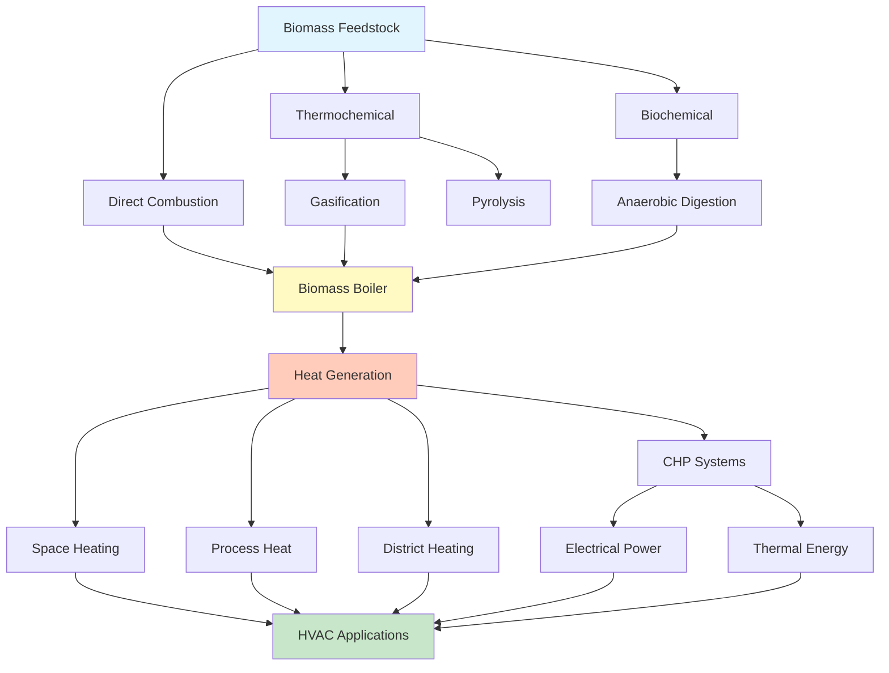

Biomass energy represents stored solar energy in organic matter, converted through photosynthesis into chemical energy accessible through combustion, gasification, and anaerobic digestion. These resources provide renewable thermal energy for space heating, domestic hot water, industrial process heat, and combined heat and power applications serving HVAC loads.

## Biomass Feedstock Categories

### Woody Biomass

Forest residues, mill waste, and energy crops constitute the largest biomass resource for thermal applications. Wood fuel delivers 6,000-9,500 Btu/lb depending on species and moisture content.

Moisture content critically affects heating value and combustion efficiency:

$$HHV_{wet} = HHV_{dry} \cdot (1 - MC) - \lambda \cdot MC$$

Where:
- $HHV_{wet}$ = higher heating value of wet fuel (Btu/lb)
- $HHV_{dry}$ = higher heating value of dry fuel (Btu/lb)
- $MC$ = moisture content (decimal fraction)
- $\lambda$ = latent heat of vaporization (approximately 1,050 Btu/lb)

**Primary fuel forms:** Wood pellets (6-8% moisture, 8,200-8,500 Btu/lb), wood chips (25-40% moisture, 5,000-6,500 Btu/lb), and cordwood (20-30% moisture, 6,000-7,000 Btu/lb).

### Agricultural Biomass and Biogas

Agricultural residues including corn stover, wheat straw, and switchgrass deliver 5,500-7,500 Btu/lb. Energy crop yields translate to thermal potential:

$$E_{thermal} = Y_{crop} \cdot HHV \cdot A \cdot \eta_{conversion}$$

Where $E_{thermal}$ = thermal energy output (Btu/acre/yr), $Y_{crop}$ = crop yield (lb/acre/yr), $HHV$ = higher heating value (Btu/lb), $A$ = cultivation area (acres), and $\eta_{conversion}$ = conversion efficiency.

Anaerobic digestion produces biogas containing 50-75% methane with heating value of 500-700 Btu/ft³ from organic waste at landfills, wastewater treatment plants, and agricultural operations.

## Biomass Conversion Technologies

### Direct Combustion Systems

Biomass combustion systems convert chemical energy to thermal energy through oxidation. Complete combustion of cellulose-based biomass follows:

$$C_6H_{10}O_5 + 6O_2 \rightarrow 6CO_2 + 5H_2O + \text{Heat}$$

Combustion efficiency:

$$\eta_{combustion} = \frac{Q_{output}}{Q_{input}} = \frac{m_{fuel} \cdot HHV - Q_{losses}}{m_{fuel} \cdot HHV}$$

Where $\eta_{combustion}$ = combustion efficiency, $Q_{output}$ = useful heat output (Btu/h), $Q_{input}$ = fuel heat input (Btu/h), and $Q_{losses}$ = stack losses, radiation, incomplete combustion (Btu/h).

Modern biomass boilers achieve 75-85% efficiency with properly dried fuel and optimized combustion controls operating with 25-50% excess air.

## US Biomass Energy Capacity

| Application Category | Installed Capacity | Annual Energy Production | Primary Feedstocks |
|---------------------|-------------------|------------------------|-------------------|
| Industrial Heat & Power | 8,500 MW electric 65,000 MW thermal | 55 billion kWh 450 trillion Btu | Wood residues, black liquor, agricultural waste |
| Residential Wood Heating | 12,000 MW thermal | 350 trillion Btu | Cordwood, pellets |
| District Heating Systems | 1,200 MW thermal | 8 trillion Btu | Wood chips, pellets |
| Biogas/Landfill Gas | 2,300 MW electric | 17 billion kWh | Municipal waste, agricultural waste |

*Source: U.S. Department of Energy Biomass Resource Assessment and EIA Renewable Energy Data*

## HVAC Applications and System Integration

### Biomass Boiler Systems

Biomass boilers integrate with hydronic heating distribution systems serving space heating, domestic hot water, and industrial process loads. Boiler sizing follows:

$$Q_{boiler} = \frac{Q_{design}}{\eta_{boiler}} \cdot SF$$

Where $Q_{boiler}$ = required boiler input capacity (Btu/h), $Q_{design}$ = design heat load (Btu/h), $\eta_{boiler}$ = seasonal boiler efficiency, and $SF$ = safety factor (typically 1.15-1.25).

Fuel consumption rate:

$$\dot{m}_{fuel} = \frac{Q_{boiler}}{HHV_{fuel} \cdot \eta_{combustion}}$$

### Pellet-Fired and CHP Systems

Wood pellet systems offer automated operation with auger feed mechanisms, electronic ignition, and modulating burners achieving 80-88% efficiency. Storage volume requirements:

$$V_{storage} = \frac{\dot{m}_{fuel,avg} \cdot t_{storage}}{\rho_{bulk}}$$

Where $V_{storage}$ = required storage volume (ft³), $\dot{m}_{fuel,avg}$ = average fuel consumption (lb/day), $t_{storage}$ = desired storage duration (days), and $\rho_{bulk}$ = bulk density of pellets (40-45 lb/ft³).

Biomass CHP systems achieve overall efficiencies of 70-85% by generating both electricity and thermal energy, serving building heating loads, domestic hot water, and absorption cooling applications.

## Performance Factors and Considerations

**Fuel Quality Management:** Moisture content below 20% optimizes combustion efficiency and minimizes creosote formation. Fuel storage in covered, ventilated areas maintains quality.

**Emissions Control:** Modern biomass systems incorporate particulate removal (cyclones, baghouses) and combustion optimization to meet EPA standards. Properly operated systems produce CO emissions below 100 ppm and particulate matter below 0.10 lb/million Btu.

**System Automation:** Advanced controls monitor combustion parameters (O₂, CO, temperature), modulate fuel and air delivery, and integrate with building management systems for optimized operation.

**Economic Analysis:** Capital costs range from $150-300/kW for residential pellet boilers to $3,000-6,000/kW for industrial systems. Operating costs: $4-8/million Btu for wood pellets compared to $10-25/million Btu for fuel oil or propane.

**Carbon Considerations:** Sustainably harvested biomass operates as carbon-neutral over growth/harvest cycles, as CO₂ released during combustion equals CO₂ absorbed during growth.

Biomass resources provide versatile, renewable thermal energy for diverse HVAC applications from residential heating to district energy systems. Proper feedstock selection, conversion technology matching, and system integration enable efficient, cost-effective deployment where biomass resources are locally available and sustainably managed.
