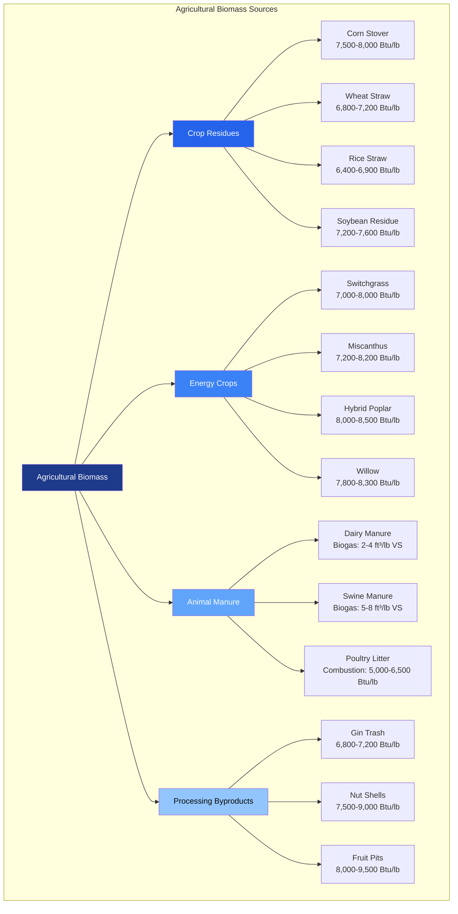

Agricultural biomass represents a significant renewable energy resource for HVAC heating applications, particularly in rural and agricultural regions. This resource includes crop residues, dedicated energy crops, animal manure, and processing byproducts that can be converted to thermal energy through direct combustion, gasification, or anaerobic digestion.

## Crop Residue Resources

Crop residues are the stalks, leaves, husks, and other plant materials remaining after harvest. These materials provide substantial energy potential while maintaining soil conservation requirements.

### Primary Crop Residues

The following table presents heating values for major crop residues:

| Residue Type | Heating Value (Btu/lb, dry basis) | Moisture Content (as harvested, %) | Bulk Density (lb/ft³) | Ash Content (%) |
|--------------|-----------------------------------|------------------------------------|-----------------------|-----------------|
| Corn Stover | 7,500 - 8,000 | 12 - 18 | 8 - 12 | 4 - 7 |
| Wheat Straw | 6,800 - 7,200 | 10 - 15 | 6 - 10 | 5 - 9 |
| Rice Straw | 6,400 - 6,900 | 8 - 12 | 5 - 8 | 14 - 20 |
| Soybean Residue | 7,200 - 7,600 | 12 - 16 | 7 - 11 | 4 - 6 |
| Cotton Stalks | 7,800 - 8,200 | 10 - 14 | 12 - 16 | 3 - 5 |
| Sugarcane Bagasse | 7,000 - 7,500 | 45 - 55 | 8 - 14 | 2 - 6 |
| Rice Hulls | 5,800 - 6,400 | 8 - 10 | 10 - 14 | 18 - 22 |

### Energy Yield Calculations

The available thermal energy from crop residues depends on yield, collection efficiency, and sustainable harvest rates. The energy potential is calculated as:

$$Q_{available} = Y \times R \times C \times HHV \times \eta_{collection}$$

Where:
- $Q_{available}$ = Available thermal energy (Btu/acre)
- $Y$ = Crop yield (bushels/acre or tons/acre)
- $R$ = Residue-to-grain ratio (dimensionless)
- $C$ = Collectible fraction (typically 0.30 - 0.50)
- $HHV$ = Higher heating value (Btu/lb, dry basis)
- $\eta_{collection}$ = Collection efficiency (typically 0.70 - 0.85)

For moisture content corrections:

$$HHV_{wet} = HHV_{dry} \times (1 - MC) - 1050 \times MC$$

Where:
- $HHV_{wet}$ = Heating value at actual moisture content (Btu/lb)
- $HHV_{dry}$ = Heating value at 0% moisture (Btu/lb)
- $MC$ = Moisture content (decimal fraction)
- $1050$ = Latent heat of vaporization correction (Btu/lb)

## Energy Crop Systems

Dedicated energy crops are perennial grasses and short-rotation woody crops grown specifically for biomass production.

### Perennial Grass Yields

| Energy Crop | Yield (dry tons/acre/year) | Heating Value (Btu/lb, dry) | Energy Yield (MMBtu/acre/year) | Growth Period (years) |
|-------------|----------------------------|------------------------------|-------------------------------|----------------------|
| Switchgrass | 4 - 8 | 7,000 - 8,000 | 56 - 128 | Perennial, 10+ |
| Miscanthus | 6 - 12 | 7,200 - 8,200 | 86 - 197 | Perennial, 15+ |
| Reed Canarygrass | 3 - 6 | 6,800 - 7,400 | 41 - 89 | Perennial, 10+ |
| Giant Reed | 8 - 15 | 6,500 - 7,200 | 104 - 216 | Perennial, 12+ |

### Short-Rotation Woody Crops

| Woody Crop | Yield (dry tons/acre/3-year rotation) | Heating Value (Btu/lb, dry) | Rotation Period (years) | Moisture Content (%) |
|------------|---------------------------------------|------------------------------|------------------------|----------------------|
| Hybrid Poplar | 12 - 20 | 8,000 - 8,500 | 3 - 5 | 45 - 55 |
| Willow | 10 - 18 | 7,800 - 8,300 | 3 - 4 | 50 - 60 |
| Eucalyptus | 15 - 25 | 8,200 - 8,800 | 5 - 7 | 40 - 50 |
| Hybrid Cottonwood | 12 - 18 | 8,100 - 8,600 | 4 - 6 | 45 - 55 |

## Animal Manure Energy Systems

Animal manure can be converted to energy through anaerobic digestion (biogas production) or direct combustion (poultry litter).

### Biogas Production Potential

Biogas yield from manure depends on volatile solids content and digester conditions:

$$V_{biogas} = VS \times Y_{biogas} \times \eta_{digester}$$

Where:
- $V_{biogas}$ = Biogas production rate (ft³/day)
- $VS$ = Volatile solids loading rate (lb/day)
- $Y_{biogas}$ = Specific biogas yield (ft³/lb VS)
- $\eta_{digester}$ = Digester efficiency (0.70 - 0.85)

Energy content of biogas:

$$Q_{biogas} = V_{biogas} \times CH_4 \times HHV_{CH_4}$$

Where:
- $Q_{biogas}$ = Thermal energy potential (Btu/day)
- $CH_4$ = Methane content (typically 0.55 - 0.65)
- $HHV_{CH_4}$ = Heating value of methane (1,010 Btu/ft³)

### Manure Characteristics

| Animal Type | Total Solids (%) | Volatile Solids (% of TS) | Biogas Yield (ft³/lb VS) | Methane Content (%) |
|-------------|------------------|---------------------------|--------------------------|---------------------|
| Dairy Cattle | 10 - 14 | 75 - 85 | 2.0 - 4.0 | 55 - 65 |
| Beef Cattle | 12 - 18 | 80 - 88 | 2.5 - 4.5 | 55 - 60 |
| Swine | 8 - 12 | 70 - 80 | 5.0 - 8.0 | 60 - 70 |
| Poultry (layers) | 20 - 30 | 65 - 75 | 3.5 - 6.0 | 55 - 65 |
| Poultry (broilers) | 18 - 25 | 70 - 80 | 4.0 - 7.0 | 60 - 65 |

## HVAC System Integration

Agricultural biomass can be integrated into HVAC systems through several conversion pathways:

**Direct Combustion Systems**: Biomass boilers ranging from 50,000 Btu/hr to 50 MMBtu/hr can fire crop residues, energy crops, or poultry litter. These systems typically require fuel storage, automated feed systems, and ash removal equipment.

**Gasification Systems**: Biomass gasifiers convert solid biomass to combustible syngas (CO + H₂ + CH₄) with heating values of 100-180 Btu/ft³ for air-blown systems or 300-500 Btu/ft³ for oxygen-blown systems. The syngas fuels engine-generators or direct-fired heaters.

**Biogas Cogeneration**: Anaerobic digesters process animal manure to produce biogas for combined heat and power systems. A typical dairy operation with 500 cows produces 8,000-12,000 ft³/day of biogas, equivalent to 275-425 therms/day of natural gas.

### Combustion Efficiency Factors

Actual thermal output from biomass combustion:

$$Q_{useful} = m_{fuel} \times HHV_{wet} \times \eta_{combustion} \times \eta_{heat\_transfer}$$

Where:
- $Q_{useful}$ = Useful heat output (Btu/hr)
- $m_{fuel}$ = Fuel consumption rate (lb/hr)
- $\eta_{combustion}$ = Combustion efficiency (0.75 - 0.90)
- $\eta_{heat\_transfer}$ = Heat transfer efficiency (0.70 - 0.85)

## Sustainability Considerations

Sustainable agricultural biomass harvesting maintains soil organic matter and prevents erosion. USDA guidelines recommend:

- Remove no more than 30-50% of crop residues
- Maintain minimum 3-4 tons/acre residue cover
- Account for slope, soil type, and tillage practices
- Monitor soil carbon levels over multi-year periods

Energy return on investment (EROI) for agricultural biomass systems typically ranges from 3:1 to 8:1, depending on transportation distances, moisture content, and conversion efficiency.

Agricultural biomass provides dispatchable renewable energy suitable for base-load or peak heating demands in distributed HVAC applications, particularly in rural communities and agricultural processing facilities.
