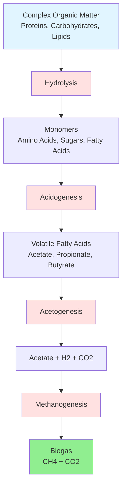

Biogas represents a renewable energy resource derived from organic waste decomposition under anaerobic conditions. The methane-rich gas produced serves as fuel for boilers, engines, turbines, and fuel cells in HVAC applications, providing both thermal energy and electricity while reducing greenhouse gas emissions.

## Anaerobic Digestion Process

Anaerobic digestion converts organic matter into biogas through microbial degradation in oxygen-free environments. The process occurs in four distinct biochemical stages.

### Methanogenesis Kinetics

Methane production follows first-order kinetics with respect to volatile solids loading:

$$\frac{dCH_4}{dt} = k \cdot VS \cdot (1 - e^{-kt})$$

Where:
- $\frac{dCH_4}{dt}$ = methane production rate (m³/day)
- $k$ = first-order rate constant (day⁻¹)
- $VS$ = volatile solids concentration (kg/m³)
- $t$ = hydraulic retention time (days)

The theoretical methane yield from organic substrates is calculated using the Buswell equation:

$$C_nH_aO_bN_c + \left(\frac{4n-a-2b+3c}{4}\right)H_2O \rightarrow \left(\frac{4n+a-2b-3c}{8}\right)CH_4 + \left(\frac{4n-a+2b+3c}{8}\right)CO_2 + cNH_3$$

For practical applications, the specific methane yield is:

$$Y_{CH_4} = \frac{V_{CH_4}}{VS_{removed}} = B_0 \cdot \left(1 - \frac{k_d}{k_d + \mu_m}\right)$$

Where:
- $Y_{CH_4}$ = methane yield (m³ CH₄/kg VS removed)
- $B_0$ = ultimate biodegradability coefficient (0.35-0.55 m³/kg VS)
- $k_d$ = endogenous decay coefficient (0.02-0.04 day⁻¹)
- $\mu_m$ = maximum specific growth rate (0.1-0.5 day⁻¹)

## Biogas Composition

Biogas composition varies with feedstock and digester conditions. The table below presents typical ranges:

| Component | Landfill Gas | Anaerobic Digester | Wastewater Treatment |
|-----------|--------------|-------------------|---------------------|
| Methane (CH₄) | 45-60% | 55-75% | 60-70% |
| Carbon Dioxide (CO₂) | 35-50% | 25-45% | 30-40% |
| Nitrogen (N₂) | 0-5% | 0-2% | 0-1% |
| Oxygen (O₂) | 0-2% | <0.5% | <0.5% |
| Hydrogen Sulfide (H₂S) | 10-200 ppm | 100-8,000 ppm | 500-3,000 ppm |
| Ammonia (NH₃) | 0-5 ppm | 0-100 ppm | 10-50 ppm |
| Siloxanes | 1-50 mg/m³ | 0-50 mg/m³ | 5-100 mg/m³ |
| Water Vapor | Saturated | Saturated | Saturated |

### Heating Value

The lower heating value (LHV) of biogas depends on methane content:

$$LHV_{biogas} = LHV_{CH_4} \cdot \chi_{CH_4} = 35.8 \text{ MJ/m}^3 \cdot \chi_{CH_4}$$

For typical compositions:
- Raw digester gas (65% CH₄): 23.3 MJ/m³ (626 Btu/ft³)
- Landfill gas (50% CH₄): 17.9 MJ/m³ (481 Btu/ft³)
- Upgraded RNG (≥95% CH₄): 34.0 MJ/m³ (914 Btu/ft³)
- Pipeline natural gas (reference): 37.3 MJ/m³ (1,002 Btu/ft³)

## Biogas Production Sources

### Agricultural Digesters

Farm-based anaerobic digesters process animal manure and crop residues. The EPA AgSTAR program tracks over 330 operational systems in the United States processing dairy, swine, and poultry waste.

**Methane Yield by Feedstock:**

| Feedstock | VS Content | Methane Yield | Energy Equivalent |
|-----------|------------|---------------|-------------------|
| Dairy manure | 75-85% | 0.20-0.25 m³/kg VS | 7.2-9.0 MJ/kg VS |
| Swine manure | 70-80% | 0.35-0.45 m³/kg VS | 12.5-16.1 MJ/kg VS |
| Poultry litter | 75-85% | 0.25-0.35 m³/kg VS | 9.0-12.5 MJ/kg VS |
| Food waste | 85-95% | 0.45-0.60 m³/kg VS | 16.1-21.5 MJ/kg VS |
| Crop residues | 90-95% | 0.30-0.45 m³/kg VS | 10.7-16.1 MJ/kg VS |

### Landfill Gas Recovery

Municipal solid waste landfills generate methane as organic materials decompose. Gas collection systems extract this biogas for energy recovery. The EPA Landfill Methane Outreach Program (LMOP) identifies 540 operational landfill gas energy projects in the United States.

Landfill gas generation follows a first-order decay model:

$$Q_{CH_4} = \sum_{i=1}^{n} \frac{k \cdot L_0 \cdot M_i \cdot e^{-kt_i}}{10}$$

Where:
- $Q_{CH_4}$ = methane generation rate (m³/year)
- $k$ = methane generation rate constant (0.02-0.20 year⁻¹)
- $L_0$ = methane generation potential (100-170 m³/Mg waste)
- $M_i$ = waste mass accepted in year $i$ (Mg)
- $t_i$ = years since waste acceptance

### Wastewater Treatment Digesters

Municipal wastewater treatment facilities employ anaerobic digestion to stabilize sewage sludge. The digester gas produced typically contains 60-70% methane and is used for facility heating and power generation via cogeneration systems.

Digester gas production capacity:

$$V_{gas} = VS_{destroyed} \cdot Y_{gas} \cdot Q$$

Where:
- $V_{gas}$ = gas production rate (m³/day)
- $VS_{destroyed}$ = volatile solids destruction efficiency (0.40-0.60)
- $Y_{gas}$ = gas yield (1.0-1.4 m³/kg VS destroyed)
- $Q$ = sludge flow rate (m³/day)

## Biogas Upgrading to RNG

Raw biogas requires cleanup and upgrading to meet pipeline natural gas specifications or vehicle fuel standards. The process removes CO₂, H₂S, moisture, and trace contaminants.

### Upgrading Technologies

**Comparison of biogas upgrading methods:**

| Technology | CH₄ Recovery | Energy Use | Capital Cost | O&M Cost |
|------------|--------------|------------|--------------|----------|
| Pressure Swing Adsorption | 96-98% | 0.2-0.3 kWh/m³ | Medium | Low |
| Membrane Separation | 90-96% | 0.18-0.25 kWh/m³ | Low-Medium | Medium |
| Water Scrubbing | 96-98% | 0.25-0.35 kWh/m³ | Medium | Medium |
| Chemical Scrubbing | 97-99% | 0.15-0.25 kWh/m³ | High | High |
| Cryogenic Separation | 97-99% | 0.5-0.7 kWh/m³ | High | Medium |

### RNG Pipeline Injection Standards

To inject RNG into natural gas pipelines, the gas must meet these specifications:

- Methane content: ≥95%
- Higher heating value: 36.0-40.5 MJ/m³ (967-1,087 Btu/ft³)
- Wobbe Index: 47.5-51.5 MJ/m³
- Hydrogen sulfide: <4 ppm (6 mg/m³)
- Total sulfur: <23 ppm
- Water dewpoint: <-7°C at pipeline pressure
- Hydrocarbon dewpoint: <-18°C at pipeline pressure
- Oxygen: <0.2%

## HVAC Applications

Biogas serves multiple roles in building energy systems:

**Direct Combustion Applications:**
- Boiler fuel for space heating and hot water
- Absorption chiller fuel for cooling
- Combined heat and power (CHP) systems
- Emergency backup generators

**Energy Conversion Efficiency:**
- Biogas boilers: 80-88% thermal efficiency
- Biogas engines (CHP): 32-42% electrical, 40-50% thermal
- Biogas turbines (CHP): 25-35% electrical, 50-60% thermal
- Biogas fuel cells: 45-55% electrical, 35-45% thermal

The total CHP system efficiency reaches 75-90%, substantially exceeding separate heat and power generation.

**System Sizing Example:**

For a dairy farm producing 150 m³/day of biogas at 65% methane:

$$\dot{Q}_{thermal} = \dot{V}_{biogas} \cdot LHV \cdot \eta_{boiler} = 150 \frac{m^3}{day} \cdot 23.3 \frac{MJ}{m^3} \cdot 0.85 = 2,971 \text{ MJ/day} = 124 \text{ kW}_{thermal}$$

This thermal output can heat approximately 8,000-10,000 ft² of agricultural buildings or provide process heat for farm operations.

## Environmental Benefits

Biogas utilization provides multiple environmental advantages:

- Methane capture prevents greenhouse gas emissions (CH₄ has 28× the global warming potential of CO₂ over 100 years)
- Displaces fossil fuel consumption
- Reduces landfill space requirements
- Stabilizes organic waste streams
- Produces nutrient-rich digestate for agricultural use
- Supports renewable energy portfolios and carbon reduction targets

According to EPA AgSTAR data, a 1,000-cow dairy operation can reduce greenhouse gas emissions equivalent to 1,800 metric tons CO₂-equivalent annually while generating sufficient biogas to power farm operations and export excess electricity.

---

*Content based on EPA AgSTAR program data, EPA LMOP statistics, ASHRAE biogas utilization guidelines, and industry performance standards current through 2025.*