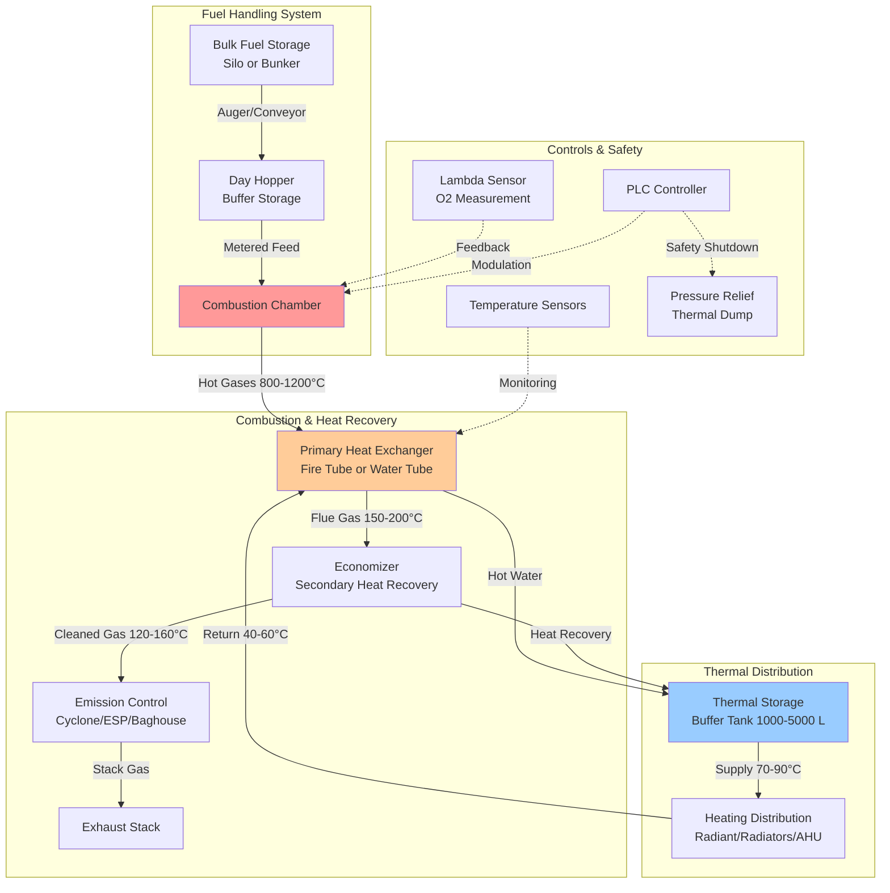

Biomass heating systems convert organic materials into thermal energy for space heating, domestic hot water, and process heat applications. Modern biomass technologies offer efficient, carbon-neutral alternatives to fossil fuel heating systems with thermal efficiencies ranging from 75% to 92% depending on fuel type and combustion technology.

## Biomass Fuel Types and Characteristics

Biomass fuels vary significantly in moisture content, energy density, and handling requirements. Selection depends on availability, storage infrastructure, and combustion equipment compatibility.

| Fuel Type | Moisture Content | Energy Density | Handling | Applications |
|-----------|-----------------|----------------|----------|--------------|
| Wood Pellets | 6-10% | 17.5 MJ/kg | Automated | Residential, commercial boilers |
| Wood Chips | 20-40% | 10-14 MJ/kg | Automated/Semi | District heating, large commercial |
| Cordwood/Logs | 15-25% | 13-16 MJ/kg | Manual | Residential stoves, small boilers |
| Agricultural Residues | 10-20% | 14-18 MJ/kg | Automated | Industrial process heat |
| Energy Crops | 15-30% | 12-16 MJ/kg | Automated | Large-scale heating plants |

## Pellet Boiler Systems

Pellet boilers represent the most automated and efficient biomass heating technology for residential and commercial applications. Pellets are manufactured from compressed sawdust and wood waste with standardized dimensions (6-8 mm diameter, 10-30 mm length).

### Design Features

- **Automated fuel delivery**: Auger systems transport pellets from bulk storage to combustion chamber
- **Modulating burners**: Adjust firing rate based on heating demand (30-100% capacity)
- **Lambda oxygen control**: Continuously optimize air-fuel ratio for complete combustion
- **Automatic ash removal**: Reduce maintenance intervals to weekly or monthly cleaning

### Efficiency Characteristics

Modern pellet boilers achieve thermal efficiencies of 85-92% through:

$$\eta_{boiler} = \frac{Q_{useful}}{Q_{fuel}} = \frac{\dot{m}_{water} \cdot c_p \cdot (T_{supply} - T_{return})}{LHV_{pellet} \cdot \dot{m}_{pellet}}$$

where:
- $\eta_{boiler}$ = boiler thermal efficiency (-)
- $Q_{useful}$ = useful heat output (kW)
- $Q_{fuel}$ = fuel energy input based on lower heating value (kW)
- $\dot{m}_{water}$ = water flow rate (kg/s)
- $c_p$ = specific heat of water (4.18 kJ/kg·K)
- $T_{supply}$, $T_{return}$ = supply and return water temperatures (°C)
- $LHV_{pellet}$ = lower heating value of pellets, typically 16.5 MJ/kg
- $\dot{m}_{pellet}$ = pellet consumption rate (kg/s)

## Wood Chip Heating Systems

Wood chip systems serve medium to large commercial installations and district heating applications. Chips accommodate variable fuel quality and lower cost biomass sources.

### System Components

- **Live-bottom storage bunkers**: Prevent bridging and ensure consistent fuel flow (50-500 m³ capacity)
- **Walking floor or drag chain conveyors**: Move chips from storage to boiler
- **Grate combustion systems**: Moving grate, vibrating grate, or underfeed stoker designs
- **Multi-cyclone particulate control**: Meet emission standards for PM10, PM2.5

### Capacity Range

Wood chip boilers typically range from 200 kW to 10+ MW thermal output, suitable for:
- Educational campuses (500-2000 kW)
- Industrial facilities (1-5 MW)
- District heating networks (5-20 MW)
- Commercial greenhouses (300-1500 kW)

## Biomass Heating System Architecture

## Boiler Efficiency Calculations

Combustion efficiency accounts for heat losses through stack gases and incomplete combustion:

$$\eta_{combustion} = 100 - L_{stack} - L_{combustion}$$

Stack loss depends on flue gas temperature and excess air:

$$L_{stack} = \frac{K \cdot (T_{flue} - T_{ambient})}{CO_2 \, \text{%}}$$

where:
- $L_{stack}$ = stack heat loss (%)
- $K$ = fuel-specific constant (0.5 for wood biomass)
- $T_{flue}$ = flue gas temperature (°C)
- $T_{ambient}$ = ambient air temperature (°C)
- $CO_2$ % = carbon dioxide concentration in flue gas (typically 12-16% for biomass)

Seasonal efficiency incorporates cycling losses and standby heat loss:

$$\eta_{seasonal} = \eta_{boiler} \cdot \left(1 - \frac{L_{cycling} + L_{standby}}{100}\right)$$

Typical seasonal efficiency ranges: 75-85% depending on load profile and buffer storage capacity.

## Combined Heat and Power (CHP) Integration

Biomass CHP systems generate both electricity and useful thermal energy through:

### Technology Options

| Technology | Electrical Efficiency | Thermal Efficiency | Total CHP Efficiency | Scale |
|------------|----------------------|-------------------|---------------------|-------|
| Organic Rankine Cycle (ORC) | 12-18% | 65-75% | 80-88% | 200 kW - 2 MW |
| Steam Turbine | 15-25% | 60-70% | 80-90% | 1 MW - 50 MW |
| Gasification + Engine | 25-35% | 45-55% | 75-85% | 100 kW - 5 MW |
| Stirling Engine | 10-15% | 70-80% | 85-90% | 10 kW - 100 kW |

### Performance Metrics

Overall CHP efficiency:

$$\eta_{CHP} = \frac{E_{electric} + Q_{thermal,useful}}{LHV_{fuel} \cdot \dot{m}_{fuel}}$$

Power-to-heat ratio:

$$\text{PHR} = \frac{E_{electric}}{Q_{thermal,useful}}$$

Biomass CHP applications require adequate thermal base load to maximize utilization. Thermal storage (10,000-50,000 L) buffers electrical generation from building heat demand fluctuations.

## Emission Control and Air Quality

Modern biomass heating systems incorporate emission control to meet air quality standards:

- **Primary measures**: Staged combustion, flue gas recirculation, optimized air distribution
- **Secondary measures**: Electrostatic precipitators (ESP), fabric filters (baghouse), multi-cyclones
- **NOx control**: Low-NOx burners, selective non-catalytic reduction (SNCR) for large units
- **CO control**: Lambda control maintaining 6-10% oxygen in flue gas

Typical emission levels for pellet boilers: PM < 20 mg/Nm³, CO < 250 mg/Nm³, NOx < 200 mg/Nm³.

## System Sizing and Thermal Storage

Proper sizing prevents short-cycling and maximizes efficiency:

$$V_{storage} = \frac{P_{boiler} \cdot t_{burn,min}}{\rho \cdot c_p \cdot \Delta T}$$

where:
- $V_{storage}$ = required buffer tank volume (m³)
- $P_{boiler}$ = boiler thermal output (kW)
- $t_{burn,min}$ = minimum burn time for efficient operation (typically 1-2 hours)
- $\rho$ = water density (1000 kg/m³)
- $\Delta T$ = storage temperature swing (20-30 K)

## Applications and Market Sectors

| Application | Typical Capacity | Fuel Type | Key Considerations |
|-------------|-----------------|-----------|-------------------|
| Single-family residential | 10-30 kW | Pellets, cordwood | Automated operation, storage space |
| Multi-family residential | 50-200 kW | Pellets, chips | Buffer storage, emission compliance |
| Commercial buildings | 100-500 kW | Chips, pellets | Maintenance access, fuel logistics |
| District heating | 1-20 MW | Chips, residues | Economy of scale, baseload operation |
| Industrial process heat | 500 kW - 10 MW | Chips, residues | Process integration, steam generation |
| Agricultural operations | 200-1000 kW | On-farm biomass | Fuel availability, seasonal loads |

Biomass heating systems provide viable renewable energy solutions where fuel supply chains exist, building loads justify capital investment, and carbon reduction goals align with slightly higher operational complexity compared to fossil fuel alternatives.

