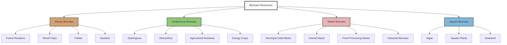

Biomass fuels represent diverse organic materials utilized for thermal energy production in HVAC heating systems. Understanding biomass classification, energy characteristics, and combustion properties enables optimal fuel selection for boilers, furnaces, and combined heat and power applications.

## Biomass Classification

Biomass resources are categorized by origin, composition, and physical characteristics that determine energy content, handling requirements, and combustion behavior.

## Woody Biomass

Woody biomass comprises lignocellulosic materials from forestry operations, lumber processing, and dedicated energy plantations. This category exhibits the highest energy density and most favorable combustion characteristics among biomass types.

**Physical and Chemical Properties**

Woody biomass contains 40-55% cellulose, 20-35% hemicellulose, and 15-30% lignin. The high lignin content provides superior energy density compared to herbaceous materials. Moisture content critically affects heating value, with air-dried wood at 15-20% moisture delivering optimal combustion efficiency.

The higher heating value (HHV) of woody biomass is calculated:

$$HHV = HHV_0 \left(1 - \frac{M}{100}\right) - 2.443 \frac{M}{100}$$

where $HHV_0$ is the heating value at zero moisture (18-21 MJ/kg for wood), $M$ is moisture content (%), and 2.443 MJ/kg represents the latent heat of vaporization for water at 25°C.

Energy density on a dry basis:

$$\rho_E = \rho_b \times HHV_d$$

where $\rho_E$ is energy density (GJ/m³), $\rho_b$ is bulk density (kg/m³), and $HHV_d$ is dry basis heating value (MJ/kg).

| Woody Biomass Type | Bulk Density (kg/m³) | Moisture Content (%) | HHV (MJ/kg, dry) | Ash Content (%) |
|-------------------|---------------------|---------------------|-----------------|----------------|
| Wood Pellets | 600-750 | 6-10 | 19.5-20.5 | 0.3-0.7 |
| Wood Chips | 250-400 | 25-40 | 18.5-19.5 | 0.5-2.0 |
| Sawdust | 180-280 | 15-25 | 19.0-20.0 | 0.4-1.5 |
| Bark | 200-350 | 30-50 | 18.0-19.0 | 2.0-6.0 |
| Logs (seasoned) | 350-500 | 15-25 | 19.0-20.0 | 0.5-1.0 |

## Herbaceous Biomass

Herbaceous biomass includes grasses, agricultural residues, and annual energy crops. These materials feature lower lignin content and higher ash compared to woody biomass, affecting combustion behavior and equipment requirements.

**Composition and Characteristics**

Herbaceous materials contain 30-45% cellulose, 20-40% hemicellulose, and 10-20% lignin. Elevated silica and alkali metal content (potassium, sodium) increases ash formation and slagging potential during combustion. Chlorine content in straw and agricultural residues can promote corrosion in boiler systems.

The ash fusion temperature relationship:

$$T_{slag} = f(SiO_2, Al_2O_3, CaO, Fe_2O_3, K_2O, Na_2O)$$

Herbaceous biomass typically exhibits lower ash fusion temperatures (1000-1200°C) compared to woody biomass (1200-1400°C), necessitating careful combustion management.

| Herbaceous Type | Bulk Density (kg/m³) | Moisture Content (%) | HHV (MJ/kg, dry) | Ash Content (%) | Alkali Index (kg/GJ) |
|----------------|---------------------|---------------------|-----------------|----------------|---------------------|
| Switchgrass | 100-200 | 10-15 | 17.5-18.5 | 3-6 | 0.25-0.45 |
| Miscanthus | 120-220 | 12-18 | 17.8-18.8 | 2-4 | 0.18-0.35 |
| Wheat Straw | 80-150 | 12-20 | 17.0-18.0 | 4-8 | 0.40-0.70 |
| Corn Stover | 100-180 | 15-25 | 17.2-18.2 | 4-7 | 0.35-0.60 |
| Rice Hulls | 100-160 | 8-12 | 15.5-16.5 | 15-20 | 0.50-0.80 |

## Waste Biomass

Waste biomass encompasses municipal solid waste (MSW), animal manures, food processing residues, and industrial organic byproducts. Heterogeneous composition and variable moisture content characterize this category.

**Energy Recovery Potential**

Waste biomass energy density varies significantly based on composition. The combustible fraction determines recoverable energy:

$$E_{rec} = \sum_{i=1}^{n} (m_i \times HHV_i \times \eta_c)$$

where $E_{rec}$ is recoverable energy, $m_i$ is mass fraction of component $i$, $HHV_i$ is heating value of component $i$, and $\eta_c$ is combustion efficiency.

| Waste Biomass Source | Typical Moisture (%) | HHV (MJ/kg, as received) | Primary Challenge |
|---------------------|---------------------|--------------------------|------------------|
| MSW (sorted) | 25-35 | 10-14 | Heterogeneity, contaminants |
| Food Waste | 70-85 | 3-6 | High moisture, decomposition |
| Animal Manure (cattle) | 75-85 | 2-4 | High moisture, odor control |
| Poultry Litter | 20-30 | 12-15 | Ammonia, high nitrogen |
| Paper/Cardboard | 5-15 | 14-17 | Variable quality |

## Aquatic Biomass

Aquatic biomass includes algae, aquatic plants, and seaweed. These resources offer rapid growth rates and high productivity per unit area but require significant dewatering for thermal applications.

**Moisture and Energy Considerations**

Algae and aquatic plants typically contain 80-95% moisture when harvested. Dewatering energy requirements often exceed thermal energy output unless efficient drying methods are employed.

Energy balance for aquatic biomass:

$$E_{net} = E_{thermal} - E_{dewater} - E_{process}$$

Economic viability requires $E_{net} > 0$, achievable through combined production (biogas and solid fuel) or low-energy drying (solar, waste heat integration).

| Aquatic Biomass | Moisture (as harvested, %) | HHV (MJ/kg, dry) | Protein Content (%) | Application Focus |
|----------------|---------------------------|-----------------|--------------------|--------------------|
| Microalgae | 85-95 | 20-24 | 40-60 | Biogas, lipid extraction |
| Macroalgae (kelp) | 80-90 | 10-14 | 8-15 | Biogas, bio-oil |
| Water Hyacinth | 90-95 | 15-17 | 12-18 | Biogas, composting |
| Duckweed | 90-94 | 16-18 | 35-45 | Animal feed, biogas |

## Fuel Selection Criteria

Biomass type selection for HVAC heating applications depends on multiple technical and economic factors:

**Energy Density and Handling**

Volumetric energy density determines storage requirements and fuel feed system design. Wood pellets provide 11-13 GJ/m³, enabling compact storage. Herbaceous bales deliver 2-3 GJ/m³, requiring larger storage facilities.

**Combustion Equipment Compatibility**

Ash content and fusion characteristics dictate boiler design requirements. Woody biomass suits fixed-bed and moving grate systems. High-ash herbaceous fuels require specialized grates and ash handling. Waste biomass necessitates emission control for chlorine and heavy metals.

**Moisture Management**

Moisture content directly affects net heating value and combustion temperature. Each percentage point of moisture reduces heating value by approximately 0.025 MJ/kg through evaporative losses. Fuel drying improves efficiency but adds processing cost.

**Supply Chain Considerations**

Local availability, seasonal variations, and transportation logistics influence fuel cost and reliability. Regional forest residues may provide year-round woody biomass supply, while agricultural residues follow harvest schedules.

## Biomass Conversion for HVAC

Thermal conversion processes transform biomass into useful heat:

- **Direct Combustion**: Complete oxidation at 800-1000°C produces hot gases for boilers and furnaces
- **Gasification**: Partial oxidation at 700-900°C generates combustible syngas (CO, H₂, CH₄)
- **Pyrolysis**: Thermal decomposition at 400-600°C yields bio-oil, biochar, and gases

Process selection depends on biomass type, scale, and desired output. Direct combustion dominates HVAC heating due to simplicity and proven technology.

Understanding biomass types enables informed fuel selection that optimizes energy efficiency, equipment longevity, and operational economics in biomass heating systems.
