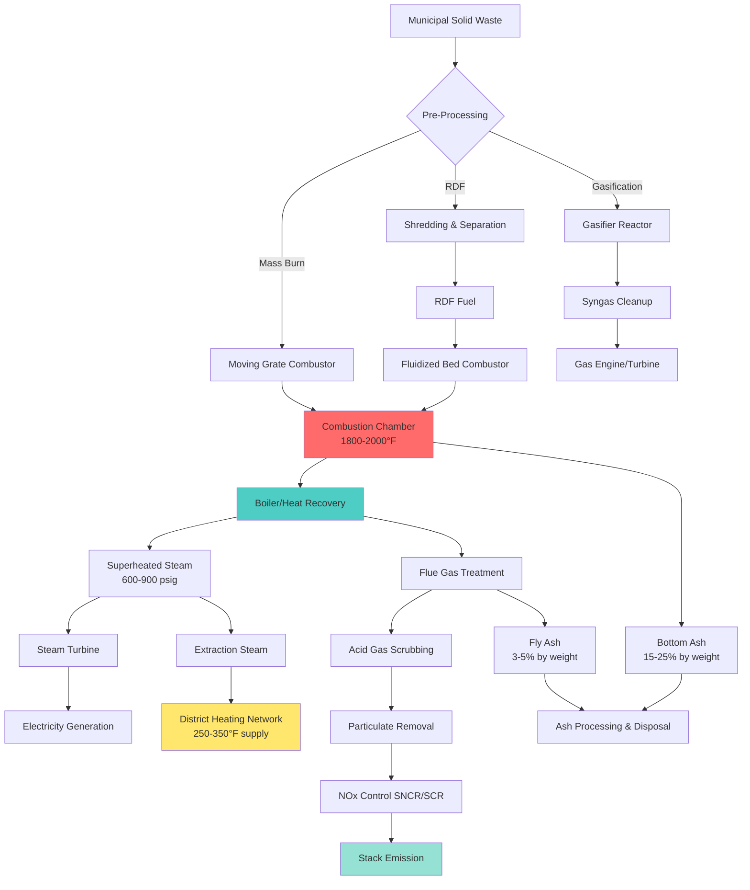

## Waste-to-Energy Technology Overview

Waste-to-Energy (WTE) facilities convert municipal solid waste (MSW) into thermal energy and electricity through controlled combustion processes. Modern WTE plants serve dual functions: waste volume reduction (typically 90% by volume, 75% by mass) and renewable energy generation. The technology provides baseload power generation while addressing waste management challenges in urban areas with limited landfill capacity.

WTE systems integrate with district heating networks by recovering thermal energy from flue gases and steam extraction. The high-temperature combustion process (1800-2000°F) produces steam at 600-900 psig and 750-850°F, suitable for both electricity generation and thermal distribution.

## Mass Burn Incineration Systems

Mass burn technology processes unprocessed MSW on moving grate combustors. The waste moves through distinct combustion zones:

1. **Drying Zone**: Evaporates moisture content (20-35% typical) at 300-500°F
2. **Ignition Zone**: Volatiles ignite at 500-1100°F
3. **Combustion Zone**: Primary oxidation at 1800-2000°F with 80-100% excess air
4. **Burnout Zone**: Complete char oxidation with extended residence time

The energy recovery efficiency from mass burn systems:

$$\eta_{thermal} = \frac{Q_{recovered}}{m_{fuel} \times LHV} = \frac{\dot{m}_{steam}(h_{steam} - h_{fw})}{m_{MSW} \times LHV_{MSW}}$$

Where:
- $Q_{recovered}$ = thermal energy recovered (Btu)
- $m_{fuel}$ = mass flow rate of MSW (lb/hr)
- $LHV$ = lower heating value of MSW (Btu/lb)
- $\dot{m}_{steam}$ = steam generation rate (lb/hr)
- $h_{steam}, h_{fw}$ = enthalpy of steam and feedwater (Btu/lb)

Typical thermal efficiency ranges from 65-75% with modern waterwall furnace designs.

## Refuse Derived Fuel (RDF) Processing

RDF systems pre-process MSW to remove non-combustibles (metals, glass, inerts) and create a more homogeneous fuel. The processing train includes:

- **Primary shredding**: Reduces particle size to 6-12 inches
- **Magnetic separation**: Removes ferrous metals (5-8% by weight)
- **Air classification**: Separates light combustibles from heavy inerts
- **Secondary shredding**: Further reduces to 2-4 inch particles
- **Densification**: Pelletizing increases bulk density to 30-40 lb/ft³

RDF heating value calculation accounts for moisture and ash removal:

$$LHV_{RDF} = LHV_{MSW} \times \frac{(100 - M_{RDF} - A_{RDF})}{(100 - M_{MSW} - A_{MSW})} \times \eta_{processing}$$

Where:
- $M$ = moisture content (%)
- $A$ = ash content (%)
- $\eta_{processing}$ = processing efficiency (0.85-0.92 typical)

## MSW and RDF Fuel Properties

| Property | MSW (As-Received) | RDF (Processed) | Units |
|----------|-------------------|-----------------|-------|
| **Higher Heating Value** | 4,500-6,500 | 6,000-8,500 | Btu/lb |
| **Lower Heating Value** | 4,000-5,800 | 5,500-7,800 | Btu/lb |
| **Moisture Content** | 20-35 | 10-20 | % wet basis |
| **Ash Content** | 20-30 | 10-18 | % dry basis |
| **Bulk Density** | 200-400 | 15-25 (loose) | lb/yd³ |
| **Volatile Matter** | 60-75 | 65-80 | % dry basis |
| **Fixed Carbon** | 8-15 | 10-18 | % dry basis |
| **Sulfur Content** | 0.1-0.3 | 0.15-0.35 | % dry basis |
| **Chlorine Content** | 0.3-0.8 | 0.4-1.0 | % dry basis |

## Gasification for WTE Applications

Gasification converts MSW into synthesis gas (syngas) through partial oxidation at high temperatures (1200-1800°F) with substoichiometric oxygen (25-40% of theoretical air). The process yields:

$$\text{MSW} + O_2 + H_2O \rightarrow CO + H_2 + CO_2 + CH_4 + \text{tar} + \text{char}$$

The syngas composition and heating value:

$$LHV_{syngas} = \sum_{i} y_i \times LHV_i$$

Where $y_i$ represents mole fraction of combustible components:
- CO: 10,100 Btu/lb (LHV)
- H₂: 51,600 Btu/lb (LHV)
- CH₄: 21,500 Btu/lb (LHV)

Typical syngas yields 150-200 Btu/scf with compositions of 15-25% CO, 10-18% H₂, 8-12% CO₂, and 2-4% CH₄.

## District Heating Integration

WTE facilities provide baseload thermal energy for district heating networks through:

**Steam Extraction Configuration**:
- Back-pressure turbines: Extract steam at 50-150 psig for district heating
- Extraction-condensing turbines: Variable steam extraction based on thermal demand
- Heat recovery steam generators (HRSG): Direct thermal recovery without power generation

The combined heat and power (CHP) efficiency for WTE district heating:

$$\eta_{CHP} = \frac{W_{electrical} + Q_{thermal}}{m_{MSW} \times LHV_{MSW}}$$

Modern WTE-CHP systems achieve 75-85% total efficiency compared to 18-25% for electricity-only generation.

**Thermal Output Sizing**:
For a 1,000 ton/day MSW facility with 5,000 Btu/lb average heating value:

$$Q_{available} = \frac{1000 \text{ ton}}{24 \text{ hr}} \times 2000 \frac{\text{lb}}{\text{ton}} \times 5000 \frac{\text{Btu}}{\text{lb}} \times 0.70 = 291.7 \text{ MMBtu/hr}$$

This supports 40-60 MW thermal capacity for district heating at 70% thermal recovery efficiency.

## Emissions Control Requirements

EPA regulations (40 CFR Part 60, Subpart Eb for large MWC) mandate stringent emissions limits:

| Pollutant | Emission Limit | Control Technology |
|-----------|----------------|-------------------|
| **Particulate Matter** | 24 mg/dscm (0.015 gr/dscf) | Fabric filters (baghouse) |
| **Sulfur Dioxide (SO₂)** | 80% reduction or 30 ppmvd | Dry/wet scrubbers, lime injection |
| **Nitrogen Oxides (NOₓ)** | 180-205 ppmvd (dry basis) | SNCR, SCR catalytic reduction |
| **Carbon Monoxide (CO)** | 100 ppmvd (4-hr avg) | Combustion optimization |
| **Hydrogen Chloride (HCl)** | 25 ppmvd or 95% reduction | Dry scrubbing, activated carbon |
| **Dioxins/Furans** | 13 ng/dscm TEQ | Activated carbon injection |
| **Mercury (Hg)** | 0.080 mg/dscm or 85% reduction | Activated carbon, wet scrubbing |
| **Lead (Pb)** | 0.20 mg/dscm | Baghouse particulate control |
| **Cadmium (Cd)** | 0.020 mg/dscm | Baghouse particulate control |

Note: dscm = dry standard cubic meter at 7% O₂; ppmvd = parts per million by volume, dry basis

**Advanced Emissions Reduction**:

The acid gas scrubbing efficiency:

$$\eta_{removal} = \frac{C_{inlet} - C_{outlet}}{C_{inlet}} \times 100\%$$

Modern semi-dry scrubbers achieve 95-98% HCl removal and 85-92% SO₂ removal using lime slurry injection at stoichiometric ratios of 1.2-1.5.

## Performance and Economics

WTE facilities processing 500-3,000 tons/day MSW generate:
- **Electricity**: 500-600 kWh per ton MSW (gross generation)
- **Net electricity**: 350-450 kWh per ton MSW (after parasitic loads)
- **District heating**: 1.5-2.5 MMBtu per ton MSW thermal energy
- **Ash residue**: 250-300 lb per ton MSW (bottom ash + fly ash)

Capital costs range from $150,000-$250,000 per ton/day capacity for greenfield mass burn facilities. Operating costs include:

- Fuel handling and processing: $5-$12 per ton
- Emissions control consumables (lime, carbon): $8-$15 per ton
- Ash disposal: $40-$80 per ton ash generated
- Operations and maintenance: $15-$25 per ton MSW

Tipping fees ($50-$120 per ton) combined with energy revenue provide economic viability in regions with high landfill costs and favorable renewable energy incentives.

---

**Key Design Considerations**:
- Maintain furnace temperature >1800°F for complete combustion and dioxin destruction
- Design for 2-second minimum gas residence time at peak temperature
- Implement continuous emissions monitoring systems (CEMS) for regulatory compliance
- Plan for seasonal thermal demand variation in district heating applications
- Consider ash beneficiation (metal recovery, aggregate production) for sustainability

Modern WTE technology represents proven, reliable thermal energy infrastructure for urban areas requiring integrated waste management and renewable energy solutions.
