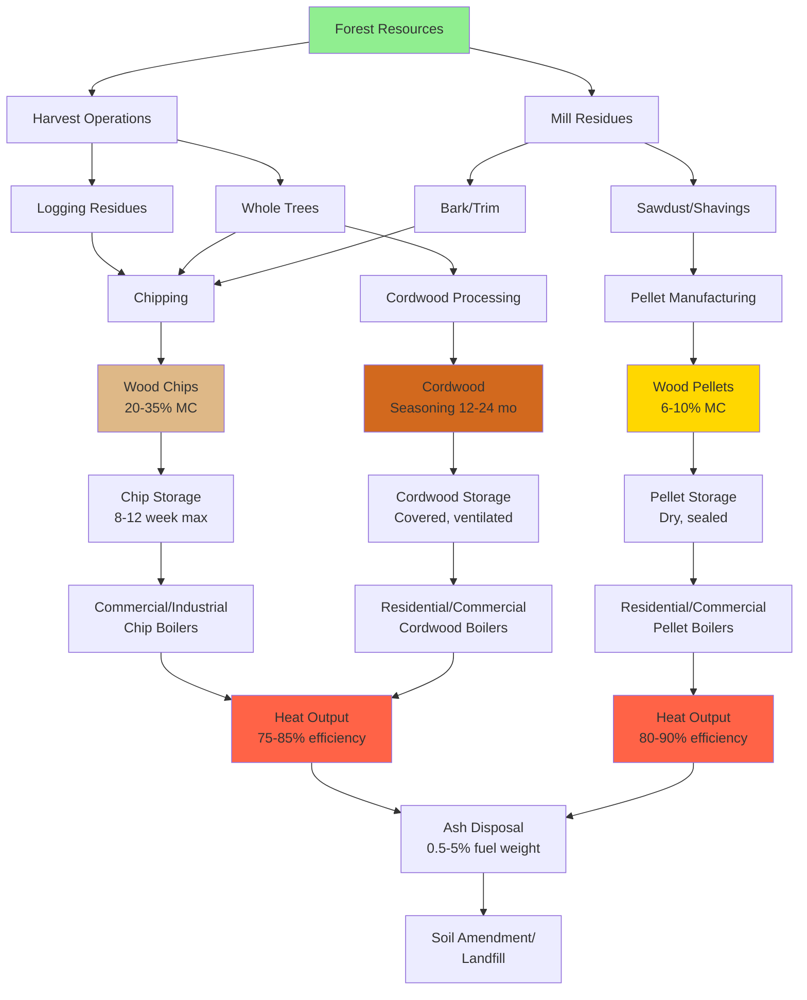

Wood biomass represents one of the oldest and most widely utilized renewable energy sources for heating applications. Modern wood heating systems achieve combustion efficiencies of 75-90% with properly dried fuel, making wood biomass a viable alternative to fossil fuels in residential, commercial, and industrial HVAC applications.

## Wood Fuel Forms

Wood biomass for heating systems is processed into three primary forms, each with distinct characteristics affecting combustion performance and system design.

### Wood Pellets (Densified Fuel)

Manufactured pellets offer the highest bulk density and most consistent fuel properties. Standard residential pellets measure 6-8 mm diameter with lengths of 15-30 mm. Manufacturing compresses sawdust and wood shavings under high pressure (10,000-15,000 psi), increasing bulk density to 40-45 lb/ft³ compared to 10-15 lb/ft³ for raw sawdust.

Pellet advantages include:
- Uniform size and energy content enabling automated feed systems
- Low moisture content (6-10%) maximizing heating value
- High bulk density reducing storage volume requirements
- Minimal ash content (0.5-1.5%) in premium grades

### Wood Chips

Chips result from mechanically processing logs, mill residues, and forest harvest slash. Particle size typically ranges from 5-50 mm with irregular geometry. Bulk density varies from 15-25 lb/ft³ depending on species, moisture content, and particle size distribution.

Chips suit medium to large-scale installations (200,000+ Btu/hr) where lower fuel cost offsets handling complexity. Chip quality depends on:
- Particle size uniformity (affects fuel flow and combustion)
- Contamination level (bark, dirt, stones)
- Moisture content (15-40% as-received)
- Storage duration (degradation begins after 8-12 weeks)

### Cordwood (Split Firewood)

Traditional cordwood consists of split logs cut to 12-24 inch lengths. One cord (128 ft³ stacked) contains approximately 70-90 ft³ solid wood depending on stacking efficiency. Cordwood requires manual loading except in specialized automated systems for large-scale applications.

Optimal cordwood characteristics:
- Seasoned 12-24 months to achieve ≤20% moisture content
- Split to 3-6 inch thickness for proper drying and combustion
- Dense hardwoods (oak, hickory, maple) preferred for energy density
- Bark-on acceptable but increases ash production

## Heating Value Analysis

The energy content of wood biomass depends critically on moisture content and wood species. Dry wood heating value ranges from 8,000-9,500 Btu/lb depending on species, with softwoods (pine, spruce) at the lower end and dense hardwoods (hickory, oak) at the higher end.

### Higher Heating Value (HHV)

Higher heating value represents total energy released during complete combustion, including latent heat of water vapor condensation:

$$
\text{HHV}_{\text{dry}} = 8,600 + 14.5 \times L
$$

where:
- $\text{HHV}_{\text{dry}}$ = higher heating value of dry wood (Btu/lb)
- $L$ = lignin content (% by weight, typically 25-35%)

For most wood species, $\text{HHV}_{\text{dry}}$ ≈ 8,500-9,500 Btu/lb on a dry basis.

### Lower Heating Value (LHV)

Lower heating value excludes the latent heat of vaporization, representing usable energy in conventional heating systems:

$$
\text{LHV}_{\text{dry}} = \text{HHV}_{\text{dry}} - 1,050 \times H
$$

where:
- $H$ = hydrogen content (% by weight, typically 6% for wood)

This yields $\text{LHV}_{\text{dry}}$ ≈ 7,850-8,850 Btu/lb for dry wood.

### Moisture Content Impact

Moisture content dramatically reduces effective heating value through two mechanisms: reduced combustible mass per unit weight and energy required for water vaporization.

As-received heating value with moisture:

$$
\text{HHV}_{\text{wet}} = \text{HHV}_{\text{dry}} \times \frac{100 - MC}{100} - 1,050 \times \frac{MC}{100}
$$

where:
- $MC$ = moisture content (wet basis, %)
- 1,050 Btu/lb = latent heat of vaporization for water

For wood at 20% moisture content:

$$
\text{HHV}_{\text{wet}} = 9,000 \times \frac{80}{100} - 1,050 \times \frac{20}{100} = 7,200 - 210 = 6,990 \text{ Btu/lb}
$$

At 40% moisture content, heating value drops to approximately 4,950 Btu/lb, representing a 45% reduction from dry wood.

## Wood Fuel Properties by Type

| Property | Wood Pellets | Wood Chips | Seasoned Cordwood |
|----------|--------------|------------|-------------------|
| **Moisture Content (%)** | 6-10 | 20-35 | 15-25 |
| **Bulk Density (lb/ft³)** | 40-45 | 15-25 | 25-35 (stacked) |
| **HHV As-Received (Btu/lb)** | 7,800-8,200 | 5,500-7,000 | 6,200-7,500 |
| **Ash Content (%)** | 0.5-1.5 | 1-5 | 0.5-2.0 |
| **Particle Size** | 6-8 mm dia. | 5-50 mm mixed | 12-24 in. length |
| **Energy Density (kBtu/ft³)** | 312-369 | 83-175 | 155-263 |
| **Feed System** | Automated auger | Automated auger/conveyor | Manual or automated |
| **Storage Requirements** | Dry, ventilated | Covered, ventilated | Covered, elevated |

## Moisture Content Measurement

Accurate moisture determination ensures proper combustion and efficiency. Two moisture content bases are used:

**Wet Basis (as-received):**

$$
MC_{\text{wet}} = \frac{W_{\text{water}}}{W_{\text{wet}}} \times 100
$$

**Dry Basis:**

$$
MC_{\text{dry}} = \frac{W_{\text{water}}}{W_{\text{dry}}} \times 100
$$

where:
- $W_{\text{water}}$ = weight of water in sample
- $W_{\text{wet}}$ = total weight of wet sample
- $W_{\text{dry}}$ = weight of dry sample

Conversion between bases:

$$
MC_{\text{dry}} = \frac{MC_{\text{wet}}}{100 - MC_{\text{wet}}} \times 100
$$

Field measurement typically employs pin-type or pinless moisture meters calibrated for wood, with oven-dry testing (103-105°C for 24 hours) serving as the reference method per ASTM D4442.

## Wood Fuel Production and Utilization Cycle

## Combustion Requirements

Efficient wood combustion requires three elements maintained simultaneously: sufficient temperature (≥1,100°F in primary combustion zone), adequate oxygen (λ = 1.4-2.0 air ratio), and proper residence time (2-4 seconds at temperature).

### Air Requirements

Stoichiometric air requirement for wood combustion:

$$
A_{\text{stoich}} = 4.5 \text{ lb air/lb dry wood}
$$

Practical combustion systems operate at 40-100% excess air (λ = 1.4-2.0) to ensure complete combustion:

$$
A_{\text{actual}} = A_{\text{stoich}} \times \lambda
$$

### Emissions Considerations

Modern wood heating systems meeting EPA emission standards achieve:
- Particulate matter: ≤2.5 g/hr (pellet stoves), ≤4.5 g/hr (cordwood stoves)
- Carbon monoxide: <0.05% by volume (optimal combustion)
- Thermal efficiency: 70-90% depending on technology

Proper moisture content (≤20%) proves critical for minimizing emissions and maximizing efficiency. Wood burned above 25% moisture produces significantly higher particulate emissions and lower combustion temperatures.

## Storage and Handling Considerations

Wood fuel storage requirements vary by form:

**Pellets:** Store in waterproof containers or buildings maintaining <10% relative humidity. Pellets absorb moisture readily, with exposure to >60% RH degrading pellet integrity within days. Bulk storage silos require 45-degree minimum cone angle for gravity discharge.

**Chips:** Cover storage with ventilated roofing to prevent rain infiltration while allowing moisture release. Chip piles exceeding 6 feet height risk spontaneous heating from biological activity. Maximum storage duration of 8-12 weeks prevents degradation and heating value loss.

**Cordwood:** Stack off ground on pallets or rails with prevailing wind exposure. Minimum 6-12 month seasoning required after splitting, with 12-24 months optimal for dense hardwoods. Top cover prevents rain infiltration while maintaining side ventilation.

## Economic and Environmental Factors

Wood biomass heating economics depend on regional fuel costs, system capital investment, and maintenance requirements. Typical residential heating costs (2023):

- Wood pellets: $250-350/ton → $16-23/million Btu
- Cordwood: $150-250/cord → $13-21/million Btu
- Natural gas: $10-15/million Btu (regional variation)
- Heating oil: $25-35/million Btu

Environmental benefits include carbon neutrality when harvested sustainably, reduced fossil fuel dependence, and support for local forestry economies. Life-cycle analysis shows well-managed wood heating reduces net CO₂ emissions by 80-95% compared to fossil fuels.

## References

1. U.S. Environmental Protection Agency. (2023). *Burn Wise: Best Burn Practices*. EPA-456/F-23-001.
2. ASTM D4442-20. *Standard Test Methods for Direct Moisture Content Measurement of Wood and Wood-Based Materials*.
3. U.S. Department of Energy. (2023). *Biomass Heating Systems*. DOE/EE-2156.
4. Biomass Energy Resource Center. (2022). *Wood Chip Fuel Quality and Specifications*.
5. Pellet Fuels Institute. (2023). *PFI Standard Specification for Residential/Commercial Densified Fuel*.
