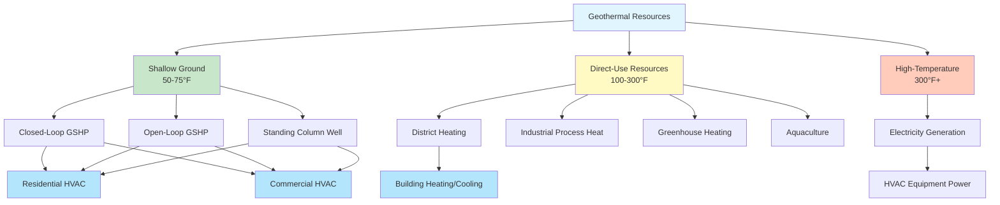

Geothermal resources represent thermal energy stored within the Earth's crust, accessible through both shallow ground temperatures and deep geothermal reservoirs. These resources provide baseload renewable energy for direct heating, electricity generation, and ground-source heat pump systems that serve as efficient alternatives to conventional HVAC equipment.

## Geothermal Resource Types

### Shallow Geothermal Resources

The ground temperature at depths of 10-400 feet remains relatively constant year-round, typically 45-75°F depending on geographic location. This thermal stability creates favorable conditions for ground-source heat pump (GSHP) systems that extract or reject heat through closed-loop or open-loop configurations.

The effective ground temperature at depth can be estimated:

$$T_g(z) = T_{mean} + A_s \cdot e^{-z\sqrt{\frac{\pi}{365\alpha}}} \cdot \cos\left[\frac{2\pi}{365}(t - t_0 - \frac{z}{2}\sqrt{\frac{365}{\pi\alpha}})\right]$$

Where:
- $T_g(z)$ = ground temperature at depth $z$ (°F)
- $T_{mean}$ = mean annual air temperature (°F)
- $A_s$ = surface temperature amplitude (°F)
- $z$ = depth below surface (ft)
- $\alpha$ = thermal diffusivity of soil (ft²/day)
- $t$ = time (days)
- $t_0$ = phase constant (days)

### Deep Geothermal Resources

Deep geothermal systems access temperatures exceeding 300°F at depths of 1-3 miles. The United States possesses significant high-temperature resources concentrated in the western states, suitable for direct-use applications and electricity generation.

Geothermal gradient represents the rate of temperature increase with depth:

$$\frac{dT}{dz} = \frac{q_E}{k}$$

Where:
- $\frac{dT}{dz}$ = geothermal gradient (°F/ft)
- $q_E$ = heat flux from Earth's interior (Btu/h·ft²)
- $k$ = thermal conductivity of rock (Btu/h·ft·°F)

Normal continental geothermal gradients range from 1.0-1.5°F per 100 feet of depth, though volcanic regions exhibit gradients exceeding 5°F per 100 feet.

## Geothermal Heat Flow Calculations

The rate of heat extraction or rejection through ground heat exchangers follows Fourier's law of heat conduction:

$$q = -k \cdot A \cdot \frac{dT}{dx}$$

Where:
- $q$ = heat transfer rate (Btu/h)
- $k$ = thermal conductivity (Btu/h·ft·°F)
- $A$ = cross-sectional area (ft²)
- $\frac{dT}{dx}$ = temperature gradient (°F/ft)

For vertical borehole heat exchangers, the required total borehole length depends on building loads:

$$L_{total} = \frac{q_a \cdot R_g + (q_c - W_{c}) \cdot R_gc + (q_h + W_{h}) \cdot R_{gh}}{t_g - \frac{t_{wi,c} + t_{wi,h}}{2}}$$

Where:
- $L_{total}$ = total borehole length (ft)
- $q_a$ = annual average heat transfer (Btu/h)
- $R_g$ = effective ground thermal resistance (h·ft·°F/Btu)
- $q_c$ = design cooling load (Btu/h)
- $q_h$ = design heating load (Btu/h)
- $W_c$, $W_h$ = heat pump power input, cooling and heating (Btu/h)
- $t_g$ = undisturbed ground temperature (°F)
- $t_{wi,c}$, $t_{wi,h}$ = entering water temperature, cooling and heating (°F)

## US Geothermal Capacity and Resources

| Resource Category | Installed Capacity | Technical Potential | Primary Locations |
|-------------------|-------------------|---------------------|-------------------|
| Electricity Generation | 3,900 MW | 30,000+ MW | CA, NV, UT, OR, ID |
| Direct-Use Heating | 600 MW_th_ | 100,000+ MW_th_ | Western States, Hot Springs |
| Ground-Source Heat Pumps | 12,000 MW_th_ | Unlimited (Nationwide) | All 50 States |
| Enhanced Geothermal Systems (EGS) | 0 MW (R&D) | 500,000+ MW | Deep Resources, All States |

### State-Level Geothermal Electricity Production

| State | Capacity (MW) | Percentage of US Total | Number of Plants |
|-------|---------------|------------------------|------------------|
| California | 2,730 | 70% | 43 |
| Nevada | 950 | 24% | 26 |
| Utah | 140 | 3.6% | 4 |
| Oregon | 33 | 0.8% | 2 |
| Idaho | 16 | 0.4% | 3 |
| New Mexico | 6 | 0.2% | 1 |

*Source: U.S. Energy Information Administration (2024) and U.S. Geothermal Technologies Office*

## Geothermal HVAC Applications

### Ground-Source Heat Pump Systems

GSHP systems exploit the relatively constant shallow ground temperature to provide space conditioning with coefficient of performance (COP) values of 3.0-5.0 for heating and energy efficiency ratios (EER) of 15-25 for cooling. These systems reduce energy consumption by 25-50% compared to conventional air-source equipment.

**Closed-Loop Configurations:**
- Vertical boreholes: 150-500 ft depth, 4-6 in diameter, 15-20 ft spacing
- Horizontal trenches: 4-6 ft depth, multiple pipes, 200-600 ft per ton
- Pond/lake loops: Submerged coils, minimum depth 8-10 ft

**Open-Loop Configurations:**
- Supply and return wells: 50-400 ft depth, 1.5-3 gpm per ton
- Standing column wells: Single deep well with bleed during peak loads
- Surface water heat exchangers: Plate-and-frame or coaxial designs

### Direct-Use Geothermal Heating

Geothermal fluids at 100-300°F serve district heating systems, industrial processes, and agricultural applications without requiring heat pumps. The United States operates over 120 direct-use projects delivering approximately 600 MW_th_ of thermal capacity.

**District heating systems** circulate geothermal fluid through insulated distribution piping to serve multiple buildings. Heat exchangers transfer energy to building heating systems while protecting equipment from potentially corrosive geothermal fluids. Boise, Idaho operates the longest-running geothermal district heating system in the United States, serving over 6 million square feet since 1892.

**Thermal cascading** maximizes resource utilization by sequentially using geothermal fluid for progressively lower-temperature applications:

1. Initial use: 180-200°F for space heating or industrial process
2. Secondary use: 140-160°F for domestic hot water
3. Tertiary use: 100-120°F for snow melting or aquaculture
4. Final use: 80-90°F for greenhouse heating or heat pump source

## Ground Thermal Properties

Successful geothermal system design requires accurate characterization of subsurface thermal properties. In-situ thermal conductivity testing determines heat transfer characteristics specific to each site.

| Soil/Rock Type | Thermal Conductivity (Btu/h·ft·°F) | Thermal Diffusivity (ft²/day) |
|----------------|-----------------------------------|------------------------------|
| Dry Sand | 0.17-0.35 | 0.30-0.50 |
| Saturated Sand | 0.80-1.39 | 0.45-0.70 |
| Dry Clay | 0.23-0.52 | 0.25-0.40 |
| Saturated Clay | 0.63-1.04 | 0.35-0.55 |
| Limestone | 1.21-2.08 | 0.50-0.75 |
| Sandstone | 1.04-2.31 | 0.55-0.85 |
| Granite | 1.56-2.60 | 0.65-0.95 |
| Basalt | 0.87-1.50 | 0.45-0.70 |

Thermal conductivity directly affects ground loop sizing. High-conductivity formations such as saturated rock require less borehole length per ton of capacity, reducing installation costs.

## Integration with HVAC Systems

Geothermal systems integrate with conventional HVAC equipment through multiple configurations:

**Water-to-Air Heat Pumps:** Refrigerant-to-air heat exchangers deliver conditioned air directly to spaces through ductwork. These units range from 1-30 tons capacity with variable-speed compressors and electronically commutated motors.

**Water-to-Water Heat Pumps:** Provide heating and cooling to hydronic distribution systems including radiant panels, fan coils, and air handlers. Dual heat exchangers enable simultaneous heating and cooling through desuperheaters.

**Hybrid Systems:** Combine geothermal heat pumps with supplemental heating (boilers, furnaces) or cooling (cooling towers, dry coolers) to reduce ground loop sizing requirements and improve economics in heating-dominated or cooling-dominated climates.

The ground loop serves as both heat source and heat sink, with heat rejection during cooling operation and heat extraction during heating operation. Annual thermal balance between heating and cooling loads affects long-term ground temperature stability and system performance.

## Performance Factors and Considerations

**Temperature Constraints:** GSHP systems operate most efficiently when entering water temperature remains between 35-100°F. Excessive heat rejection or extraction can degrade performance or cause system shutdown.

**Groundwater Flow:** Natural groundwater movement enhances heat dissipation through convective transport, improving system performance. Thermal response testing quantifies this enhancement factor.

**System Sizing:** Proper ground loop design prevents thermal drift that accumulates over multiple operating seasons. Building load imbalances exceeding 20% between heating and cooling typically require supplemental heat rejection or extraction equipment.

**Economic Analysis:** Higher upfront installation costs ($15,000-$25,000 per ton installed) offset against 30-50% energy savings and 20-25 year equipment life. Federal tax credits provide 30% investment credit through 2032 under the Inflation Reduction Act.

Geothermal resources provide reliable, renewable energy for HVAC applications across all climate zones. Ground-source heat pump systems deliver superior efficiency compared to air-source equipment, while direct-use resources serve specialized heating applications where high-temperature fluids are accessible. Integration with modern HVAC controls and equipment enables optimized performance and maximum energy savings.
