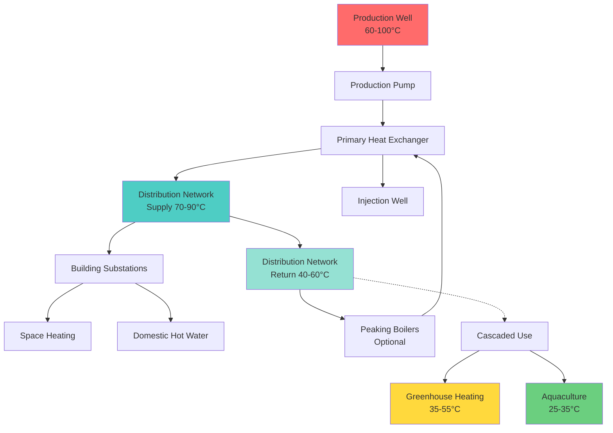

Geothermal direct use harnesses low to moderate temperature geothermal resources (50-150°C) for heating applications without conversion to electricity. These systems provide cost-effective, sustainable thermal energy for space heating, industrial processes, agriculture, and aquaculture operations.

## Temperature-Application Relationships

Direct use applications depend on available geothermal fluid temperature. The table below shows typical temperature requirements for various applications based on DOE Geothermal Technologies Office data.

| Application | Temperature Range (°C) | Temperature Range (°F) | Typical Flow Rate | Heat Load |
|-------------|------------------------|------------------------|-------------------|-----------|
| District heating | 60-100 | 140-212 | 50-500 gpm | 1-50 MMBtu/hr |
| Greenhouse heating | 40-80 | 104-176 | 20-200 gpm | 0.5-10 MMBtu/hr |
| Aquaculture heating | 25-35 | 77-95 | 10-100 gpm | 0.2-5 MMBtu/hr |
| Industrial drying | 100-150 | 212-302 | 30-300 gpm | 2-20 MMBtu/hr |
| Food processing | 60-120 | 140-248 | 25-250 gpm | 1-15 MMBtu/hr |
| Balneology/spas | 30-50 | 86-122 | 5-50 gpm | 0.1-2 MMBtu/hr |
| Snow melting | 30-60 | 86-140 | 15-150 gpm | 0.3-8 MMBtu/hr |

## District Heating Systems

District heating represents the largest direct use application globally. Geothermal district heating systems distribute thermal energy from production wells through insulated piping networks to multiple buildings.

### System Configuration

### Heat Exchanger Sizing

The primary heat exchanger transfers heat from geothermal fluid to the clean distribution loop. Design calculations follow standard heat exchanger theory.

Heat transfer rate:

$$Q = \dot{m}_{geo} c_{p,geo} (T_{geo,in} - T_{geo,out})$$

Where:
- $Q$ = heat transfer rate (W)
- $\dot{m}_{geo}$ = geothermal mass flow rate (kg/s)
- $c_{p,geo}$ = specific heat of geothermal fluid (J/kg·K)
- $T_{geo,in}$ = geothermal inlet temperature (°C)
- $T_{geo,out}$ = geothermal outlet temperature (°C)

Log mean temperature difference (LMTD) for counterflow:

$$\Delta T_{lm} = \frac{(T_{geo,in} - T_{dist,out}) - (T_{geo,out} - T_{dist,in})}{\ln\left(\frac{T_{geo,in} - T_{dist,out}}{T_{geo,out} - T_{dist,in}}\right)}$$

Required heat transfer area:

$$A = \frac{Q}{U \cdot \Delta T_{lm}}$$

Where:
- $A$ = heat transfer surface area (m²)
- $U$ = overall heat transfer coefficient (W/m²·K)
- Typical $U$ values: 1000-2000 W/m²·K for plate heat exchangers with clean fluids
- Typical $U$ values: 500-1000 W/m²·K for shell-and-tube with scaling potential

For geothermal fluids with high mineral content, fouling resistance must be included:

$$\frac{1}{U} = \frac{1}{h_{geo}} + R_{f,geo} + \frac{t_{wall}}{k_{wall}} + R_{f,dist} + \frac{1}{h_{dist}}$$

Where $R_f$ represents fouling resistance (0.0001-0.0005 m²·K/W typical for geothermal applications).

## Greenhouse Heating

Geothermal greenhouse heating provides consistent, economical warmth for year-round crop production. Heating systems maintain optimal growing temperatures (15-25°C) using low-temperature geothermal resources.

### Heat Distribution Methods

**Floor heating systems** distribute heat through embedded piping in concrete floors or gravel beds:

$$q_{floor} = \frac{T_{fluid} - T_{soil}}{R_{total}}$$

Where $R_{total}$ includes pipe-to-fluid, pipe wall, concrete, and soil resistances.

Pipe spacing calculation:

$$S = \sqrt{\frac{k_{concrete} \cdot t_{slab} \cdot (T_{fluid} - T_{soil})}{q_{required}}}$$

**Fan-coil units** provide rapid temperature response for high-value crops:

$$Q_{coil} = \dot{V} \cdot \rho \cdot c_p \cdot (T_{out} - T_{in})$$

Design considerations:
- Maintain minimum 35-40°C supply temperature for adequate heat output
- Size for worst-case outdoor design conditions (-20°C to -30°C depending on location)
- Include backup heating for temperatures below geothermal resource capability
- Design for 50-80 W/m² heat loss typical of modern greenhouse construction

## Aquaculture Applications

Geothermal aquaculture maintains optimal water temperatures for fish, shrimp, and algae production. Temperature control directly affects growth rates, feed conversion, and survival.

### Species Temperature Requirements

| Species | Optimal Temp (°C) | Acceptable Range (°C) | Growth Rate Impact |
|---------|-------------------|------------------------|-------------------|
| Tilapia | 28-30 | 22-32 | ±10% per 2°C deviation |
| Shrimp | 26-30 | 24-32 | ±15% per 2°C deviation |
| Salmon | 12-16 | 8-18 | ±8% per 2°C deviation |
| Catfish | 24-28 | 18-30 | ±12% per 2°C deviation |
| Spirulina algae | 32-35 | 28-38 | ±20% per 2°C deviation |

### Pond Heating Design

Heat requirement for raceway or pond:

$$Q_{pond} = Q_{surface} + Q_{ground} + Q_{water}$$

Surface heat loss (radiation, convection, evaporation):

$$Q_{surface} = A_{surface} \left[h_c(T_{water} - T_{air}) + \epsilon \sigma (T_{water}^4 - T_{sky}^4) + h_{evap}\right]$$

Ground heat loss:

$$Q_{ground} = \frac{A_{bottom} \cdot k_{soil}}{d_{soil}} (T_{water} - T_{ground})$$

Fresh water heating requirement:

$$Q_{water} = \dot{V}_{makeup} \cdot \rho \cdot c_p \cdot (T_{pond} - T_{source})$$

Heat exchanger submerged in pond or raceway provides direct heating. For titanium plate heat exchangers with geothermal fluid:

$$A_{HX} = \frac{Q_{total}}{U \cdot \Delta T_{lm}}$$

Typical $U$ = 1500-2500 W/m²·K for clean geothermal water in titanium plate exchangers.

## Cascaded Use Systems

Cascaded use maximizes energy extraction by utilizing geothermal fluid sequentially through progressively lower temperature applications. A typical cascade:

1. **High temperature (80-100°C)**: Industrial process heat or district heating supply
2. **Medium temperature (50-80°C)**: Greenhouse heating or secondary district heating
3. **Low temperature (25-50°C)**: Aquaculture or balneology
4. **Residual (20-25°C)**: Ground source heat pump source

Energy utilization factor:

$$\eta_{cascade} = \frac{Q_{extracted}}{Q_{available}} = \frac{\dot{m} c_p (T_{well} - T_{injection})}{\dot{m} c_p (T_{well} - T_{ambient})}$$

Well-designed cascaded systems achieve 60-75% utilization compared to 30-45% for single-use applications.

## Economic Considerations

Direct use applications provide favorable economics due to:

- Low parasitic power consumption (5-10% of thermal output)
- High capacity factors (80-95% for heating applications)
- Minimal environmental emissions
- Long equipment life (30-50 years for wells, 20-30 years for heat exchangers)

Levelized cost of heat for geothermal district heating typically ranges from $15-35/MMBtu compared to $25-50/MMBtu for natural gas heating in suitable geological regions.

## Design Best Practices

1. **Specify corrosion-resistant materials**: Titanium, stainless steel 316L, or polymer heat exchangers for geothermal fluid contact
2. **Include filtration**: 50-100 micron strainers prevent scaling and fouling in heat exchangers
3. **Design for full reinjection**: Closed-loop systems with complete reinjection minimize environmental impact
4. **Provide redundancy**: Parallel heat exchangers or backup heating for critical applications
5. **Monitor chemistry**: Continuous monitoring prevents scaling and corrosion issues
6. **Optimize cascade**: Maximize energy extraction through sequential temperature reduction

Geothermal direct use applications provide reliable, cost-effective heating for diverse applications where suitable resources exist. Proper heat exchanger sizing, material selection, and cascaded system design maximize economic and environmental benefits.
