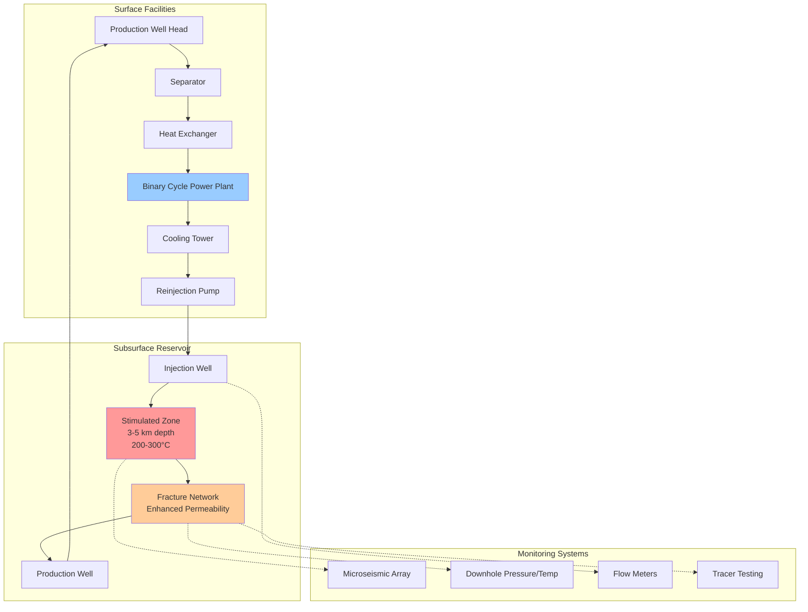

Enhanced Geothermal Systems (EGS) represent an advanced approach to geothermal energy extraction that enables power generation from hot dry rock formations lacking natural permeability or fluid content. Unlike conventional hydrothermal systems that rely on naturally occurring steam or hot water reservoirs, EGS creates artificial reservoirs through hydraulic stimulation of deep crystalline rock formations at depths of 3-10 km where temperatures exceed 150-300°C.

## Hot Dry Rock Technology

Hot dry rock (HDR) formations represent approximately 98% of Earth's geothermal energy potential but historically remained inaccessible without engineered enhancement. These formations consist of crystalline basement rock with:

- **Low intrinsic permeability:** < 10⁻¹⁸ m² requiring fracture networks for fluid circulation
- **High thermal gradients:** 40-80°C/km in favorable locations compared to 25-30°C/km normal gradients
- **Deep drilling requirements:** 3,000-10,000 m depth for adequate temperatures
- **Widespread geographic distribution:** Not limited to tectonic boundaries like hydrothermal resources

The fundamental physics governing heat extraction from HDR involves conductive heat transfer from the rock matrix to circulating working fluid through engineered fracture networks. The volumetric heat extraction rate follows:

$$Q_{extract} = \rho_{fluid} c_{p,fluid} \dot{V} (T_{out} - T_{in})$$

where ρ_fluid is working fluid density (kg/m³), c_p,fluid is specific heat capacity (J/kg·K), V̇ is volumetric flow rate (m³/s), and (T_out - T_in) represents the temperature gain through the reservoir.

The thermal drawdown rate for an EGS reservoir depends on the fracture surface area, flow velocity, and rock thermal properties:

$$\frac{dT_{rock}}{dt} = -\frac{h \cdot A_{fracture}}{V_{rock} \cdot \rho_{rock} \cdot c_{p,rock}}(T_{rock} - T_{fluid})$$

where h is the convective heat transfer coefficient (W/m²·K), A_fracture is fracture surface area (m²), V_rock is stimulated rock volume (m³), and ρ_rock and c_p,rock are rock density and specific heat.

## Hydraulic Stimulation Methods

Hydraulic stimulation creates permeable pathways through controlled fracturing of the reservoir rock. The process involves:

1. **Injection well drilling:** Vertical or deviated wells to target depth with specialized high-temperature drilling fluids
2. **Hydraulic fracturing:** High-pressure fluid injection (30-80 MPa) to exceed rock tensile strength and initiate fracture propagation
3. **Fracture network development:** Sequential injection cycles to create interconnected fracture networks with 10⁻¹⁴ to 10⁻¹⁵ m² permeability
4. **Production well placement:** Directional drilling to intersect stimulated volume at optimal spacing (400-600 m typical)

The critical injection pressure for fracture initiation follows:

$$P_{inject} > \sigma_{h,min} + T_{rock} - P_{pore} + \frac{K_{IC}}{\sqrt{\pi a}}$$

where σ_h,min is minimum horizontal stress, T_rock is rock tensile strength, P_pore is pore pressure, K_IC is fracture toughness, and a is initial flaw size.

Microseismic monitoring during stimulation maps fracture propagation through detection of acoustic emissions from rock failure events, enabling real-time adjustment of injection parameters.

## Closed-Loop EGS Systems

Advanced closed-loop systems eliminate the need for hydraulic fracturing by using sealed wellbore heat exchangers. Two primary configurations exist:

**Deep U-tube systems:** Single vertical wellbore with insulated injection tube inside larger production casing. Working fluid circulates down the center tube, exchanges heat with surrounding rock through the outer annulus, and returns to surface. Heat extraction rate:

$$Q_{U-tube} = \frac{2\pi k_{rock} L (T_{rock} - T_{fluid,avg})}{\ln(r_{thermal}/r_{wellbore})}$$

where k_rock is rock thermal conductivity (W/m·K), L is heat exchanger length (m), and r_thermal/r_wellbore is the thermal to wellbore radius ratio.

**Multilateral configurations:** Single vertical shaft with multiple horizontal or deviated laterals extending 1-3 km from main wellbore, increasing contact area with hot rock formations by factors of 5-10 compared to vertical wells.

Closed-loop systems offer advantages in seismic risk mitigation, elimination of reservoir short-circuiting, and applicability to formations unsuitable for hydraulic stimulation.

## EGS System Architecture

## Global EGS Projects

| Project | Location | Depth (m) | Temp (°C) | Capacity (MW) | Status | Technology |
|---------|----------|-----------|-----------|---------------|--------|------------|
| Fenton Hill | New Mexico, USA | 4,400 | 235 | 0.01 (test) | Completed | HDR stimulation |
| Soultz-sous-Forêts | France | 5,000 | 200 | 1.5 | Operating | Hydraulic stimulation |
| Cooper Basin | Australia | 4,200 | 250 | 1.0 (pilot) | Suspended | Granite stimulation |
| Groß Schönebeck | Germany | 4,300 | 150 | 0.5 | Testing | Sedimentary EGS |
| Desert Peak | Nevada, USA | 3,200 | 215 | 1.7 | Operating | Hydro-shearing |
| Newberry Volcano | Oregon, USA | 3,066 | 315 | 3.0 (planned) | Development | Volcanic EGS |
| FORGE (Utah) | Utah, USA | 2,400 | 220 | Test facility | Active R&D | Multiple methods |
| Pohang | South Korea | 4,200 | 300 | 1.0 | Suspended | Deep stimulation |

## DOE Enhanced Geothermal Research

The U.S. Department of Energy has invested significantly in EGS development through multiple programs:

**FORGE Initiative (Frontier Observatory for Research in Geothermal Energy):** Established 2018 as dedicated subsurface laboratory in Milford, Utah. Research focus includes advanced drilling technologies, stimulation optimization, and reservoir modeling. Target demonstration of 5 MW commercial-scale EGS power generation.

**EGS Collab Project:** Multi-laboratory collaboration conducting meter-scale fracture experiments at Sanford Underground Research Facility in South Dakota to validate coupled thermal-hydrological-mechanical-chemical (THMC) models.

**Technology Development Priorities:**

- Zonal isolation techniques for multi-stage stimulation
- Distributed fiber optic sensing for real-time reservoir monitoring
- Thermally resistant polymers and proppants for fracture conductivity
- Advanced drilling methods reducing cost from $10-15 million to $3-5 million per well
- Machine learning for microseismic event prediction and stimulation control

## Performance and Economic Considerations

EGS power generation capacity depends on sustainable heat extraction over 20-30 year operational lifetimes. Key performance metrics include:

**Specific power output:** 10-30 W_e/m³ of stimulated reservoir volume based on thermal drawdown modeling

**Levelized cost of electricity (LCOE):** Currently $100-200/MWh compared to $50-100/MWh for conventional hydrothermal, with targets of $60-80/MWh through technology advancement

**Capacity factor:** 90-95% enabling baseload operation superior to solar (25%) and wind (35%) resources

**Thermal recovery ratio:** 10-15% of in-situ thermal energy converted to electrical power over system lifetime

The primary challenge remains drilling cost economics, comprising 40-60% of total project capital. Breakthrough drilling technologies enabling 50% cost reduction would expand EGS resource accessibility from hundreds to thousands of potential sites globally.

EGS technology transforms geothermal energy from a location-constrained to broadly available renewable resource, potentially providing hundreds of gigawatts of firm, dispatchable baseload power generation capacity worldwide. Continued research addressing drilling economics, stimulation predictability, and long-term reservoir sustainability will determine commercial deployment timelines.
