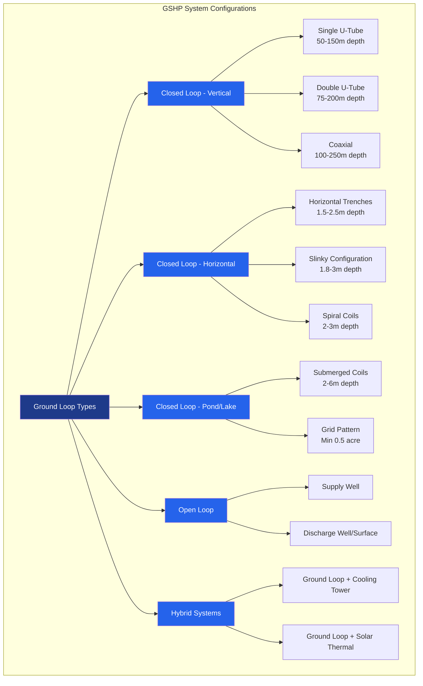

Ground-source heat pumps (GSHP) extract thermal energy from shallow geothermal resources, exploiting the earth's relatively constant subsurface temperature (10-20°C at depths below 3-6 m) to provide highly efficient space conditioning. GSHP systems achieve coefficient of performance (COP) values of 3.5-5.0 in heating mode and energy efficiency ratios (EER) of 15-25 in cooling mode, significantly exceeding air-source heat pump performance.

## Physical Principles

The earth functions as a thermal reservoir with temperature stability derived from:

**Heat Storage Capacity**: Soil and rock possess substantial thermal mass, maintaining temperatures near the annual average air temperature at depths exceeding the frost line.

**Thermal Inertia**: Underground temperatures lag seasonal variations by approximately 3 months due to soil thermal diffusivity:

$$\alpha = \frac{k}{\rho c_p}$$

where $\alpha$ is thermal diffusivity (m²/s), $k$ is thermal conductivity (W/m·K), $\rho$ is density (kg/m³), and $c_p$ is specific heat capacity (J/kg·K).

**Temperature Profile**: Subsurface temperature varies with depth according to:

$$T(z,t) = T_m + A_s e^{-z\sqrt{\frac{\omega}{2\alpha}}} \cos\left(\omega t - z\sqrt{\frac{\omega}{2\alpha}}\right)$$

where $T_m$ is mean annual surface temperature, $A_s$ is surface temperature amplitude, $z$ is depth, $\omega$ is annual frequency (2π/365 days), and $t$ is time.

## Ground Loop Configurations

### Vertical Borehole Systems

Vertical closed-loop systems employ U-tube heat exchangers installed in boreholes ranging from 50-200 m depth, spaced 4-6 m apart. This configuration minimizes land area requirements and accesses more stable ground temperatures.

**Borehole Heat Transfer**: Heat exchange rate per unit length:

$$q' = \frac{T_g - T_f}{R_b}$$

where $q'$ is heat transfer rate per meter (W/m), $T_g$ is undisturbed ground temperature, $T_f$ is fluid temperature, and $R_b$ is borehole thermal resistance (m·K/W).

**Thermal Resistance Components**:

$$R_b = R_{pipe} + R_{grout} + R_{contact}$$

Grout thermal conductivity significantly impacts performance: enhanced thermally-conductive grout (k = 1.5-2.5 W/m·K) reduces borehole length requirements by 15-30% compared to standard bentonite grout (k = 0.7-1.0 W/m·K).

### Horizontal Loop Systems

Horizontal loops require larger land areas (0.3-0.5 acres per ton of cooling capacity) but involve lower drilling costs. Installation depth typically ranges from 1.5-2.5 m, below frost depth but within the zone of seasonal temperature variation.

**Slinky Configuration**: Overlapped coils increase heat transfer surface area per trench length:

$$L_{slinky} = \frac{L_{straight}}{2.5 \text{ to } 3.5}$$

This configuration reduces trench length by 60-70% while maintaining equivalent heat transfer performance.

### Pond and Lake Loops

Submerged coils in bodies of water exploit natural convection and high water thermal conductivity (0.6 W/m·K). Minimum requirements:

- Water depth: 2-3 m minimum to prevent freezing
- Surface area: 0.5 acre minimum per 12,000 BTU/h (3.5 kW) capacity
- Coil placement: 1.5-2 m depth with ballast anchoring

### Open Loop Systems

Direct groundwater systems pump water through a heat exchanger and discharge to a secondary well or surface water body. Key considerations:

- Groundwater flow rate: 1.5 gpm (5.7 L/min) per ton of capacity
- Water quality: minimize fouling, scaling, and corrosion
- Regulatory compliance: discharge permits and well construction codes
- Screen sizing: prevent sand migration (maximum velocity 0.05-0.1 ft/s)

## Ground Loop Sizing Methodology

**Heat Extraction/Rejection**: Annual heat balance must prevent long-term ground temperature degradation:

$$Q_{annual,heating} \approx Q_{annual,cooling}$$

**IGSHPA Sizing Equation**: Required borehole length:

$$L = \frac{Q_a R_{ga} + Q_h R_{gh} - W_c(COP-1)R_{gh}}{T_g - (T_{wi} + T_{wo})/2}$$

where:
- $L$ = total borehole length (m)
- $Q_a$ = annual average heat transfer (W)
- $Q_h$ = peak heat transfer (W)
- $R_{ga}$ = effective ground thermal resistance for annual pulse (m·K/W)
- $R_{gh}$ = effective ground thermal resistance for short-term pulse (m·K/W)
- $W_c$ = compressor power (W)
- $T_g$ = undisturbed ground temperature (°C)
- $T_{wi}, T_{wo}$ = inlet/outlet fluid temperatures (°C)

**Thermal Conductivity Values**:

| Soil/Rock Type | Thermal Conductivity k (W/m·K) | Typical Applications |
|---|---|---|
| Heavy clay (saturated) | 1.5 - 2.0 | Horizontal loops favorable |
| Sandy clay | 1.2 - 1.8 | Good performance |
| Sand/gravel (dry) | 0.4 - 0.8 | Requires larger loops |
| Sand/gravel (saturated) | 1.8 - 2.5 | Excellent performance |
| Granite | 2.5 - 4.0 | Vertical boreholes optimal |
| Limestone | 2.0 - 3.5 | Good borehole performance |
| Sandstone | 1.5 - 2.5 | Moderate performance |
| Basalt | 1.3 - 2.3 | Variable performance |

## Performance Metrics

**Coefficient of Performance**:

| Operating Condition | Heating COP | Cooling EER |
|---|---|---|
| Entering water temp 0°C (32°F) | 3.0 - 3.5 | - |
| Entering water temp 10°C (50°F) | 3.8 - 4.5 | 16 - 20 |
| Entering water temp 20°C (68°F) | 4.5 - 5.2 | 20 - 25 |
| Entering water temp 30°C (86°F) | - | 13 - 17 |

**Loop Type Comparison**:

| Configuration | Installed Cost | Land Required | COP Range | Applications |
|---|---|---|---|
| Vertical borehole | $15-30/ft depth | Minimal | 3.8-5.0 | Limited land, high performance |
| Horizontal trench | $6-12/ft length | 0.3-0.5 acre/ton | 3.5-4.5 | Available land, lower budget |
| Slinky horizontal | $8-15/ft length | 0.15-0.25 acre/ton | 3.6-4.6 | Moderate land area |
| Pond/lake | $4-8/ft coil | Water body required | 3.7-4.8 | Existing water resources |
| Open loop | $8-18/gpm | Well field area | 4.0-5.2 | Adequate aquifer, water quality |

## Hybrid System Configurations

Hybrid GSHP systems integrate supplemental heat rejection or source equipment to optimize performance and reduce ground loop size:

**Cooling Tower Hybrid**: Reduces peak cooling load on ground loop by 20-40%, preventing thermal saturation in cooling-dominated climates.

**Solar Thermal Hybrid**: Solar collectors recharge ground temperature during heating season, maintaining long-term thermal balance.

**Boiler/Chiller Hybrid**: Conventional equipment handles peak loads beyond GSHP capacity, downsizing ground loop investment.

## Design Standards and Guidelines

**IGSHPA Standards**: International Ground Source Heat Pump Association provides:
- Closed-loop/geothermal heat pump systems design and installation standards
- Grouting procedures and materials specifications
- Thermal conductivity testing protocols

**ASHRAE References**:
- ASHRAE Handbook - HVAC Applications, Chapter 34: Geothermal Energy
- ASHRAE Standard 90.1: minimum efficiency requirements for water-source heat pumps
- ASHRAE Guideline 14: measurement of energy and demand savings

**Thermal Response Testing**: In-situ testing determines actual ground thermal conductivity and borehole resistance for projects exceeding 20 tons capacity. Test duration: 48-72 hours minimum with constant heat injection rate 50-80 W/m.

## System Longevity and Maintenance

Ground loop lifespan: 50+ years for HDPE piping (ASTM D3350, PE4710 specification). Heat pump equipment lifespan: 20-25 years with proper maintenance. Annual maintenance includes filter replacement, refrigerant charge verification, and antifreeze concentration testing (25-30% propylene glycol maintains freeze protection to -15°C).

