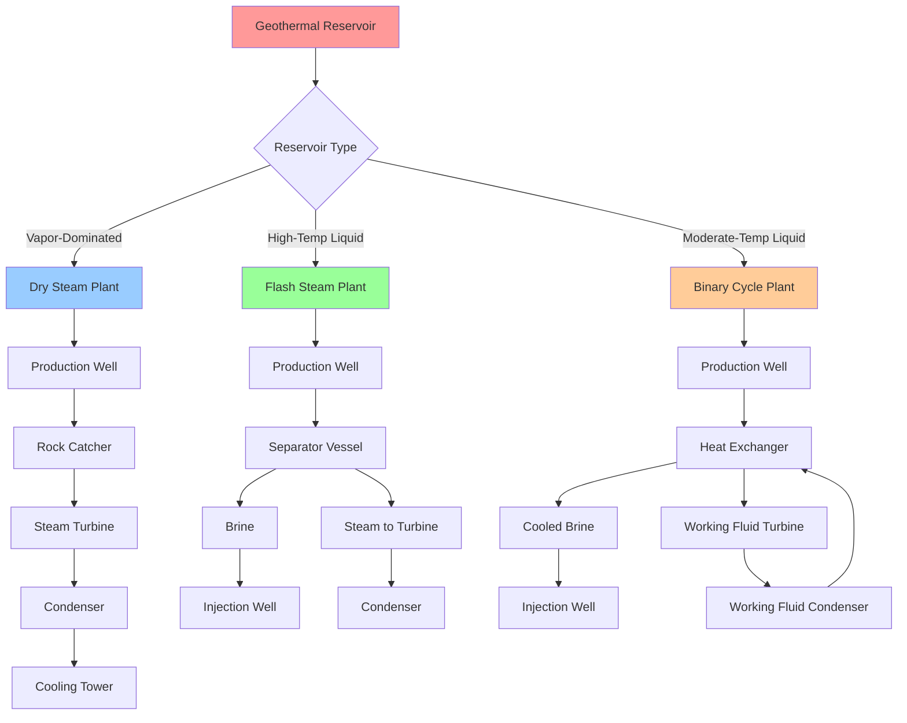

Hydrothermal resources represent naturally occurring concentrations of the Earth's thermal energy in the form of hot water and steam reservoirs. These resources provide the most economically viable form of geothermal energy extraction for power generation and direct-use applications. Understanding hydrothermal system characteristics, resource assessment methods, and conversion technologies is essential for HVAC engineers evaluating geothermal energy integration.

## Hydrothermal System Classification

Hydrothermal reservoirs are categorized based on temperature, phase, and permeability characteristics. The classification determines appropriate utilization technology and economic viability.

### Temperature Classification

**High-Temperature Resources (>150°C / 302°F)**
High-temperature hydrothermal systems support conventional power generation technologies. These resources typically occur in tectonically active regions with recent volcanic activity or high heat flow. The reservoir fluid temperatures enable efficient thermodynamic cycles for electricity production.

Resource assessment requires temperature verification through exploratory drilling. Surface manifestations such as fumaroles, hot springs, and geysers indicate potential high-temperature reservoirs at depth. The critical temperature threshold of 150°C allows for cost-effective binary cycle operation.

**Moderate-Temperature Resources (90-150°C / 194-302°F)**
Moderate-temperature resources suit direct-use applications including district heating, industrial process heat, and greenhouse operations. Binary cycle power generation becomes marginally economic at temperatures above 120°C.

These resources occur more widely than high-temperature systems and are found in sedimentary basins with elevated geothermal gradients. Economic utilization depends on heat load proximity and cascade applications that maximize energy extraction.

**Low-Temperature Resources (<90°C / 194°F)**
Low-temperature hydrothermal resources primarily support ground-source heat pump applications and direct-use heating in immediate proximity to the resource. The thermodynamic limitations prevent power generation but allow for space conditioning and agricultural applications.

### Reservoir Type Classification

**Vapor-Dominated Reservoirs**
Vapor-dominated systems represent the rarest and most valuable hydrothermal resource type. These reservoirs contain superheated steam with minimal liquid water content. Only a few commercially productive vapor-dominated fields exist globally.

The most notable examples include The Geysers in California (>1,500 MW installed capacity) and Larderello in Italy. Vapor-dominated reservoirs form when permeability allows continuous vapor extraction while liquid water remains trapped in lower permeability zones.

The pressure-temperature relationship in vapor-dominated systems follows:

$$P_{reservoir} = P_{sat}(T_{reservoir}) - \Delta P_{capillary}$$

Where $P_{sat}$ represents saturated steam pressure at reservoir temperature and $\Delta P_{capillary}$ accounts for capillary pressure effects.

**Liquid-Dominated Reservoirs**
Liquid-dominated systems constitute the majority of productive hydrothermal resources. These reservoirs contain hot water under pressure, preventing boiling at depth. When produced to surface, pressure reduction causes flashing to steam.

The flash fraction determines power generation potential:

$$x_{flash} = \frac{h_f(P_{res}) - h_f(P_{sep})}{h_{fg}(P_{sep})}$$

Where:
- $x_{flash}$ = steam mass fraction
- $h_f(P_{res})$ = liquid enthalpy at reservoir pressure
- $h_f(P_{sep})$ = liquid enthalpy at separator pressure
- $h_{fg}(P_{sep})$ = latent heat of vaporization at separator pressure

## Power Generation Technologies

### Dry Steam Plants

Dry steam plants represent the simplest and most efficient geothermal power technology. These plants utilize direct steam from vapor-dominated reservoirs without requiring separation equipment.

**Process Flow:**
Steam flows directly from production wells through rock catchers and moisture separators to the turbine. After expansion through the turbine, exhaust steam passes to condensers. Non-condensable gases (primarily CO₂ and H₂S) require removal through gas extraction systems.

**Performance Characteristics:**
Net plant efficiency ranges from 15-20% based on steam conditions and ambient temperature. The theoretical maximum efficiency follows the Carnot limit:

$$\eta_{Carnot} = 1 - \frac{T_{sink}}{T_{source}}$$

Actual efficiency achieves 50-65% of Carnot efficiency due to irreversibilities.

### Flash Steam Plants

Flash steam technology dominates high-temperature liquid-dominated resource development. Single-flash plants operate at separator pressures of 4-8 bar, while double-flash systems add a low-pressure separator at 1-3 bar.

**Single-Flash Process:**
Hot water from production wells enters a cyclone separator where pressure reduction causes partial flashing. Separated steam drives the turbine while separated brine either undergoes injection or additional flashing in a second stage.

**Double-Flash Efficiency:**
Double-flash plants extract 15-25% more power than single-flash designs from identical reservoir conditions. The incremental power from low-pressure steam is:

$$\Delta W = \dot{m}_{LP} \cdot (h_{LP,in} - h_{LP,out}) \cdot \eta_{turbine}$$

Where $\dot{m}_{LP}$ represents the low-pressure steam mass flow rate.

### Binary Cycle Plants

Binary cycle plants enable power generation from moderate-temperature resources (90-175°C) that cannot efficiently support flashing. These systems use a secondary working fluid (typically isopentane, isobutane, or R-245fa) with lower boiling points than water.

**Operating Principle:**
Geothermal fluid transfers heat to the working fluid through heat exchangers without direct contact. The vaporized working fluid drives an organic Rankine cycle turbine. After expansion, the working fluid condenses and returns to the heat exchanger.

**Performance Analysis:**
Binary cycle efficiency depends on temperature differential and working fluid selection:

$$\eta_{binary} = \eta_{cycle} \cdot \eta_{heat \, exchanger} \cdot \eta_{turbine} \cdot \eta_{generator}$$

Typical net efficiencies range from 10-13% for resource temperatures of 150°C. The approach temperature difference in heat exchangers critically affects performance—typical values are 5-10°C.

## US Hydrothermal Resource Assessment

The USGS conducts periodic assessments of identified and undiscovered hydrothermal resources. The 2008 assessment (Circular 1296) provides the most comprehensive analysis of US geothermal potential.

### Identified Hydrothermal Resources

| State | Number of Sites | Mean Temperature (°C) | Electric Potential (MWe) |
|-------|----------------|----------------------|-------------------------|
| California | 89 | 180-295 | 5,929 |
| Nevada | 306 | 150-260 | 5,260 |
| Oregon | 78 | 140-210 | 2,076 |
| Idaho | 97 | 130-195 | 1,090 |
| Utah | 45 | 145-215 | 1,045 |
| Alaska | 86 | 140-275 | 1,023 |
| Hawaii | 4 | 260-290 | 460 |
| New Mexico | 52 | 135-180 | 272 |
| Wyoming | 38 | 140-200 | 467 |
| Arizona | 31 | 130-165 | 183 |

*Source: USGS Circular 1296 (2008)*

### Resource Quality Indicators

| Parameter | Excellent | Good | Fair | Marginal |
|-----------|-----------|------|------|----------|
| Temperature (°C) | >200 | 150-200 | 120-150 | 90-120 |
| Flow Rate (kg/s per well) | >100 | 50-100 | 25-50 | <25 |
| Total Dissolved Solids (ppm) | <5,000 | 5,000-15,000 | 15,000-50,000 | >50,000 |
| Non-Condensable Gases (wt%) | <1 | 1-3 | 3-7 | >7 |
| Well Depth (m) | <1,500 | 1,500-2,500 | 2,500-3,500 | >3,500 |
| Permeability (mD) | >100 | 20-100 | 5-20 | <5 |

## Reservoir Engineering

### Production Capacity Assessment

The sustainable production capacity of a hydrothermal reservoir requires analysis of natural recharge, reservoir volume, and drawdown rates:

$$Q_{sustainable} = A \cdot \phi \cdot \rho \cdot c_p \cdot \frac{\Delta T}{t_{recovery}}$$

Where:
- $A$ = reservoir area (m²)
- $\phi$ = effective porosity
- $\rho$ = fluid density (kg/m³)
- $c_p$ = specific heat capacity (J/kg·K)
- $\Delta T$ = exploitable temperature difference (K)
- $t_{recovery}$ = acceptable recovery period (s)

### Pressure Decline Analysis

Pressure decline in produced reservoirs follows:

$$\frac{dP}{dt} = -\frac{Q}{V \cdot \beta_t}$$

Where:
- $Q$ = production rate (m³/s)
- $V$ = reservoir volume (m³)
- $\beta_t$ = total compressibility (Pa⁻¹)

Maintaining reservoir pressure through injection extends field life and prevents premature thermal decline.

## Direct-Use Applications

Moderate-temperature hydrothermal resources support numerous direct-use applications where cascading use maximizes energy extraction:

**District Heating (60-150°C)**
Geothermal district heating provides space conditioning and domestic hot water for residential and commercial buildings. Systems operate at supply temperatures of 70-90°C with return temperatures of 40-50°C.

**Industrial Process Heat (80-200°C)**
Applications include food processing, timber drying, chemical processing, and enhanced oil recovery. Process integration requires matching temperature requirements to available resource temperatures.

**Greenhouse Heating (25-80°C)**
Year-round greenhouse operations utilize low to moderate temperature resources. Underfloor heating systems distribute thermal energy efficiently.

**Aquaculture (20-40°C)**
Fish farming and shrimp cultivation benefit from temperature-controlled water. Geothermal resources provide economical heating compared to conventional fossil fuel systems.

## Economic Considerations

Hydrothermal project economics depend on multiple factors:

**Development Costs:**
- Exploration and confirmation: $2-8 million per site
- Production well drilling: $3-7 million per well
- Injection well drilling: $2-5 million per well
- Power plant construction: $2,500-4,500 per kW installed

**Operating Costs:**
- Well maintenance and workover: $100-200 per kW-year
- Plant operations and maintenance: $50-150 per kW-year
- Cooling water treatment: $20-40 per kW-year

**Revenue Requirements:**
Levelized cost of energy for hydrothermal projects ranges from $0.05-0.10 per kWh depending on resource quality, plant size, and financing terms.

---

**Related Topics:**
- Enhanced Geothermal Systems
- Ground-Source Heat Pumps
- Direct-Use Applications
- Geothermal Resource Assessment
- Thermodynamic Cycle Analysis
