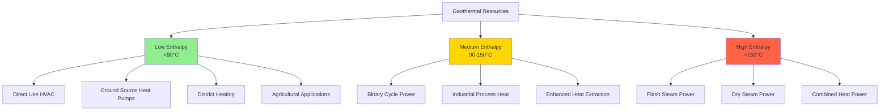

## Geothermal Resource Classification

Geothermal resources are categorized based on temperature, enthalpy content, and geological characteristics. The classification system determines the viable applications, from direct-use heating and cooling in HVAC systems to electric power generation. Understanding resource types is fundamental to selecting appropriate extraction technologies and assessing economic feasibility.

## Geothermal Temperature Gradient

The geothermal gradient describes the rate of temperature increase with depth below the Earth's surface. The normal continental gradient averages 25-30°C/km, though this varies significantly based on tectonic setting and local geology.

The temperature at depth can be estimated using:

$$T(z) = T_s + \Gamma \cdot z$$

where:
- $T(z)$ = temperature at depth $z$ (°C)
- $T_s$ = surface temperature (°C)
- $\Gamma$ = geothermal gradient (°C/km)
- $z$ = depth below surface (km)

For anomalous high-gradient regions, the gradient can reach 40-80°C/km or higher near active volcanic systems.

The heat flux from Earth's interior is expressed as:

$$q = -k \cdot \frac{dT}{dz} = -k \cdot \Gamma$$

where:
- $q$ = heat flux (W/m²)
- $k$ = thermal conductivity of rock (W/m·K)
- $\frac{dT}{dz}$ = temperature gradient (K/m)

## Resource Classification by Enthalpy

## Low Enthalpy Resources (<90°C)

Low enthalpy resources represent the most abundant geothermal category and are particularly relevant for HVAC applications. These resources exist at relatively shallow depths (50-400 m) and are accessible across most continental regions.

**Primary HVAC Applications:**
- Ground-source heat pump systems (GSHP)
- Direct heating for buildings and greenhouses
- Snow melting and de-icing systems
- Aquaculture and agricultural heating
- Low-temperature district heating networks

The coefficient of performance (COP) for heat extraction from low enthalpy sources:

$$\text{COP}_{\text{heating}} = \frac{T_{\text{delivery}}}{T_{\text{delivery}} - T_{\text{source}}}$$

where temperatures are in absolute units (K).

For typical ground temperatures of 10-20°C and delivery temperatures of 35-45°C, COPs range from 3.5 to 5.0, meaning 3.5-5.0 units of heat are delivered per unit of electrical input.

## Medium Enthalpy Resources (90-150°C)

Medium enthalpy resources bridge the gap between direct-use heating and power generation. These resources typically occur at depths of 400-2000 m in regions with above-average geothermal gradients.

**Applications:**
- Binary cycle electricity generation (organic Rankine cycle)
- Industrial process heating
- Large-scale district heating
- Absorption refrigeration for cooling
- Combined heat and power (CHP) systems

The thermal efficiency of binary cycle systems operating on medium enthalpy resources:

$$\eta_{\text{binary}} = \eta_{\text{Carnot}} \cdot \eta_{\text{cycle}} = \frac{T_H - T_C}{T_H} \cdot \eta_{\text{cycle}}$$

where $\eta_{\text{cycle}}$ accounts for real-world inefficiencies (typically 0.5-0.7).

## High Enthalpy Resources (>150°C)

High enthalpy resources are associated with active tectonic regions, volcanic systems, and areas of recent magmatic activity. These resources support high-efficiency power generation and represent the highest energy density geothermal systems.

**Characteristics:**
- Reservoir temperatures: 150-350°C (up to 400°C near magmatic intrusions)
- Depths: 1000-3000 m
- Concentrated along plate boundaries and volcanic arcs
- Support flash steam and dry steam power plants

## Temperature Classification Summary

| Resource Type | Temperature Range | Typical Depth | Energy Density | Primary Applications |
|---------------|-------------------|---------------|----------------|---------------------|
| Low Enthalpy | <90°C | 50-400 m | 0.5-2 MJ/kg | GSHP, direct heating, district heating |
| Medium Enthalpy | 90-150°C | 400-2000 m | 2-4 MJ/kg | Binary power, CHP, industrial heat |
| High Enthalpy | 150-240°C | 1000-3000 m | 4-6 MJ/kg | Flash steam power, industrial processes |
| Very High Enthalpy | >240°C | 2000-4000 m | 6-10 MJ/kg | Dry steam power, supercritical systems |

## Geological Resource Types

### Hydrothermal Conventional Resources

Hydrothermal systems contain naturally occurring hot water or steam in permeable rock formations. These represent the most economically developed geothermal resources.

**Key Parameters:**
- Reservoir permeability: >10⁻¹⁴ m² (>10 millidarcies)
- Fluid circulation through fracture networks or porous media
- Self-sustaining convective heat transfer
- Recharge from meteoric water infiltration

### Geopressured Geothermal Resources

Geopressured zones occur in deep sedimentary basins where fluids are trapped under abnormally high pressure (exceeding hydrostatic gradient). The Gulf Coast of the United States contains significant geopressured resources.

**Characteristics:**
- Depths: 3000-6000 m
- Pressures: 70-140 MPa (10,000-20,000 psi)
- Temperatures: 90-200°C
- Dissolved methane content: 0.5-1.5 m³/m³ of brine

Energy extraction from geopressured resources involves three components:
1. Thermal energy from hot brine
2. Mechanical energy from high pressure
3. Chemical energy from dissolved natural gas

### Hot Dry Rock (HDR) and Enhanced Geothermal Systems (EGS)

HDR and EGS technologies target hot crystalline basement rocks with low natural permeability. Artificial fracture networks are created through hydraulic stimulation to enable fluid circulation.

**Development Process:**
1. Drill injection well to target depth (3000-5000 m)
2. Hydraulic fracturing to create permeability
3. Drill production well to intersect fracture network
4. Circulate working fluid through engineered reservoir

The heat extraction rate from EGS:

$$\dot{Q} = \dot{m} \cdot c_p \cdot (T_{\text{prod}} - T_{\text{inj}})$$

where:
- $\dot{Q}$ = heat extraction rate (W)
- $\dot{m}$ = fluid mass flow rate (kg/s)
- $c_p$ = specific heat capacity of water (4.18 kJ/kg·K)
- $T_{\text{prod}}$ = production temperature (°C)
- $T_{\text{inj}}$ = injection temperature (°C)

### Magma Energy Potential

Magma bodies represent the ultimate geothermal resource with temperatures of 600-1200°C. While direct extraction remains technologically challenging, proximity to magma chambers creates the highest-grade hydrothermal systems.

**Supercritical Geothermal Systems:**
- Temperatures >374°C, pressures >22.1 MPa
- Water exists as supercritical fluid
- Energy density 5-10 times conventional resources
- Currently in experimental development phase

## DOE Geothermal Resource Assessment

The U.S. Department of Energy categorizes geothermal resources into identified and undiscovered categories. Identified hydrothermal resources in the western United States exceed 23,000 MW of potential electric capacity. EGS resources represent a vastly larger potential, with estimates exceeding 100,000 MW for depths up to 6 km.

**Resource Development Priorities:**
1. Low-temperature direct-use for building HVAC (near-term)
2. Binary cycle plants for moderate temperature resources (current)
3. Enhanced geothermal systems for broad deployment (long-term)
4. Supercritical systems for ultra-high efficiency (research phase)

The selection of appropriate geothermal resource type depends on location, required temperature, project scale, and economic constraints. For HVAC applications, low and medium enthalpy resources provide cost-effective, sustainable thermal energy with minimal environmental impact.

## Components

- [Hydrothermal Conventional Resources](hydrothermal-conventional-resources)
- [Geopressured Geothermal Resources](geopressured-geothermal-resources)
- [Hot Dry Rock HDR](hot-dry-rock-hdr)
- [Enhanced Geothermal Systems EGS](enhanced-geothermal-systems-egs)
- [Magma Energy Potential](magma-energy-potential)
