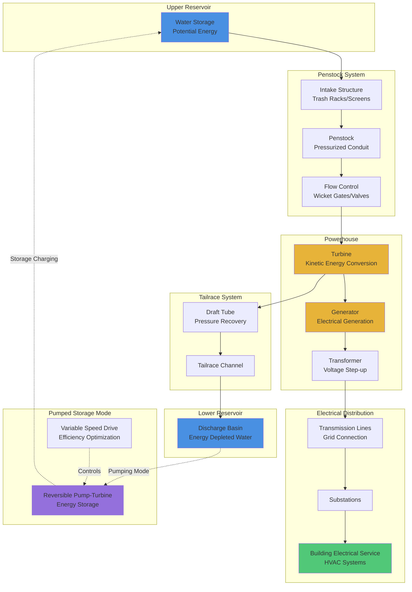

Hydroelectric power represents one of the most mature and reliable renewable energy sources for building electrical loads, including HVAC systems. While not directly integrated into individual buildings like solar photovoltaics, hydroelectric resources provide stable, dispatchable renewable electricity to the grid that powers large-scale commercial and industrial HVAC equipment.

## Hydroelectric Power Generation Principles

Hydroelectric power converts the potential energy of elevated water into electrical energy through turbine-generator systems. The fundamental relationship governing hydropower output:

$$P = \eta \rho g Q H$$

Where:
- $P$ = electrical power output (W)
- $\eta$ = overall system efficiency (typically 0.85-0.90)
- $\rho$ = water density (1000 kg/m³)
- $g$ = gravitational acceleration (9.81 m/s²)
- $Q$ = volumetric flow rate (m³/s)
- $H$ = effective head (hydraulic height, m)

The available hydraulic power before conversion losses:

$$P_{hydraulic} = \rho g Q H$$

And the theoretical energy over time period $t$:

$$E = P \cdot t = \eta \rho g Q H t$$

For installations with varying head conditions, the net head accounts for friction and turbulence losses:

$$H_{net} = H_{gross} - h_f - h_t$$

Where $h_f$ represents friction losses in the penstock and $h_t$ represents turbulence losses at intake and draft tube.

## Hydroelectric Resource Types

### Conventional Hydroelectric Facilities

**Reservoir Systems**
- Impoundment dams create large water storage
- Provide dispatchable generation on demand
- Capacity factors: 40-60%
- Seasonal storage capability
- Environmental considerations for river ecosystems

**Run-of-River Installations**
- Minimal water storage
- Generation follows natural flow patterns
- Lower environmental impact
- Capacity factors: 30-50%
- Limited dispatchability

**Diversion Systems**
- Channel portion of flow through power generation
- Maintain environmental flows in natural channel
- Common in mountainous terrain
- High head, low flow characteristics

### Pumped Storage Hydroelectric

Pumped storage facilities serve dual functions as both generation and grid-scale energy storage:

**Operating Principles**
- During low-demand periods: pump water from lower reservoir to upper reservoir
- During peak demand: generate electricity by releasing water to lower reservoir
- Round-trip efficiency: 70-85%
- Response time: full power in 1-3 minutes

**Energy Storage Capacity**

$$E_{storage} = \eta_{RT} \rho g V H$$

Where:
- $E_{storage}$ = usable stored energy (J)
- $\eta_{RT}$ = round-trip efficiency
- $V$ = reservoir volume (m³)
- $H$ = elevation difference between reservoirs (m)

**Grid Integration Benefits**
- Load leveling for baseload nuclear and coal plants
- Renewable energy integration (store excess wind/solar)
- Frequency regulation
- Black start capability
- Voltage support

## US Hydroelectric Capacity and Generation

### Installed Capacity by Facility Type

| Facility Type | Capacity (GW) | Number of Plants | Average Size (MW) |
|---------------|---------------|------------------|-------------------|
| Conventional Hydroelectric | 80.25 | 1,450 | 55.3 |
| Pumped Storage | 22.88 | 43 | 532.1 |
| Total Hydroelectric | 103.13 | 1,493 | 69.1 |

*Source: EIA Electric Power Annual 2023*

### Regional Distribution of Hydroelectric Resources

| Region | Capacity (GW) | % of US Total | Primary Resource |
|--------|---------------|---------------|------------------|
| Pacific Northwest | 35.2 | 34.1% | Columbia River Basin |
| California | 14.1 | 13.7% | Sierra Nevada snowmelt |
| Southeast | 12.8 | 12.4% | Tennessee Valley Authority |
| Great Lakes | 8.5 | 8.2% | Niagara Falls, regional rivers |
| Southwest | 6.9 | 6.7% | Colorado River system |
| Other Regions | 25.6 | 24.9% | Distributed resources |

*Source: DOE Hydropower Vision Report 2024*

### Annual Generation Characteristics

**2023 Hydroelectric Generation Statistics**
- Total generation: 247 TWh
- Percentage of US electricity: 5.9%
- Percentage of US renewable electricity: 26.1%
- Capacity factor: 38.7% (conventional)
- Capacity factor: 15.2% (pumped storage, net)

## Applications for Building Energy Systems

### Direct Grid Power Supply

**Large Commercial and Industrial HVAC**
- Hydroelectric provides reliable baseload and peak power
- Particularly important in Pacific Northwest where hydro exceeds 60% of generation
- Enables high renewable energy content for building operations
- Low-carbon electricity source for electric chillers and heat pumps

**Power Purchase Agreements**
- Large building owners can contract directly for hydroelectric power
- Renewable Energy Certificates (RECs) from hydroelectric sources
- LEED and sustainability credits
- Carbon footprint reduction strategies

### Pumped Storage Integration with Building Systems

**Time-of-Use Optimization**
- Pumped storage enables lower electricity costs during off-peak charging periods
- Building thermal storage systems can coordinate with regional pumped storage
- Peak demand reduction through stored energy dispatch
- Demand response program participation

**Renewable Energy Firming**
- Pumped storage compensates for solar PV intermittency
- Wind generation smoothing
- Enables higher renewable penetration for building microgrids
- Grid stability for critical facility operations

## Hydroelectric System Components

## Environmental and Regulatory Considerations

### Environmental Impacts

**Aquatic Ecosystem Effects**
- Flow regime alteration affects downstream habitats
- Fish passage requirements (upstream and downstream)
- Dissolved oxygen management in discharge
- Sediment transport disruption

**Mitigation Measures**
- Minimum environmental flows
- Fish ladders and bypass systems
- Aerating turbines and diffusers
- Seasonal flow scheduling

### Regulatory Framework

**Federal Energy Regulatory Commission (FERC)**
- Licensing authority for projects exceeding 5 MW
- 30-50 year license terms
- Environmental impact assessment requirements
- Stakeholder consultation processes

**Environmental Compliance**
- Clean Water Act Section 401 water quality certification
- Endangered Species Act consultation
- National Environmental Policy Act (NEPA) review
- State water rights and appropriation

## Performance Metrics and Efficiency

### Turbine Selection by Head and Flow

| Head Range | Flow Range | Turbine Type | Peak Efficiency |
|------------|------------|--------------|-----------------|
| 2-40 m | High | Kaplan/Propeller | 90-94% |
| 10-350 m | Medium | Francis | 90-95% |
| 50-2000+ m | Low | Pelton | 88-92% |
| Variable | Variable | Crossflow | 80-88% |

### Capacity Factor Determinants

The capacity factor for hydroelectric facilities:

$$CF = \frac{E_{actual}}{P_{rated} \cdot 8760}$$

Where:
- $CF$ = capacity factor
- $E_{actual}$ = actual annual energy generation (kWh/year)
- $P_{rated}$ = nameplate capacity (kW)
- 8760 = hours per year

Typical capacity factors range from 30-60% depending on:
- Hydrological variability (seasonal precipitation, snowmelt)
- Storage reservoir volume
- Environmental flow obligations
- Market demand and dispatch strategies
- Equipment availability and maintenance schedules

## Future Trends and Development

**Modernization of Existing Fleet**
- Digital turbine governors for improved efficiency
- Advanced flow forecasting and optimization
- Abrasion-resistant coatings extending equipment life
- Environmental turbine designs reducing fish mortality

**Pumped Storage Expansion**
- Closed-loop systems (no river connection)
- Underground facilities in retired mines
- Seawater pumped storage in coastal regions
- Variable-speed pump-turbines increasing flexibility

**Non-Powered Dam Opportunities**
- DOE estimates 65 GW potential at existing non-powered dams
- Lower environmental impact (existing infrastructure)
- Modular standardized generation equipment
- Reduces project development timeline and costs

Hydroelectric resources provide critical renewable energy infrastructure supporting the electrification of building HVAC systems and the broader transition to clean energy grids. Understanding hydroelectric generation principles, regional resource availability, and grid integration capabilities enables HVAC engineers to design systems that leverage this reliable renewable resource effectively.

