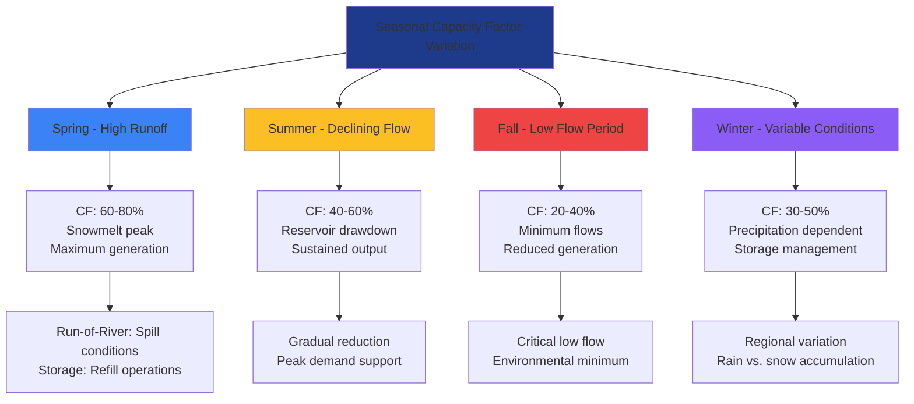

Hydroelectric capacity factor represents the ratio of actual electrical energy output over a given period to the maximum possible output if the plant operated at full nameplate capacity continuously. This metric quantifies the utilization and performance of hydroelectric facilities, accounting for hydrological variability, operational constraints, and design characteristics.

## Capacity Factor Fundamentals

The capacity factor for hydroelectric plants is calculated as:

$$CF = \frac{E_{actual}}{P_{rated} \times t} \times 100\%$$

Where:
- $CF$ = Capacity factor (%)
- $E_{actual}$ = Actual energy generated (kWh)
- $P_{rated}$ = Rated nameplate capacity (kW)
- $t$ = Time period (hours)

For annual capacity factor assessment:

$$CF_{annual} = \frac{\sum_{i=1}^{8760} P_i}{P_{rated} \times 8760} \times 100\%$$

Where $P_i$ represents the power output during each hour of the year.

## Capacity Factors by Hydroelectric Type

Different hydroelectric configurations exhibit characteristic capacity factor ranges based on water availability, storage capability, and operational strategy.

| Hydroelectric Type | Typical Capacity Factor | Range | Primary Limiting Factors |
|-------------------|------------------------|-------|-------------------------|
| Run-of-River | 35-45% | 30-50% | Seasonal flow variation, no storage |
| Conventional Storage | 50-60% | 40-70% | Reservoir management, inflow patterns |
| Pumped Storage | 15-30% | 10-40% | Peak demand periods, cycling operation |
| Large Multi-Purpose | 55-65% | 45-75% | Multiple constraints, optimized dispatch |
| Small Hydro (<10 MW) | 30-40% | 25-55% | Limited flow regulation, local conditions |
| Peaking Facilities | 25-35% | 20-45% | Demand-following operation |

According to EIA data, the U.S. hydroelectric fleet averaged approximately 39.1% capacity factor in 2022, with significant regional and facility-specific variation.

## Run-of-River Systems

Run-of-river facilities generate electricity using natural stream flow without significant water storage. The capacity factor is directly dependent on hydrological patterns:

$$CF_{ROR} = \frac{\int_0^T Q(t) \cdot H \cdot \eta \cdot dt}{P_{rated} \cdot T}$$

Where:
- $Q(t)$ = Flow rate as function of time (m³/s)
- $H$ = Effective head (m)
- $\eta$ = Overall efficiency (typically 0.80-0.90)
- $T$ = Time period

**Performance Characteristics:**

- **Diurnal Variation:** Minimal daily fluctuation in capacity factor
- **Seasonal Peaks:** Higher capacity factors during spring runoff or monsoon periods
- **Baseload Operation:** Continuous generation at varying output levels
- **Flow Duration Dependency:** Design flow typically set at 30-50% exceedance probability

Run-of-river plants in regions with stable year-round precipitation achieve capacity factors of 45-50%, while facilities in snow-melt dominated watersheds may experience 30-35% annual capacity factors with pronounced seasonal peaks.

## Reservoir Storage Systems

Reservoir-based hydroelectric plants store water to regulate generation, achieving higher capacity factors through temporal load shifting:

$$CF_{reservoir} = f(V_{storage}, Q_{inflow}, H_{variable}, \eta, Constraints)$$

**Storage Impact on Capacity Factor:**

The usable storage volume affects dispatch flexibility:

$$V_{effective} = V_{total} - V_{dead} - V_{flood}$$

Where:
- $V_{total}$ = Total reservoir volume
- $V_{dead}$ = Minimum pool for intake operation
- $V_{flood}$ = Reserved capacity for flood control

**Operational Considerations:**

1. **Multi-Year Storage:** Large reservoirs smooth multi-year hydrological cycles, maintaining 55-65% capacity factors
2. **Seasonal Storage:** Annual regulation supports 45-55% capacity factors
3. **Weekly/Daily Storage:** Limited regulation yields 40-50% capacity factors
4. **Flood Control Constraints:** Mandatory releases reduce capacity factor during high-inflow periods
5. **Environmental Flow Requirements:** Minimum discharge obligations affect utilization

## Seasonal Variation Impacts

Hydroelectric capacity factors exhibit pronounced seasonal patterns driven by hydrological cycles:

**Regional Seasonal Patterns:**

| Region | Peak Season | CF Range | Low Season | CF Range | Annual Average |
|--------|-------------|----------|------------|----------|----------------|
| Pacific Northwest | Apr-Jul | 65-85% | Aug-Oct | 25-40% | 50-55% |
| Northeast | Mar-May | 55-70% | Jul-Sep | 30-45% | 45-50% |
| Southeast | Jan-Apr | 50-65% | Aug-Oct | 30-45% | 42-48% |
| Mountain West | May-Jul | 70-90% | Nov-Feb | 20-35% | 45-52% |
| Alaska | Jun-Sep | 60-80% | Nov-Mar | 15-30% | 38-45% |

## Drought and Climate Impacts

Extended drought periods significantly reduce hydroelectric capacity factors:

$$CF_{drought} = CF_{normal} \times \left(\frac{Q_{drought}}{Q_{normal}}\right)^{1.2 \text{ to } 1.5}$$

The exponent exceeds 1.0 because capacity factor degradation is non-linear with flow reduction. When flows drop below minimum generation thresholds, capacity factor declines precipitously.

**Documented Drought Impacts:**

- 2012-2016 California drought reduced state hydroelectric capacity factor from 42% to 22%
- 2021 Pacific Northwest drought decreased regional average from 52% to 34%
- Multi-year southwestern U.S. drought (2000-2022) reduced Colorado River system capacity factors by 30-40%

## Pumped Storage Performance

Pumped storage facilities operate differently than conventional hydroelectric plants, cycling water between upper and lower reservoirs:

$$\eta_{round-trip} = \eta_{generation} \times \eta_{pumping}$$

Typical round-trip efficiencies range from 70-85%, with modern variable-speed units achieving 80-82%.

**Capacity Factor Calculation:**

$$CF_{pumped} = \frac{E_{generated} - E_{pumped}}{P_{rated} \times 8760}$$

Pumped storage capacity factors of 15-30% reflect their peaking operation role rather than continuous generation. The metric is less meaningful for storage facilities than for conventional plants.

## Optimization Strategies

Maximizing capacity factor within operational constraints:

1. **Predictive Inflow Modeling:** Forecast-based reservoir management optimizes water allocation
2. **Coordinated Cascade Operation:** Multi-plant coordination on river systems improves fleet utilization
3. **Variable-Speed Technology:** Turbine efficiency across broader flow ranges increases generation
4. **Sediment Management:** Maintaining reservoir storage capacity sustains long-term performance
5. **Upgraded Controls:** Real-time optimization balances energy market prices with water availability

Modern plants with advanced forecasting and controls achieve 5-10 percentage point capacity factor improvements over conventional fixed-schedule operations.

## Performance Benchmarking

Evaluating hydroelectric facility performance requires normalizing for hydrological conditions:

$$CF_{normalized} = CF_{actual} \times \frac{Q_{long-term}}{Q_{current}}$$

This adjusted capacity factor allows year-to-year performance comparison independent of precipitation variability. Well-operated facilities maintain normalized capacity factors within ±3% across multiple years, while degradation exceeding 5% indicates maintenance requirements or operational inefficiencies.

## Economic Implications

Capacity factor directly affects hydroelectric project economics:

$$LCOE = \frac{CapEx + \sum_{t=1}^{n} \frac{OpEx_t}{(1+r)^t}}{\sum_{t=1}^{n} \frac{E_t}{(1+r)^t}}$$

A 10 percentage point capacity factor increase reduces levelized cost of energy by approximately 8-12%, assuming fixed capital and operating costs. This relationship emphasizes the economic value of storage capabilities and operational flexibility.

Hydroelectric capacity factors reflect the complex interaction between natural hydrological variability, facility design, and operational strategy. Understanding these factors is essential for accurate energy planning, economic evaluation, and grid integration of hydroelectric resources in power systems with increasing renewable penetration.
