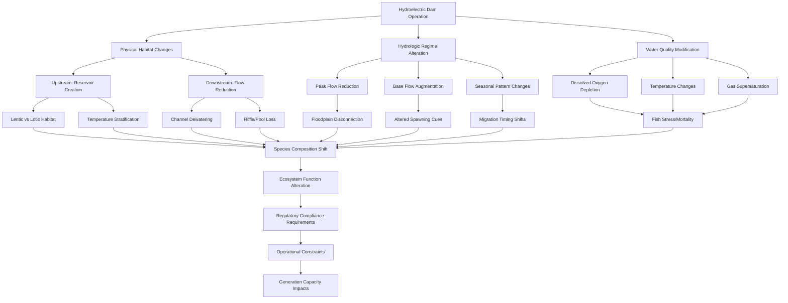

Hydroelectric power generation, while renewable and low-carbon, introduces significant environmental considerations that must be addressed through proper design, operation, and regulatory compliance. For HVAC system designers evaluating hydroelectric resources, understanding these environmental constraints is critical to project feasibility and long-term operational sustainability.

## Fish Passage Requirements

Fish passage represents one of the most significant environmental challenges in hydroelectric facility design. Dams and diversion structures block natural migration routes for anadromous species (salmon, steelhead, shad) and resident fish populations, disrupting life cycles and population dynamics.

### Upstream Fish Passage Technologies

**Fish Ladders**: Stepped pools that allow fish to swim upstream by creating a series of low-velocity steps with energy dissipation at each level. Typical design criteria:
- Pool dimensions: 6-10 ft × 6-10 ft with 1 ft drop between pools
- Water velocity through orifices: 4-8 ft/s maximum
- Attraction flow: 5-10% of total river flow at dam

**Fish Lifts**: Mechanical elevators that trap fish in a collection chamber and transport them upstream. Efficiency ranges from 40-95% depending on species and design.

**Fish Locks**: Chambered systems similar to navigation locks that incrementally raise fish elevation. Suitable for high-head facilities (>50 ft).

### Downstream Fish Passage

Downstream passage protects juvenile fish (smolts) during outmigration. Turbine mortality rates vary by turbine type:

| Turbine Type | Typical Mortality Rate | Factors |
|--------------|------------------------|---------|
| Francis | 10-30% | Blade strike, pressure changes, shear |
| Kaplan | 5-15% | Lower blade strike due to fewer, larger blades |
| Cross-flow | 0-5% | Gentle passage, low pressure differential |
| Archimedes screw | 0-2% | Minimal fish contact, natural flow path |

Protection strategies include trash racks with narrow spacing (0.75-1 inch), behavioral guidance systems using lights or sound, and surface bypass collectors that divert fish around turbines.

## Minimum Instream Flow Requirements

Minimum instream flows (MIF) maintain aquatic habitat, water quality, and ecological functions in bypassed river reaches. FERC licensing requires year-round flow releases based on hydrologic conditions and biological needs.

### Flow Determination Methods

**Tennant Method**: Allocates percentage of average annual flow (AAF) based on habitat quality:
- 10% AAF: Poor habitat (short-term survival)
- 30% AAF: Fair to good habitat
- 60-100% AAF: Excellent habitat

**Wetted Perimeter Method**: Identifies critical flows where habitat area decreases rapidly as flow reduces. Analyzes inflection points in wetted perimeter vs. discharge curves.

**Instream Flow Incremental Methodology (IFIM)**: Quantifies habitat availability (weighted usable area) across flow ranges using species-specific criteria for depth, velocity, substrate, and cover.

### Seasonal Flow Variations

Environmental flow requirements vary seasonally to support:
- **Spring**: Higher flows for spawning migration and flushing flows
- **Summer**: Base flows maintaining temperature and dissolved oxygen
- **Fall**: Spawning flows for fall-run species
- **Winter**: Incubation flows protecting redds (spawning nests)

## Water Quality Impacts

Hydroelectric operations alter natural water quality conditions through stratification, gas supersaturation, and temperature modification.

### Dissolved Oxygen Depletion

Deep water releases from stratified reservoirs often contain low dissolved oxygen (DO) concentrations due to hypolimnetic decay of organic matter. Minimum DO standards typically require 5-6 mg/L for coldwater fisheries.

**Mitigation Technologies**:

| Technology | DO Increase | Energy Penalty | Capital Cost |
|------------|-------------|----------------|--------------|
| Turbine venting | 1-3 mg/L | 0-2% | Low |
| Surface withdrawal | 2-5 mg/L | 0% | Medium |
| Auto-venting turbines | 2-4 mg/L | 0-1% | Medium |
| Mechanical aerators | 4-8 mg/L | 2-5% | High |

### Total Dissolved Gas Supersaturation

Spill over dams entrains air, creating supersaturated conditions (>110% saturation) that cause gas bubble disease in fish. Mitigation includes:
- Flip lips and flow deflectors reducing plunge depth
- Surface spillways minimizing aeration
- Operational strategies maximizing turbine passage

### Temperature Effects

Reservoirs stratify thermally, with surface waters warming and deep waters remaining cold. Release depth determines downstream temperature regime:
- **Hypolimnetic releases**: Cold water benefiting coldwater species but depressing productivity
- **Epilimnetic releases**: Warm water supporting warmwater fisheries but potentially exceeding thermal limits

Multi-level intake structures allow selective withdrawal to meet downstream temperature targets.

## Sediment Transport Impacts

Dams trap sediment, altering downstream channel morphology and habitat composition. Annual sediment deposition reduces reservoir storage capacity and starves downstream reaches of bedload material.

**Consequences**:
- Channel incision and bank erosion below dam
- Coarsening of bed material (armor layer formation)
- Loss of spawning gravel recruitment
- Reservoir filling reducing generation capacity

**Management Strategies**:
- Scheduled flushing flows during high sediment transport capacity
- Mechanical dredging and downstream placement
- Sluice gates allowing sediment pass-through
- Upstream sediment traps reducing reservoir inflow

## FERC Licensing Requirements

Federal Energy Regulatory Commission (FERC) licenses hydroelectric projects under the Federal Power Act. The licensing process requires comprehensive environmental impact assessment and mitigation measures.

### Licensing Process Timeline

Standard licensing process spans 5-7 years and includes:
1. **Pre-application consultation** (2-3 years): Stakeholder engagement and study planning
2. **License application preparation** (1-2 years): Environmental studies and engineering design
3. **FERC review and NEPA compliance** (2-3 years): Environmental assessment or environmental impact statement
4. **License issuance**: 30-50 year license term with monitoring requirements

### Environmental Conditions

FERC licenses incorporate mandatory conditions from resource agencies under Federal Power Act sections 4(e) and 18:
- **Section 18 (Fish and Wildlife Coordination Act)**: Fish passage prescriptions
- **Section 401 (Clean Water Act)**: State water quality certification
- **Section 7 (Endangered Species Act)**: Biological opinion and incidental take authorization

## Ecosystem Effects Flowchart

## Mitigation Cost Considerations

Environmental compliance imposes capital and operational costs that affect project economics:

- **Fish passage facilities**: $2-15 million capital cost depending on dam height and passage type
- **Minimum flow releases**: 10-40% reduction in generation capacity during low flow periods
- **Water quality measures**: $500,000-$5 million for aeration systems
- **Monitoring and reporting**: $50,000-$200,000 annually for biological and water quality monitoring
- **License application**: $1-5 million for environmental studies and process costs

These environmental requirements must be integrated into feasibility analysis when evaluating hydroelectric resources for facility power supply. Project economics depend on balancing environmental protection with generation capacity and operational flexibility.

## Habitat Alteration Concerns

Hydroelectric development fundamentally transforms riverine ecosystems from flowing (lotic) to standing (lentic) water systems in impounded areas. This conversion favors different species assemblages:

**Pre-development**: Benthic macroinvertebrates adapted to current (Ephemeroptera, Plecoptera, Trichoptera), rheophilic fish species (trout, darters, suckers)

**Post-development**: Zooplankton communities, warmwater fish (bass, pike, panfish), nuisance species (common carp, goldfish)

Downstream of dams, flow stabilization eliminates flood pulses that maintain channel complexity and riparian vegetation recruitment. Cottonwood and willow regeneration requires periodic overbank flooding that is often eliminated by flow regulation.

## Recreational Use Conflicts

Flow releases for power generation may conflict with recreational uses:
- **Whitewater boating**: Requires scheduled high flows during summer months
- **Fishing**: Benefits from stable flows but reduced by rapid fluctuations
- **Swimming/boating**: Reservoir drawdown exposes hazards and reduces usability

FERC licenses often require recreational flow releases during peak use periods, reducing generation flexibility and revenue.

## Conclusion

Environmental considerations for hydroelectric resources represent critical constraints on project development and operation. Fish passage requirements, minimum instream flows, water quality maintenance, and sediment management impose design requirements and operational limitations that directly affect generation capacity and economic feasibility. FERC licensing ensures comprehensive environmental review but adds significant time and cost to project development. HVAC facility planners evaluating hydroelectric options must account for these environmental constraints in resource assessment and economic analysis.
