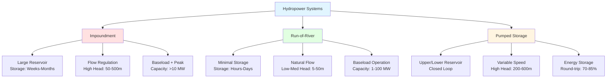

## Hydropower Classification Overview

Hydropower systems convert the potential and kinetic energy of water into electrical power through multiple configurations. The classification depends on hydraulic head, flow characteristics, storage capacity, and operational mode. Each type serves distinct grid requirements ranging from baseload generation to peak demand management and energy storage.

## Fundamental Power Equations

The theoretical power available from falling water depends on head and flow rate:

$$P = \rho \cdot g \cdot Q \cdot H \cdot \eta$$

Where:
- $P$ = Power output (W)
- $\rho$ = Water density (1000 kg/m³)
- $g$ = Gravitational acceleration (9.81 m/s²)
- $Q$ = Flow rate (m³/s)
- $H$ = Net head (m)
- $\eta$ = Overall efficiency (0.70-0.90)

The simplified form for practical calculations:

$$P_{kW} = 9.81 \cdot Q \cdot H \cdot \eta$$

Head development distinguishes hydropower categories:

$$H_{net} = H_{gross} - h_{losses}$$

Where head losses include friction in penstocks, inlet losses, and draft tube losses typically ranging from 5-15% of gross head.

## Hydropower Type Classification

## Impoundment Hydropower Systems

Impoundment facilities use dams to create large reservoirs, providing storage capacity and head development. The dam height and reservoir volume determine energy storage potential.

**Storage capacity calculation:**

$$E_{storage} = \rho \cdot g \cdot V \cdot H_{avg} \cdot \eta$$

Where $V$ represents usable reservoir volume and $H_{avg}$ is the average operating head.

### Operational Characteristics

Storage reservoirs enable load following and seasonal regulation. Large impoundments provide multi-day to multi-month storage, allowing operators to dispatch power independent of instantaneous inflow. This flexibility makes impoundment facilities valuable for grid stability and renewable energy integration.

Head development in impoundment systems typically ranges from 50-500 meters, with some facilities exceeding 700 meters. Higher heads increase power density, reducing flow requirements for a given capacity.

## Run-of-River Systems

Run-of-river installations generate power from natural streamflow with minimal storage. A small weir or diversion structure channels water through turbines, maintaining ecological flow in the original channel.

### Flow Characteristics

Power output varies with natural hydrograph:

$$P(t) = \rho \cdot g \cdot Q(t) \cdot H \cdot \eta$$

Where $Q(t)$ represents time-varying streamflow. Seasonal variations directly affect generation, with peak output during high-flow periods.

Run-of-river systems maintain higher environmental compatibility through reduced flow alteration. The absence of large reservoirs eliminates habitat disruption while preserving sediment transport and water quality.

### Design Considerations

Head development utilizes natural elevation drops or constructed low dams. Typical heads range from 5-50 meters, though some installations achieve higher heads through longer penstocks following terrain contours.

Turbine selection depends on site-specific head and flow characteristics. Kaplan turbines suit low-head, high-flow conditions, while Francis turbines handle medium heads efficiently. Pelton wheels serve high-head applications with lower flows.

## Pumped Storage Hydropower

Pumped storage facilities provide grid-scale energy storage by cycling water between upper and lower reservoirs. During low-demand periods, excess grid power pumps water uphill. During peak demand, water flows downward through turbines, generating electricity.

### Energy Storage Capacity

Total storage capacity depends on reservoir volumes and head:

$$E_{storage} = \rho \cdot g \cdot \Delta V \cdot H \cdot \eta_{turbine}$$

Where $\Delta V$ represents the usable volume range between maximum and minimum reservoir levels.

Round-trip efficiency accounts for pumping and generating losses:

$$\eta_{round-trip} = \eta_{turbine} \cdot \eta_{pump} \cdot \eta_{hydraulic}$$

Modern variable-speed units achieve round-trip efficiencies of 75-85%, with advanced designs approaching 87%.

### Operational Modes

Pumped storage units operate in three modes:
- **Generation mode**: Water flows from upper to lower reservoir through turbines
- **Pumping mode**: Water pumps from lower to upper reservoir using grid power
- **Synchronous condenser mode**: Unit spins without flow, providing grid stability services

Variable-speed pump-turbines enable continuous adjustment of pumping and generating power, improving grid frequency regulation and renewable energy integration.

## System Comparison

| Parameter | Impoundment | Run-of-River | Pumped Storage |
|-----------|-------------|--------------|----------------|
| **Storage Duration** | Weeks to months | Hours to days | 6-20 hours |
| **Typical Head** | 50-500 m | 5-50 m | 200-600 m |
| **Capacity Range** | 10-22,500 MW | 1-100 MW | 100-3,000 MW |
| **Flow Regulation** | High | Minimal | N/A (closed loop) |
| **Operational Mode** | Baseload + peak | Baseload | Peak + storage |
| **Environmental Impact** | High (reservoir) | Low | Medium (reservoirs) |
| **Capital Cost** | $2,000-5,000/kW | $1,500-4,000/kW | $1,000-3,000/kW |
| **Construction Time** | 5-10 years | 2-5 years | 6-12 years |
| **Efficiency** | 85-90% | 80-90% | 75-85% (round-trip) |

## Capacity Classification

| Class | Capacity Range | Typical Application | Head Range |
|-------|----------------|---------------------|------------|
| **Micro Hydro** | <100 kW | Remote communities, farms | 5-100 m |
| **Mini Hydro** | 100 kW - 1 MW | Villages, industrial facilities | 10-150 m |
| **Small Hydro** | 1-10 MW | Regional distribution | 15-200 m |
| **Medium Hydro** | 10-100 MW | Grid baseload | 30-300 m |
| **Large Hydro** | >100 MW | Grid baseload and regulation | 50-500 m |

## Technology Selection Criteria

Site characteristics determine optimal hydropower configuration:

**Head availability** governs turbine selection and power density. High-head sites enable compact installations with smaller flow requirements. Low-head sites require larger turbines and higher flows for equivalent capacity.

**Flow characteristics** influence storage requirements. Consistent year-round flows suit run-of-river configurations, while seasonal variations benefit from reservoir storage for flow regulation.

**Grid requirements** determine operational flexibility needs. Baseload-only grids accept run-of-river generation, while systems requiring load following and peak capacity benefit from storage-based impoundment or pumped storage.

**Environmental constraints** affect project feasibility. Sites with strict ecological requirements favor run-of-river designs preserving natural flow regimes. Areas with existing reservoirs or disturbed land suit pumped storage development.

## Integration with Variable Renewables

Pumped storage provides critical services for wind and solar integration:

**Energy time-shift**: Store excess renewable generation during high-production periods for use during low-production periods or peak demand.

**Frequency regulation**: Variable-speed units provide fast-responding frequency control through continuous power adjustment.

**Voltage support**: Synchronous condensers maintain grid voltage stability without water flow.

**Black start capability**: Large facilities provide grid restoration capability following system-wide outages.

The combination of energy storage, fast response, and ancillary services makes pumped storage the most mature grid-scale storage technology, with global installed capacity exceeding 180 GW.

## Performance Optimization

Hydropower efficiency depends on operating head, flow rate, and turbine design. Maximum efficiency occurs at rated head and flow conditions. Deviations reduce efficiency through hydraulic losses and turbine off-design operation.

Modern variable-speed generators improve part-load efficiency by optimizing turbine speed for varying flow conditions. Advanced blade designs extend the high-efficiency operating range.

Seasonal head variation affects output in impoundment facilities. Lower reservoir levels during drought reduce head and available power. Operators balance water conservation against power generation revenue.

---

**Related Topics:**
- [Reservoir Storage Regulation](/hvac-fundamentals/energy-resources/renewable-energy-resources/hydroelectric-resources/hydropower-types/reservoir-storage-regulation/)
- [Pumped Storage Energy Storage](/hvac-fundamentals/energy-resources/renewable-energy-resources/hydroelectric-resources/hydropower-types/pumped-storage-energy-storage/)
- [Hydroelectric Turbines](/hvac-fundamentals/energy-resources/renewable-energy-resources/hydroelectric-resources/hydroelectric-turbines/)

**References:**
- U.S. Department of Energy - Water Power Technologies Office
- International Hydropower Association Technical Standards
- ASHRAE Handbook - HVAC Applications, Chapter 38: Energy Resources
