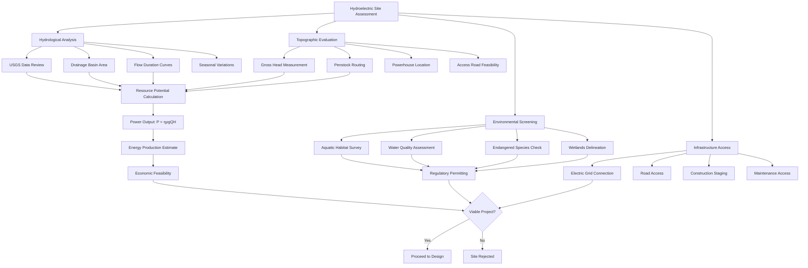

## Overview

Hydroelectric resource assessment quantifies the technical and economic potential of a water resource for power generation. The assessment integrates hydrological data, topographic analysis, and energy calculations to determine site feasibility for HVAC system power supply applications.

## Fundamental Power Equation

The theoretical hydroelectric power available at a site is:

$$P = \eta \rho g Q H$$

Where:
- $P$ = Power output (W)
- $\eta$ = Overall efficiency (0.60-0.85 typical)
- $\rho$ = Water density (1000 kg/m³)
- $g$ = Gravitational acceleration (9.81 m/s²)
- $Q$ = Flow rate (m³/s)
- $H$ = Net head (m)

## Flow Assessment Methodology

### Stream Flow Data Sources

USGS maintains over 10,000 stream gauging stations across the United States, providing continuous discharge measurements. Key data requirements include:

- Minimum 10 years of daily flow records for reliable analysis
- Peak flow events for design flood determination
- Low flow statistics for minimum generation capacity
- Monthly average flows for seasonal variation assessment

### Flow Duration Analysis

Flow duration curves (FDC) represent the percentage of time a given flow rate is equaled or exceeded. The exceedance probability is:

$$P_{exceed} = \frac{m}{n+1} \times 100\%$$

Where:
- $m$ = Rank of flow value (1 = highest)
- $n$ = Total number of observations

Design flows are typically selected at specific exceedance percentages:

| Exceedance | Flow Designation | Application |
|------------|------------------|-------------|
| Q10 | High flow | Spillway design, maximum generation |
| Q30 | Upper design flow | Peak capacity planning |
| Q50 | Median flow | Average generation estimate |
| Q90 | Low flow | Minimum reliable generation |
| Q95 | Very low flow | Environmental flow requirements |

### Energy Potential Calculation

Annual energy production integrates power over the flow duration:

$$E_{annual} = \int_{0}^{8760} P(t) \, dt$$

For discrete flow intervals:

$$E_{annual} = \sum_{i=1}^{n} P_i \Delta t_i$$

Where $P_i$ is the power at flow interval $i$ and $\Delta t_i$ is the time duration.

## Head Determination

### Gross Head Measurement

Gross head is the vertical elevation difference between headwater and tailwater:

$$H_{gross} = Z_{headwater} - Z_{tailwater}$$

Measurement methods include:
- **Differential GPS**: ±0.05 m accuracy for reconnaissance surveys
- **Survey leveling**: ±0.01 m accuracy for final design
- **Topographic maps**: ±0.5 m to 2 m accuracy for preliminary assessment
- **Altimeter**: ±2 m to 5 m accuracy for initial screening

### Net Head Calculation

Net head accounts for hydraulic losses in the conveyance system:

$$H_{net} = H_{gross} - h_{friction} - h_{entrance} - h_{trash\,rack} - h_{exit}$$

Friction losses in penstock follow the Darcy-Weisbach equation:

$$h_{friction} = f \frac{L}{D} \frac{v^2}{2g}$$

Where:
- $f$ = Darcy friction factor (0.015-0.025 for steel pipe)
- $L$ = Pipe length (m)
- $D$ = Pipe diameter (m)
- $v$ = Flow velocity (m/s)

## Site Selection Criteria

### Drainage Basin Characteristics

Basin area correlates with available flow for ungauged sites:

$$Q_{mean} = C \times A \times P$$

Where:
- $Q_{mean}$ = Mean annual flow (m³/s)
- $C$ = Runoff coefficient (0.2-0.5 depending on terrain)
- $A$ = Drainage area (km²)
- $P$ = Mean annual precipitation (m/year)

## Resource Potential Classification

| Site Class | Head (m) | Flow (m³/s) | Power Potential (kW) | HVAC Application |
|------------|----------|-------------|----------------------|------------------|
| Micro | 2-20 | 0.01-0.10 | 0.2-20 | Small facility backup |
| Mini | 10-50 | 0.10-1.0 | 10-200 | Building-scale systems |
| Small | 20-100 | 1.0-10 | 200-2,000 | District energy plants |
| Medium | 30-150 | 10-50 | 2,000-15,000 | Industrial HVAC complexes |

## Flow Measurement Techniques

### Direct Measurement Methods

**Current Meter Method**: Velocity-area integration across channel cross-section:

$$Q = \sum_{i=1}^{n} v_i A_i$$

Where $v_i$ is average velocity and $A_i$ is area of subsection $i$.

**Weir Flow Measurement**: Sharp-crested rectangular weir:

$$Q = \frac{2}{3} C_d b \sqrt{2g} h^{3/2}$$

Where:
- $C_d$ = Discharge coefficient (0.60-0.62)
- $b$ = Weir width (m)
- $h$ = Head above weir crest (m)

### Indirect Estimation Methods

For ungauged locations, regional regression equations relate flow statistics to basin characteristics. Example USGS regional equation:

$$Q_{50} = a \times A^b \times S^c \times P^d$$

Where:
- $A$ = Drainage area
- $S$ = Channel slope
- $P$ = Mean annual precipitation
- $a, b, c, d$ = Regional regression coefficients

## Assessment Report Components

A comprehensive resource assessment includes:

1. **Hydrology Summary**: Flow statistics, duration curves, seasonal patterns
2. **Head Analysis**: Gross head survey, net head calculations, loss estimates
3. **Power Calculations**: Turbine selection, efficiency curves, annual energy
4. **Site Layout**: Intake location, penstock routing, powerhouse placement
5. **Environmental Baseline**: Aquatic surveys, water quality, flow requirements
6. **Economic Analysis**: Capital costs, O&M costs, energy value, payback period

## Regulatory Data Requirements

FERC preliminary permit applications require:

- 10-year minimum flow record or equivalent regional analysis
- Flow duration curve at 10% intervals
- Topographic map showing project features (1:24,000 scale)
- Gross head determination with survey accuracy
- Environmental resource inventory
- Interconnection feasibility with existing electric grid

## Conclusion

Rigorous hydroelectric resource assessment integrates hydrological data analysis, topographic surveying, and hydraulic engineering to quantify site potential. Flow duration analysis establishes the temporal availability of water resources, while head determination defines the gravitational energy gradient. The combination yields reliable estimates of power generation capacity for HVAC system applications, supporting informed decisions on project feasibility and design parameters.
