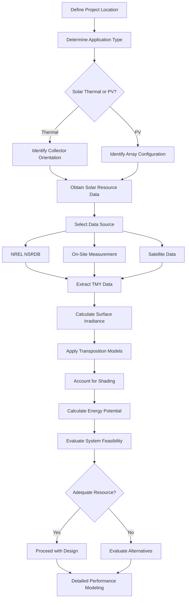

Solar resource assessment quantifies the available solar energy at a specific location to determine the feasibility and potential performance of solar thermal and photovoltaic systems integrated with HVAC applications. Accurate resource assessment forms the foundation for proper system sizing, economic analysis, and performance prediction.

## Solar Radiation Components

Solar radiation reaching a surface consists of three distinct components that must be characterized for comprehensive resource assessment.

**Direct Normal Irradiance (DNI)** represents the solar radiation received directly from the solar disk on a surface perpendicular to the sun's rays. DNI drives the performance of concentrating solar thermal collectors and tracking photovoltaic systems. Values range from 0 W/m² during overcast conditions to approximately 1000 W/m² under clear skies at sea level.

**Diffuse Horizontal Irradiance (DHI)** quantifies the solar radiation scattered by the atmosphere and received on a horizontal surface. DHI becomes the dominant component during cloudy conditions and remains significant even under clear skies, typically representing 10-20% of total radiation in clear conditions and up to 100% during heavy overcast.

**Global Horizontal Irradiance (GHI)** combines both direct and diffuse components on a horizontal surface:

$$
GHI = DNI \cdot \cos(\theta_z) + DHI
$$

where $\theta_z$ represents the solar zenith angle (angle between the sun and vertical).

For tilted surfaces, the total irradiance includes an additional ground-reflected component:

$$
I_{total} = I_{beam} + I_{diffuse} + I_{reflected}
$$

$$
I_{total} = DNI \cdot \cos(\theta) + DHI \cdot \left(\frac{1 + \cos(\beta)}{2}\right) + GHI \cdot \rho \cdot \left(\frac{1 - \cos(\beta)}{2}\right)
$$

where:
- $\theta$ = incidence angle on the tilted surface
- $\beta$ = surface tilt angle from horizontal
- $\rho$ = ground reflectance (albedo), typically 0.2 for most surfaces, 0.6-0.8 for snow

## Solar Energy Potential Calculations

The daily solar energy potential on a surface depends on the integrated irradiance over the operational period:

$$
E_{daily} = \int_{sunrise}^{sunset} I_{total}(t) \cdot dt
$$

For practical calculations, this integral approximates as:

$$
E_{daily} = \sum_{i=1}^{n} I_{total,i} \cdot \Delta t \cdot A_{collector} \cdot \eta_{system}
$$

where:
- $I_{total,i}$ = total irradiance during time interval $i$ (W/m²)
- $\Delta t$ = time interval duration (hours)
- $A_{collector}$ = collector area (m²)
- $\eta_{system}$ = overall system efficiency (thermal or electrical)

Monthly and annual energy production estimates require summing daily values accounting for seasonal variations in solar geometry and atmospheric conditions.

## Assessment Process Workflow

## US Solar Resource Data

Solar resource quality varies significantly across the United States, driven by latitude, climate patterns, and atmospheric conditions. The following table presents typical annual solar resource values for major US regions:

| Region | Representative City | Annual GHI (kWh/m²/yr) | Annual DNI (kWh/m²/yr) | Climate Classification |
|--------|-------------------|----------------------|----------------------|----------------------|
| Southwest Desert | Phoenix, AZ | 2,350-2,450 | 2,500-2,700 | Excellent - Class 7 |
| Southern California | Los Angeles, CA | 2,050-2,150 | 2,200-2,400 | Excellent - Class 6-7 |
| Southern Plains | Albuquerque, NM | 2,250-2,350 | 2,600-2,800 | Excellent - Class 7 |
| Mountain West | Denver, CO | 1,950-2,050 | 2,100-2,300 | Very Good - Class 6 |
| Southeast | Atlanta, GA | 1,650-1,750 | 1,500-1,700 | Good - Class 5 |
| Mid-Atlantic | Washington, DC | 1,550-1,650 | 1,400-1,600 | Good - Class 4-5 |
| Midwest | Chicago, IL | 1,450-1,550 | 1,300-1,500 | Moderate - Class 4 |
| Northeast | Boston, MA | 1,450-1,550 | 1,200-1,400 | Moderate - Class 4 |
| Pacific Northwest | Seattle, WA | 1,300-1,400 | 900-1,100 | Fair - Class 3 |

**Peak sun hours**, a simplified metric for system sizing, represents the equivalent number of hours at 1000 W/m² that would deliver the same total daily energy:

$$
PSH = \frac{E_{daily,GHI}}{1000 \text{ W/m}^2}
$$

Typical values range from 3.5-4.0 hours/day in the Pacific Northwest to 6.0-7.5 hours/day in the Southwest desert regions.

## Data Sources and Tools

**NREL National Solar Radiation Database (NSRDB)** provides the most comprehensive solar resource dataset for the United States, covering 1998-present with 4 km spatial resolution and 30-minute temporal resolution. The database includes measured and modeled values for GHI, DNI, and DHI, along with meteorological data critical for system performance modeling.

**Typical Meteorological Year (TMY)** datasets synthesize 12 typical months from multi-year datasets to represent average conditions for long-term performance analysis. TMY3 files contain hourly solar radiation and weather data for 1,020 US locations, enabling detailed annual energy simulations.

**PVWatts Calculator** (NREL) and **System Advisor Model (SAM)** provide web-based and desktop tools for quick resource assessment and detailed performance modeling respectively. Both tools access NSRDB data automatically based on location input.

**On-site measurement** using calibrated pyranometers (for GHI) and pyrheliometers (for DNI) provides the highest accuracy for critical applications, particularly where micro-climate effects, urban shading, or terrain features significantly impact resource availability. Measurement periods of 12 months minimum establish seasonal patterns, while 2-3 years reduces uncertainty from year-to-year variability.

## HVAC-Specific Applications

**Solar thermal domestic hot water** systems require assessment of collector orientation and tilt angle to maximize annual energy delivery. Optimal tilt typically approximates site latitude for year-round applications, while seasonal applications benefit from adjusted angles (latitude + 15° for winter priority, latitude - 15° for summer priority).

**Solar-assisted space heating** systems prioritize winter resource availability when heating loads peak. Assessment must account for reduced winter solar angles and shorter day lengths, making resource quality during heating months more critical than annual totals.

**Solar cooling applications** using absorption chillers align well with solar resource patterns, as peak cooling loads coincide with maximum solar availability. Assessment focuses on summer DNI for concentrating collectors or summer GHI for flat-plate collectors driving the absorption cycle.

**Building-integrated photovoltaics (BIPV)** for HVAC electrical loads require assessment of available surface orientations (facades, roofs, canopies) and their respective irradiance throughout the year. Non-optimal orientations remain viable when integrated architectural benefits offset reduced energy production.

**Daylighting integration** with HVAC controls requires assessment of both resource magnitude and temporal patterns to coordinate natural lighting with artificial lighting and associated cooling load reductions.

## Uncertainty and Variability

Solar resource assessment inherently contains uncertainty from multiple sources. Satellite-derived data carries 5-15% uncertainty in annual totals, with higher uncertainty for DNI compared to GHI. Temporal variability introduces inter-annual variations of 5-10% from typical values, requiring conservative design margins for critical applications.

Shading analysis identifies objects (buildings, trees, terrain) that block direct radiation during portions of the day or year. Even partial shading significantly reduces photovoltaic system performance due to electrical mismatch losses, making detailed shading assessment critical for urban installations.

Accurate solar resource assessment enables confident system sizing, realistic performance expectations, and sound economic analysis for solar HVAC applications. The combination of validated data sources, established calculation methods, and proper uncertainty treatment produces reliable assessments supporting successful solar energy integration.
