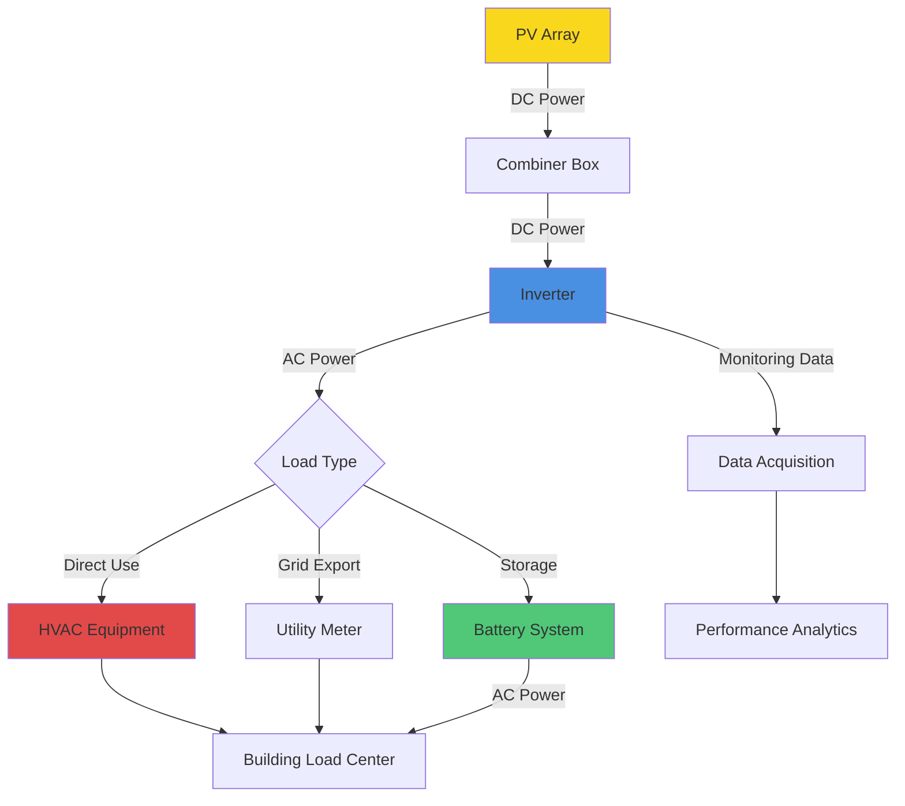

Photovoltaic (PV) systems convert solar irradiance directly into electrical energy through semiconductor materials exhibiting the photovoltaic effect. Integration of PV systems with HVAC equipment provides opportunities for reducing grid electricity consumption, peak demand reduction, and improving building energy performance.

## PV Technology Fundamentals

The core component of any PV system is the solar cell, which generates direct current (DC) electricity when photons excite electrons in semiconductor material. Multiple cells are connected in series and parallel configurations to form modules, which are then combined into arrays to achieve desired voltage and current outputs.

The electrical output of a PV module depends on solar irradiance, cell temperature, module efficiency, and electrical configuration. Under Standard Test Conditions (STC: 1000 W/m² irradiance, 25°C cell temperature, AM 1.5 spectrum), manufacturers rate module performance. Real-world conditions deviate significantly from STC, requiring careful analysis for accurate energy predictions.

## PV Module Technologies

Different PV technologies offer distinct performance characteristics relevant to HVAC applications:

| Technology Type | Efficiency Range | Temperature Coefficient | Cost Relative | Best Application |
|----------------|------------------|------------------------|---------------|------------------|
| Monocrystalline Silicon | 18-22% | -0.35 to -0.45%/°C | High | Limited roof space, high performance |
| Polycrystalline Silicon | 15-18% | -0.40 to -0.50%/°C | Medium | Standard installations, cost-sensitive |
| Thin-Film (CdTe, CIGS) | 10-15% | -0.20 to -0.30%/°C | Low | Large available area, diffuse light |
| Perovskite (Emerging) | 15-25% | Variable | R&D phase | Future applications, flexible substrates |
| Bifacial Modules | 20-24% effective | -0.35 to -0.45%/°C | High | Reflective surfaces, elevated mounting |

Monocrystalline silicon dominates commercial HVAC applications due to superior efficiency and space utilization. Bifacial modules gain increasing adoption on flat roofs with white membrane surfaces, capturing reflected irradiance from the rear side for 5-30% additional energy yield depending on albedo and mounting configuration.

## PV System Architecture

The fundamental PV system for HVAC applications consists of the PV array, power conditioning equipment (inverters), electrical protection devices, mounting structures, and monitoring systems. Grid-tied systems dominate commercial installations, allowing bidirectional power flow between the building and utility grid.

## PV Output Calculation Methodology

The DC power output from a PV array operating at maximum power point is calculated as:

$$P_{DC} = G_T \cdot A \cdot \eta_{module} \cdot PR$$

Where:
- $P_{DC}$ = DC power output (W)
- $G_T$ = Total solar irradiance on array plane (W/m²)
- $A$ = Total array area (m²)
- $\eta_{module}$ = Module efficiency under operating conditions (dimensionless)
- $PR$ = Performance ratio accounting for system losses (dimensionless)

The module efficiency decreases with increasing cell temperature according to:

$$\eta_{module} = \eta_{STC} \cdot [1 + \gamma(T_{cell} - 25)]$$

Where:
- $\eta_{STC}$ = Module efficiency at Standard Test Conditions (dimensionless)
- $\gamma$ = Temperature coefficient of power (typically -0.0035 to -0.0050/°C)
- $T_{cell}$ = Cell operating temperature (°C)

Cell temperature is estimated from ambient temperature and solar irradiance:

$$T_{cell} = T_{ambient} + \frac{G_T}{G_{NOCT}} \cdot (NOCT - 20)$$

Where:
- $T_{ambient}$ = Ambient air temperature (°C)
- $G_{NOCT}$ = Irradiance at NOCT conditions = 800 W/m²
- $NOCT$ = Nominal Operating Cell Temperature (°C), typically 42-46°C

The performance ratio (PR) accounts for multiple loss mechanisms:

$$PR = (1 - L_{soiling})(1 - L_{shading})(1 - L_{mismatch})(1 - L_{wiring})(1 - L_{inverter})$$

Typical values for well-designed systems range from 0.75 to 0.85. High-performance systems with bifacial modules, optimized tilt angles, and minimal shading achieve PR values approaching 0.90.

Annual energy production is calculated by integrating hourly production over the year:

$$E_{annual} = \sum_{t=1}^{8760} P_{AC}(t) \cdot \Delta t$$

Where $P_{AC}(t)$ is the AC power output at hour $t$ after inverter conversion, typically 96-98.5% of DC power for modern inverters.

## Building-Integrated Photovoltaics (BIPV)

BIPV systems serve dual functions as both building envelope components and electricity generators. HVAC engineers must coordinate with architects and structural engineers to ensure proper integration.

**BIPV Applications:**
- Curtain wall spandrel panels replacing vision glass
- Roofing membrane replacement with flexible PV laminates
- Canopy structures providing shaded outdoor spaces
- Skylight glazing with semi-transparent PV cells

BIPV presents thermal management challenges as restricted airflow behind integrated modules increases operating temperatures, reducing efficiency. Ventilated BIPV designs incorporate air gaps allowing convective cooling, recovering waste heat for building heating during winter months.

## Rooftop Solar for Commercial HVAC

Commercial buildings with large flat roofs provide ideal platforms for PV arrays powering HVAC equipment. Roof-mounted systems require coordination with mechanical equipment placement, maintenance access pathways, and structural loading analysis.

**Critical Design Considerations:**
- Structural capacity: PV systems add 2.5-5.0 psf including racking, modules, and wind/snow loads
- Rooftop unit (RTU) shading: Maintain minimum 3-6 ft clearance to prevent module shading
- Service access: Provide clear pathways to all mechanical equipment per code requirements
- Electrical routing: Coordinate conduit runs with existing HVAC piping and ductwork
- Wind loading: Ballasted systems for EPDM/TPO roofs avoid membrane penetration

Optimal tilt angles for rooftop arrays equal the site latitude ±10° to maximize annual energy production. Flat-mounted arrays (0-5° tilt) simplify installation and reduce wind loads but sacrifice 5-12% annual energy production.

## HVAC-PV Integration Strategies

**Direct DC Coupling:**
Variable refrigerant flow (VRF) systems and DC motor-driven equipment can operate directly from PV arrays without AC conversion, eliminating inverter losses. This approach requires specialized controllers managing power point tracking and load matching.

**Battery-Buffered Systems:**
Lithium-ion battery storage decouples PV generation from instantaneous HVAC loads, enabling peak demand reduction and improved solar utilization. Battery systems add 30-50% to total installed cost but provide resilience during grid outages.

**Grid-Tied Net Metering:**
Most common configuration exports excess PV production to the grid during low HVAC loads (spring/fall), receiving credits offsetting summer cooling electricity consumption. Net metering policies vary by jurisdiction, significantly affecting project economics.

## NREL Analytical Tools

The National Renewable Energy Laboratory (NREL) provides industry-standard tools for PV system analysis:

**PVWatts Calculator:**
Simplified hourly simulation using typical meteorological year (TMY3) weather data. Provides quick estimates suitable for preliminary feasibility analysis. Access at pvwatts.nrel.gov.

**System Advisor Model (SAM):**
Detailed hourly simulation including advanced loss models, financial analysis, and component-level performance modeling. Required for detailed engineering and financing applications.

**NSRDB (National Solar Radiation Database):**
High-resolution solar irradiance data including direct normal irradiance (DNI), diffuse horizontal irradiance (DHI), and global horizontal irradiance (GHI) at 4 km spatial resolution and 30-minute temporal resolution.

## System Sizing for HVAC Loads

PV system capacity is sized based on available roof area, electrical load profiles, and project economics. HVAC-dominated buildings exhibit high cooling season electricity consumption correlating favorably with solar production.

A 100-ton (350 kW cooling) commercial building consuming 500,000 kWh/year with 60% cooling-related electricity requires approximately 350-400 kW DC PV capacity to achieve net-zero operation, assuming:
- Specific yield: 1,300-1,500 kWh/kWp annually (location-dependent)
- System performance ratio: 0.80
- Available roof area: 25,000-30,000 ft² (assuming 12-15 W/ft² DC)

## Performance Monitoring and Verification

Continuous monitoring of PV system performance ensures design expectations are met and identifies degradation or component failures. Key performance metrics include:

- Specific yield (kWh/kWp): Annual energy per installed capacity
- Capacity factor: Ratio of actual to theoretical maximum production
- Performance ratio: Actual yield relative to expected yield at STC
- Degradation rate: Annual decrease in peak power output (typically 0.5-0.7%/year)

Integration of PV monitoring with building automation systems (BAS) enables coordinated control strategies optimizing combined HVAC-PV performance.

## Conclusion

Photovoltaic systems integrated with HVAC equipment provide substantial opportunities for reducing building energy consumption and operating costs. Successful implementation requires careful attention to solar resource assessment, accurate performance modeling, proper system sizing, and coordination with building envelope and mechanical systems. NREL tools and methodologies provide rigorous analytical frameworks supporting engineering decisions throughout the design process.
