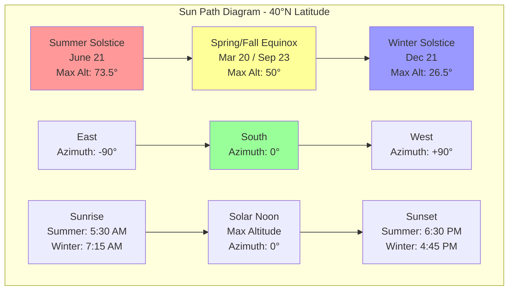

Solar geometry defines the mathematical relationships between the sun's position and a location on Earth at any given time. These calculations are fundamental for accurate solar heat gain analysis, building energy modeling, and solar thermal or photovoltaic system design in HVAC applications.

## Solar Declination Angle

The solar declination angle (δ) represents the angular position of the sun at solar noon relative to the equatorial plane. It varies throughout the year as Earth orbits the sun with its tilted axis.

**ASHRAE approximation for solar declination:**

$$\delta = 23.45° \sin\left[\frac{360(284 + n)}{365}\right]$$

Where:
- δ = solar declination angle (degrees)
- n = day of year (1-365)
- 23.45° = Earth's axial tilt

**Key declination values:**

| Date | Day (n) | Declination (δ) | Event |
|------|---------|-----------------|-------|
| June 21 | 172 | +23.45° | Summer solstice |
| March 20 / Sept 23 | 80 / 266 | 0° | Equinoxes |
| December 21 | 355 | -23.45° | Winter solstice |

The declination reaches maximum positive values during Northern Hemisphere summer and maximum negative values during winter, directly affecting solar altitude and radiation intensity.

## Hour Angle

The hour angle (H) measures the angular displacement of the sun east or west of the local meridian due to Earth's rotation. Solar noon occurs when H = 0°.

**Hour angle calculation:**

$$H = 15° \times (t_{solar} - 12)$$

Where:
- H = hour angle (degrees)
- tsolar = solar time (hours)
- 15° = Earth's rotation rate (degrees per hour)

Hour angle is negative before solar noon (morning) and positive after solar noon (afternoon). The factor of 15°/hour derives from Earth's 360° rotation in 24 hours.

## Solar Altitude Angle

The solar altitude angle (α) is the vertical angle between the sun and the horizontal plane at the observer's location. This angle directly affects solar irradiance on horizontal and tilted surfaces.

**Solar altitude calculation:**

$$\sin(\alpha) = \sin(L)\sin(\delta) + \cos(L)\cos(\delta)\cos(H)$$

Where:
- α = solar altitude angle (degrees)
- L = latitude (degrees, positive north)
- δ = solar declination angle (degrees)
- H = hour angle (degrees)

**Maximum solar altitude at solar noon:**

$$\alpha_{max} = 90° - L + \delta$$

### Solar Altitude by Latitude (Summer Solstice, Solar Noon)

| Latitude | Location Example | Max Altitude (α) | Zenith Angle (θz) |
|----------|------------------|------------------|------------------------------|
| 0° | Equator | 66.55° | 23.45° |
| 25°N | Miami, FL | 88.45° | 1.55° |
| 30°N | Houston, TX | 83.45° | 6.55° |
| 35°N | Albuquerque, NM | 78.45° | 11.55° |
| 40°N | Denver, CO | 73.45° | 16.55° |
| 45°N | Minneapolis, MN | 68.45° | 21.55° |
| 50°N | Winnipeg, Canada | 63.45° | 26.55° |

The zenith angle (θz) is the complement of the altitude angle: θz = 90° - α.

## Solar Azimuth Angle

The solar azimuth angle (γ) measures the horizontal angular displacement of the sun from true south (in Northern Hemisphere). ASHRAE convention defines south as 0°, with positive angles toward west.

**Solar azimuth calculation:**

$$\cos(\gamma) = \frac{\sin(\alpha)\sin(L) - \sin(\delta)}{\cos(\alpha)\cos(L)}$$

Alternative form using hour angle:

$$\sin(\gamma) = \frac{\cos(\delta)\sin(H)}{\cos(\alpha)}$$

**Sign convention:**
- Morning (H < 0): γ is negative (eastern angles)
- Afternoon (H > 0): γ is positive (western angles)
- Solar noon (H = 0): γ = 0° (due south in Northern Hemisphere)

### Azimuth Angles Throughout the Day (40°N Latitude, Summer Solstice)

| Solar Time | Hour Angle (H) | Altitude (α) | Azimuth (γ) | Direction |
|------------|----------------|--------------|-------------|-----------|
| 6:00 AM | -90° | 4.5° | -111° | East-southeast |
| 8:00 AM | -60° | 28.1° | -86° | East |
| 10:00 AM | -30° | 54.3° | -54° | East-southeast |
| 12:00 PM | 0° | 73.5° | 0° | South |
| 2:00 PM | +30° | 54.3° | +54° | West-southwest |
| 4:00 PM | +60° | 28.1° | +86° | West |
| 6:00 PM | +90° | 4.5° | +111° | West-northwest |

## Sun Path Diagram

The sun path diagram visualizes the sun's trajectory across the sky throughout the year, combining altitude and azimuth angles.

## ASHRAE Solar Calculation Methods

ASHRAE Handbook - Fundamentals provides comprehensive solar geometry tables and calculation procedures:

**Clear-sky solar irradiance model:**

$$E_{direct,normal} = A \cdot e^{-B/\sin(\alpha)}$$

Where:
- Edirect,normal = direct normal irradiance (W/m²)
- A, B = atmospheric clearness coefficients
- α = solar altitude angle

**Solar heat gain through windows:**

$$q_{solar} = A_{window} \times SHGC \times E_{transmitted}$$

The transmitted irradiance depends on:
- Solar altitude angle (α)
- Solar azimuth angle (γ)
- Window orientation and tilt
- Atmospheric conditions

## Practical Applications in HVAC

**Building load calculations:**
- Peak cooling loads occur when solar altitude and azimuth align with large glazing areas
- East-facing windows experience peak gains at 8-9 AM
- West-facing windows peak at 3-4 PM
- South-facing windows vary significantly with season

**Solar thermal collector design:**
- Optimal tilt angle ≈ latitude for year-round performance
- Tilt = latitude + 15° for winter heating priority
- Tilt = latitude - 15° for summer cooling applications
- Azimuth should be within ±15° of true south for maximum efficiency

**Photovoltaic system optimization:**
- Fixed-tilt arrays positioned based on latitude and solar geometry
- Tracking systems follow altitude and azimuth angles for maximum irradiance
- Shading analysis requires hour-by-hour solar position calculations

**Daylighting and shading:**
- Overhang design uses summer and winter altitude angles
- Effective shading blocks high summer sun while admitting low winter sun
- Solar geometry determines required overhang projection and height

## Equation of Time Correction

Solar time differs from standard clock time due to Earth's elliptical orbit and axial tilt. The equation of time (ET) correction converts between the two:

$$t_{solar} = t_{standard} + \frac{ET}{60} + \frac{4(L_{standard} - L_{local})}{60}$$

Where ET varies from -14 to +16 minutes throughout the year, with zero crossings near April 15, June 14, September 1, and December 25.

## Components

- Solar Declination Angle
- Hour Angle Solar Time
- Solar Altitude Angle
- Solar Azimuth Angle
- Zenith Angle
- Incidence Angle Surface
- Sunrise Sunset Calculations
- Equation Of Time Solar Time Correction
