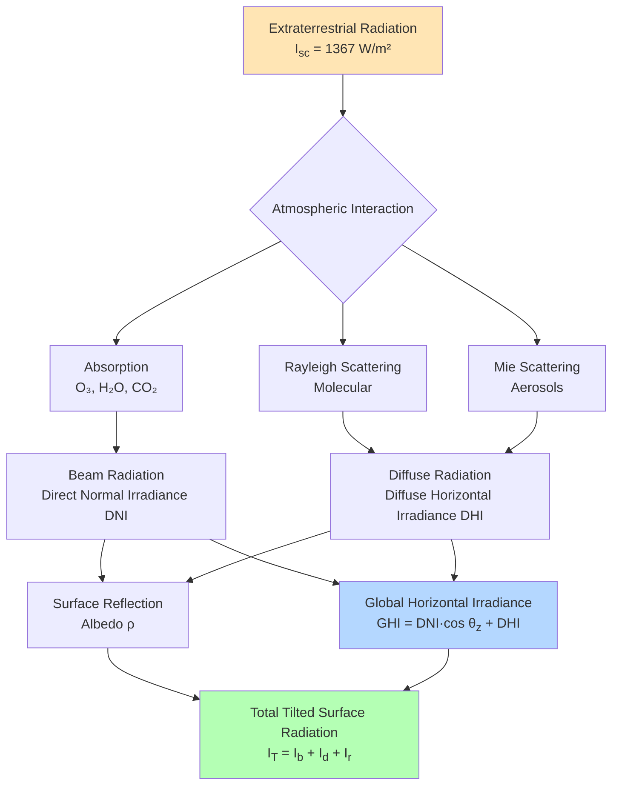

## Extraterrestrial Solar Radiation

Solar radiation originates from nuclear fusion reactions in the sun's core, delivering energy to Earth at a nearly constant rate. The **solar constant** ($I_{sc}$) represents the extraterrestrial solar irradiance on a surface perpendicular to the sun's rays at mean Earth-sun distance:

$$I_{sc} = 1367 \text{ W/m}^2$$

This value varies by ±3.3% throughout the year due to Earth's elliptical orbit. The actual extraterrestrial radiation on a horizontal surface depends on the solar zenith angle ($\theta_z$):

$$I_o = I_{sc} \left(1 + 0.033 \cos \frac{360n}{365}\right) \cos \theta_z$$

where $n$ is the day number of the year (1-365). This equation accounts for the eccentricity correction factor and geometric projection.

## Atmospheric Attenuation Mechanisms

Solar radiation traversing the atmosphere undergoes significant modification through multiple physical processes that reduce intensity and alter spectral distribution.

### Absorption Processes

Atmospheric gases selectively absorb solar radiation at specific wavelengths. Ozone ($\text{O}_3$) absorbs ultraviolet radiation below 0.3 μm, protecting the Earth's surface from harmful UV. Water vapor and carbon dioxide absorb strongly in the infrared spectrum. These absorption processes convert radiant energy to thermal energy, warming the atmosphere while reducing surface irradiance.

### Scattering Mechanisms

**Rayleigh scattering** occurs when radiation interacts with atmospheric molecules smaller than the wavelength of light. This wavelength-dependent process ($\propto \lambda^{-4}$) scatters shorter blue wavelengths more effectively than longer red wavelengths, creating the blue sky phenomenon and reducing beam radiation.

**Mie scattering** results from interaction with aerosols and water droplets with diameters comparable to radiation wavelengths (0.1-10 μm). This weakly wavelength-dependent scattering affects all visible wavelengths similarly, creating hazy white skies in polluted or humid conditions.

## Air Mass and Optical Path Length

Air mass ($AM$) quantifies the relative path length solar radiation travels through the atmosphere compared to the vertical path at sea level:

$$AM = \frac{1}{\cos \theta_z}$$

For zenith angles exceeding 70°, atmospheric curvature requires correction:

$$AM = \frac{1}{\cos \theta_z + 0.50572(96.07995 - \theta_z)^{-1.6364}}$$

Standard test conditions use $AM = 1.5$ (representing $\theta_z = 48.2°$) for photovoltaic performance ratings.

## Solar Radiation Components

### Direct Normal Irradiance (DNI)

DNI represents beam radiation arriving directly from the solar disk onto a surface perpendicular to the sun's rays. This component dominates under clear sky conditions and enables concentrating solar technologies. DNI is measured with pyrheliometers employing narrow field-of-view (typically 5°) collimating tubes.

### Diffuse Horizontal Irradiance (DHI)

DHI quantifies scattered radiation arriving from the entire sky dome onto a horizontal surface, excluding direct beam radiation. Atmospheric scattering processes generate this omnidirectional component. DHI becomes the dominant radiation source under overcast conditions when cloud cover obscures direct sunlight. Shaded pyranometers with shadow bands or tracking disks measure DHI by blocking beam radiation.

### Global Horizontal Irradiance (GHI)

GHI represents total solar radiation received on a horizontal surface, combining beam and diffuse components:

$$GHI = DNI \cdot \cos \theta_z + DHI$$

This fundamental relationship allows calculation of any component when two others are measured. Standard pyranometers with hemispherical field-of-view directly measure GHI.

### Reflected Radiation

Ground-reflected radiation depends on surface albedo ($\rho$) and incident radiation. For tilted surfaces, reflected irradiance becomes:

$$I_r = \rho \cdot GHI \cdot \frac{1 - \cos \beta}{2}$$

where $\beta$ is surface tilt angle. This component significantly impacts vertical facades and steeply tilted collectors, particularly with high-albedo surfaces (fresh snow: $\rho \approx 0.8$).

## Atmospheric Effects on Solar Radiation

| Atmospheric Factor | Transmission Impact | Spectral Effect | Typical Loss Range |
|-------------------|---------------------|-----------------|-------------------|
| Clean, dry air | Minimal attenuation | Rayleigh scattering | 10-20% |
| Water vapor | Moderate absorption | IR bands affected | 5-15% |
| Aerosols (urban) | Significant scattering | Broadband reduction | 15-30% |
| Thin clouds | Strong scattering | Wavelength independent | 30-60% |
| Thick clouds | Severe attenuation | Nearly complete beam loss | 60-95% |
| Dust/sand storms | Extreme attenuation | Broadband absorption | 40-80% |

## Clearness Index and Sky Conditions

The clearness index ($K_T$) characterizes atmospheric transparency:

$$K_T = \frac{GHI}{I_o}$$

This dimensionless parameter ranges from 0 (complete overcast) to approximately 0.8 (exceptionally clear conditions). Values exceeding unity occasionally occur due to cloud enhancement effects where scattered radiation augments direct beam radiation.

**Sky condition classification:**
- Clear sky: $K_T > 0.65$
- Partly cloudy: $0.35 < K_T < 0.65$
- Overcast: $K_T < 0.35$

ASHRAE clear-sky models use $K_T$ along with air mass and precipitable water to estimate design-day irradiance values for HVAC load calculations.

## Tilted Surface Radiation

Total irradiance on tilted surfaces combines three components:

$$I_T = I_b + I_d + I_r$$

**Beam component:** $I_b = DNI \cdot \cos \theta$ where $\theta$ is the angle of incidence between sun rays and surface normal.

**Diffuse component:** Multiple models exist; the isotropic sky model assumes uniform diffuse radiation from the sky dome:

$$I_d = DHI \cdot \frac{1 + \cos \beta}{2}$$

The Perez anisotropic model provides improved accuracy by accounting for circumsolar brightening and horizon brightening effects.

## Engineering Applications

Understanding solar radiation fundamentals enables accurate prediction of solar heat gains through building envelopes, essential for HVAC system sizing per ASHRAE Standard 90.1. Solar radiation data drives renewable energy system design, including photovoltaic arrays and solar thermal collectors. Daylighting analysis relies on diffuse radiation distributions to optimize fenestration design and reduce artificial lighting loads.

Accurate solar radiation measurement and modeling forms the foundation for building energy simulation tools, solar resource assessment, and performance verification of solar energy systems.
