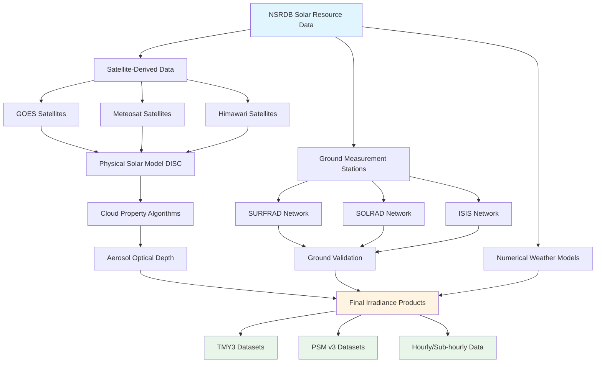

## Solar Radiation Components

Solar resource data quantifies the available solar energy at a specific location for HVAC applications including solar thermal collectors, photovoltaic systems, and daylighting analysis. Accurate solar data is fundamental to sizing equipment, predicting performance, and conducting energy simulations.

### Primary Irradiance Measurements

**Global Horizontal Irradiance (GHI)**

Total solar radiation received on a horizontal surface, combining direct beam and diffuse components:

$$
\text{GHI} = \text{DNI} \cdot \cos(\theta_z) + \text{DHI}
$$

where $\theta_z$ is the solar zenith angle (angle from vertical to sun position).

**Direct Normal Irradiance (DNI)**

Solar radiation received perpendicular to the sun's rays, excluding scattered light. Critical for concentrating solar thermal systems and tracking photovoltaic arrays:

$$
\text{DNI} = \frac{\text{GHI} - \text{DHI}}{\cos(\theta_z)}
$$

**Diffuse Horizontal Irradiance (DHI)**

Scattered solar radiation from sky and clouds received on a horizontal surface. Represents the portion of solar energy available even under cloudy conditions.

## Typical Meteorological Year (TMY) Data

TMY datasets provide hourly solar and meteorological values representing typical conditions over multi-year periods. TMY3 data, developed by NREL, selects 12 typical months from a 30-year database using statistical analysis.

### TMY Data Elements

| Parameter | Units | HVAC Application |
|-----------|-------|------------------|
| GHI | W/m² | Flat-plate collector input |
| DNI | W/m² | Tracking system design |
| DHI | W/m² | Diffuse radiation availability |
| Dry-bulb temperature | °C | Cooling load calculations |
| Dew-point temperature | °C | Latent load analysis |
| Wind speed | m/s | Convective losses |
| Atmospheric pressure | Pa | Density corrections |

TMY data enables annual energy simulations without modeling 30+ years of weather data, reducing computational requirements while maintaining statistical accuracy for long-term performance predictions.

## National Solar Radiation Database (NSRDB)

The NREL NSRDB provides high-resolution solar irradiance data covering North America with 4 km spatial resolution and temporal intervals ranging from 30 minutes to hourly.

### NSRDB Data Sources

### Data Accuracy and Validation

NSRDB data undergoes extensive validation against ground-based pyranometer and pyrheliometer measurements. Typical uncertainty values:

| Measurement | Mean Bias Error | Root Mean Square Error |
|-------------|-----------------|------------------------|
| GHI | ±3% to ±5% | 8% to 12% |
| DNI | ±4% to ±7% | 12% to 18% |
| DHI | ±8% to ±15% | 20% to 30% |

## Regional Solar Resource Variations

Solar irradiance varies significantly by geographic location, affecting HVAC solar system performance and economic viability.

### Annual Average Daily Solar Irradiance by U.S. Region

| Region | GHI (kWh/m²/day) | DNI (kWh/m²/day) | Climate Characteristics |
|--------|------------------|------------------|-------------------------|
| Southwest (Phoenix, AZ) | 6.5 - 7.0 | 7.0 - 8.0 | High DNI, low cloud cover |
| Southeast (Miami, FL) | 5.0 - 5.5 | 4.5 - 5.5 | High humidity, afternoon clouds |
| California Coast | 5.5 - 6.0 | 5.0 - 6.5 | Marine layer mornings |
| Great Plains | 5.0 - 5.5 | 5.5 - 6.5 | Variable cloud cover |
| Northeast (Boston, MA) | 4.0 - 4.5 | 3.5 - 4.5 | Seasonal variation, winter snow |
| Pacific Northwest | 3.5 - 4.0 | 2.5 - 3.5 | Frequent cloud cover |

### Seasonal Variation Analysis

Solar resource availability exhibits significant seasonal patterns requiring consideration in HVAC system design:

**Summer Peak Analysis**

Maximum GHI occurs during summer months when solar altitude angles are highest:

$$
\text{GHI}_{\text{peak}} = \text{GHI}_{\text{extraterrestrial}} \cdot \tau_{\text{clear-sky}}
$$

where $\tau_{\text{clear-sky}}$ represents atmospheric transmittance under cloudless conditions (typically 0.70-0.85).

**Winter Minimum Considerations**

Reduced day length and lower sun angles decrease available solar energy:

$$
\text{Day Length} = \frac{2}{15} \arccos(-\tan(\phi) \cdot \tan(\delta))
$$

where $\phi$ is latitude and $\delta$ is solar declination angle.

## Data Access and Tools

**PVWatts Calculator**

NREL's PVWatts provides simplified access to NSRDB data for photovoltaic system performance estimation. The tool uses TMY3 data to predict monthly and annual energy production based on system specifications.

**Solar Resource Maps**

Geographic Information System (GIS) maps display spatial distribution of solar resources, enabling preliminary site assessment before detailed analysis.

**Ground-Based Measurement Stations**

High-accuracy reference stations provide validation data and site-specific measurements where satellite-derived estimates may have limitations:

- **SURFRAD**: 7 stations across U.S. climate zones
- **SOLRAD**: 17 stations focused on solar energy applications
- **ISIS**: International stations for global coverage

## Application in HVAC Design

Solar resource data directly influences HVAC system design decisions:

1. **Solar Thermal Sizing**: Annual GHI determines collector area required for domestic hot water or space heating loads
2. **PV System Design**: DNI/GHI ratio indicates optimal tracking system versus fixed-tilt configuration
3. **Energy Modeling**: TMY data enables accurate annual energy consumption predictions in building simulation software
4. **Economic Analysis**: Multi-year irradiance data improves financial modeling accuracy for solar investments
5. **Daylighting Design**: Diffuse horizontal irradiance influences skylight sizing and positioning

Proper selection and application of solar resource data ensures HVAC solar systems meet performance expectations throughout their operational lifetime.
