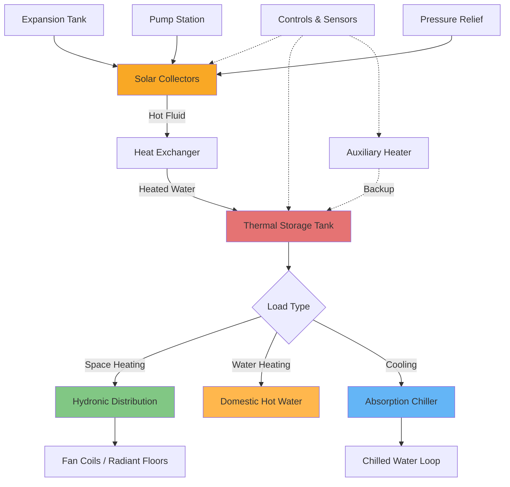

Solar thermal systems convert solar radiation into usable thermal energy for HVAC applications. Unlike photovoltaic systems that generate electricity, solar thermal collectors directly heat working fluids for immediate use or thermal storage. These systems achieve conversion efficiencies of 30-80%, substantially higher than PV systems at 15-22%, making them particularly effective for heating-dominated applications.

## Solar Thermal Collector Types

Solar thermal collectors operate across different temperature ranges, each suited to specific HVAC applications:

| Collector Type | Operating Temp Range | Typical Efficiency | SRCC Rating Category | Primary Applications |
|----------------|---------------------|-------------------|---------------------|---------------------|
| Unglazed Flat Plate | 10-30°C (50-86°F) | 60-90% | OG-100 | Pool heating, low-temp processes |
| Glazed Flat Plate | 30-80°C (86-176°F) | 40-70% | OG-100 | Domestic water heating, space heating |
| Evacuated Tube | 50-120°C (122-248°F) | 50-80% | OG-100 | Water heating, absorption cooling |
| Parabolic Trough | 100-400°C (212-752°F) | 50-70% | OG-300 | Process heat, power generation |
| Compound Parabolic (CPC) | 60-200°C (140-392°F) | 40-65% | OG-100 | Medium-temp industrial processes |

The Solar Rating and Certification Corporation (SRCC) provides standardized performance ratings under OG-100 (water heating) and OG-300 (pool heating) certification programs, enabling direct comparison between manufacturers.

## Collector Efficiency Analysis

Solar thermal collector efficiency depends on incident solar radiation, fluid inlet temperature, and ambient conditions. The instantaneous efficiency equation relates these parameters:

$$\eta = F_R(\tau\alpha) - F_R U_L \frac{(T_{in} - T_a)}{G_T}$$

Where:
- $\eta$ = instantaneous collector efficiency (dimensionless)
- $F_R$ = heat removal factor (0.85-0.95 for well-designed collectors)
- $\tau\alpha$ = transmittance-absorptance product (0.70-0.90)
- $U_L$ = overall heat loss coefficient (W/m²·K)
- $T_{in}$ = inlet fluid temperature (°C)
- $T_a$ = ambient air temperature (°C)
- $G_T$ = total incident solar radiation (W/m²)

The efficiency equation demonstrates that performance decreases linearly as the temperature difference $(T_{in} - T_a)$ increases relative to solar intensity $G_T$. This relationship defines the reduced temperature parameter:

$$T^* = \frac{T_{in} - T_a}{G_T}$$

Collectors with lower $U_L$ values (better insulation) maintain higher efficiency at elevated operating temperatures. Evacuated tube collectors achieve $U_L$ = 1-2 W/m²·K compared to 3-6 W/m²·K for flat plate collectors.

## Solar Thermal System Architecture

## Domestic Water Heating Systems

Solar water heating represents the most common thermal application, with installed capacity exceeding 400 GWth globally. System configurations vary by climate:

**Active Direct Systems**: Water circulates directly through collectors. Limited to non-freezing climates due to freeze damage risk. Simplest design with highest efficiency (60-70% annual solar fraction).

**Active Indirect Systems**: Propylene glycol or other antifreeze solution transfers heat through a heat exchanger. Required for freezing climates. Slight efficiency penalty (3-5%) from heat exchanger but eliminates freeze risk.

**Thermosiphon Systems**: Passive circulation relies on density differences between hot and cold water. No pumps required. Storage tank must be elevated above collectors. Limited to moderate climates and small systems (<300 liters).

**Drain-Back Systems**: Water drains from collectors to storage when circulation stops, preventing freezing. Requires proper pitch (≥0.5 inches per foot) and drain-back reservoir. Excellent freeze protection without antifreeze.

Sizing criteria for domestic water heating:

$$A_c = \frac{V_{daily} \times c_p \times \rho \times \Delta T \times SF}{I_{avg} \times \eta_{annual}}$$

Where $A_c$ = collector area (m²), $V_{daily}$ = daily hot water demand (L), $\Delta T$ = temperature rise (typically 40-50°C), $SF$ = desired solar fraction (0.5-0.8), $I_{avg}$ = average daily insolation (Wh/m²), and $\eta_{annual}$ = annual average efficiency (0.40-0.60).

## Solar Space Heating

Solar space heating systems integrate with hydronic distribution networks. The heating load temporal mismatch—peak demand in winter when solar availability is lowest—necessitates large thermal storage or auxiliary backup.

**Combisystems**: Combined space and water heating maximizes solar contribution by providing year-round load. Summer water heating prevents stagnation while winter space heating utilizes full collector capacity.

**Seasonal Storage**: Large water tanks (10,000-100,000 liters) or underground thermal energy storage (UTES) shift summer heat collection to winter use. High capital costs limit application to large installations or district heating.

Effective solar space heating requires low-temperature distribution (35-50°C supply) compatible with radiant floors or oversized fan coils. High-temperature systems (70-85°C baseboard) reduce solar contribution by 30-50% due to decreased collector efficiency.

## Solar Absorption Cooling

Solar-driven absorption chillers convert thermal energy into cooling, addressing the beneficial load alignment between solar availability and cooling demand. Single-effect lithium bromide-water chillers require 80-95°C input temperatures, achievable with evacuated tube or compound parabolic collectors.

**Coefficient of Performance**: Single-effect absorption chillers achieve COP = 0.6-0.7, meaning 1 kWth of solar heat produces 0.6-0.7 kWth of cooling. The overall system cooling efficiency combines collector efficiency with absorption COP:

$$COP_{system} = \eta_{collector} \times COP_{chiller}$$

For a system operating at 85°C with $\eta_{collector}$ = 0.55 and $COP_{chiller}$ = 0.65, the system COP = 0.36. This translates to 2.8 m² of collector area per kW of cooling capacity at 800 W/m² insolation.

**Economic Considerations**: High capital costs ($3,000-5,000 per kW cooling) and moderate efficiency limit solar cooling to applications with high cooling loads, expensive electricity, or sustainability mandates. Payback periods typically exceed 10-15 years without incentives.

## Performance Verification and Standards

SRCC OG-100 certification tests collectors under standardized conditions (800 W/m² irradiance, 20°C ambient, various inlet temperatures) to generate performance curves. The certification provides:

- Optical efficiency $F_R(\tau\alpha)$
- Heat loss coefficient $F_R U_L$
- Gross collector area and aperture area
- Fluid capacity and recommended flow rates
- Incidence angle modifier coefficients

Annual system performance estimates use TRNSYS simulation with TMY3 weather data, validated against SRCC System Comparison tool benchmarks. Properly designed systems achieve 40-70% solar fraction for water heating, 20-50% for space heating, and 50-80% for pool heating in favorable climates.

Solar thermal applications offer proven technology for reducing HVAC energy consumption through direct solar heat utilization. System economics improve with high fuel costs, available incentives, and loads well-matched to solar availability patterns.
