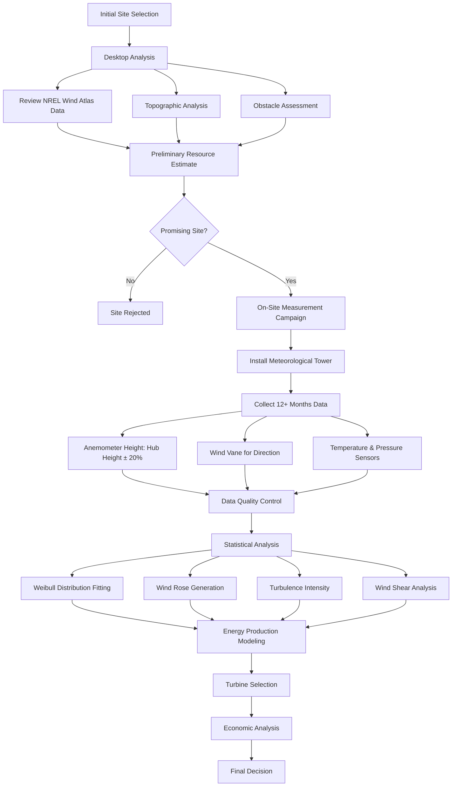

Wind resource assessment quantifies available wind energy at a site to determine feasibility for wind-powered HVAC systems or building energy applications. Proper assessment combines meteorological data collection, statistical analysis, and energy production modeling.

## Fundamental Wind Power Equations

Wind power available in an airstream depends on air density, swept area, and wind velocity cubed:

$$P_{wind} = \frac{1}{2} \rho A V^3$$

where:
- $P_{wind}$ = wind power (W)
- $\rho$ = air density (kg/m³), typically 1.225 kg/m³ at sea level, 15°C
- $A$ = swept area (m²)
- $V$ = wind speed (m/s)

Actual turbine power output incorporates the power coefficient:

$$P_{turbine} = \frac{1}{2} \rho A V^3 C_p \eta$$

where:
- $C_p$ = power coefficient (dimensionless), maximum 0.593 (Betz limit)
- $\eta$ = mechanical and electrical efficiency

The cubic relationship between wind speed and power makes accurate wind measurement critical. A 10% error in wind speed measurement translates to approximately 30% error in energy production estimates.

## Wind Speed Distribution

Wind speeds at a site follow a Weibull probability distribution:

$$f(V) = \frac{k}{c}\left(\frac{V}{c}\right)^{k-1}e^{-\left(\frac{V}{c}\right)^k}$$

where:
- $k$ = shape parameter (dimensionless), typically 1.5-3.0
- $c$ = scale parameter (m/s)
- $V$ = wind speed (m/s)

Wind speed varies with height according to the power law:

$$V_2 = V_1 \left(\frac{z_2}{z_1}\right)^{\alpha}$$

where:
- $V_1$, $V_2$ = wind speeds at heights $z_1$, $z_2$
- $\alpha$ = power law exponent, typically 0.14-0.20 (1/7 = 0.143 commonly used)

## US Wind Resource Classification

The National Renewable Energy Laboratory (NREL) and Department of Energy classify wind resources by power density and speed:

| Wind Power Class | 10m Height | 50m Height | Resource Potential |
|------------------|------------|------------|-------------------|
| | Speed (m/s) / Power (W/m²) | Speed (m/s) / Power (W/m²) | |
| Class 1 | 0-4.4 / 0-100 | 0-5.6 / 0-200 | Poor |
| Class 2 | 4.4-5.1 / 100-150 | 5.6-6.4 / 200-300 | Marginal |
| Class 3 | 5.1-5.6 / 150-200 | 6.4-7.0 / 300-400 | Fair |
| Class 4 | 5.6-6.0 / 200-250 | 7.0-7.5 / 400-500 | Good |
| Class 5 | 6.0-6.4 / 250-300 | 7.5-8.0 / 500-600 | Excellent |
| Class 6 | 6.4-7.0 / 300-400 | 8.0-8.8 / 600-800 | Outstanding |
| Class 7 | >7.0 / >400 | >8.8 / >800 | Superb |

Wind power density provides a better resource indicator than speed alone because it accounts for both wind speed and air density variations.

## Site Assessment Methodology

## Resource Data Collection

**Measurement Duration**: Minimum 12 months required to capture seasonal variations. Sites with strong seasonal patterns may require 24-36 months for accurate characterization.

**Measurement Height**: Install anemometers at proposed turbine hub height ± 20%. Multiple heights provide wind shear data for vertical extrapolation.

**Data Resolution**: Record 10-minute average wind speeds and directions. Higher resolution (1-second samples) needed for turbulence analysis.

**Sensor Specifications**:
- Anemometer accuracy: ± 0.1 m/s or ± 1% of reading
- Wind vane accuracy: ± 3°
- Data recovery target: > 90% valid data

## NREL Wind Resource Tools

**Wind Prospector**: Web-based tool providing wind resource data at 30-meter, 50-meter, 80-meter, 100-meter, and 110-meter heights across the United States. Data resolution: 200-meter grid spacing.

**Wind Toolkit**: High-resolution wind resource dataset covering seven years (2007-2013) with 5-minute temporal resolution and 2-km spatial resolution. Includes:
- Wind speed and direction
- Temperature and pressure
- Surface roughness
- Turbulence kinetic energy

**System Advisor Model (SAM)**: Free techno-economic analysis software from NREL for wind energy system design and performance prediction.

## Turbine Selection Criteria

**Rated Power**: Match turbine capacity to site wind resource and electrical load. Undersized turbines capture less available energy; oversized turbines operate below rated capacity.

**Hub Height**: Taller towers access stronger, less turbulent winds but increase structural costs. Economic optimization balances energy gain versus tower expense.

**Rotor Diameter**: Larger rotors capture more energy at low wind speeds. Select rotor size based on site's wind speed distribution:
- High wind sites: smaller rotor, higher rated speed
- Low wind sites: larger rotor, lower rated speed

**Cut-in Speed**: Minimum wind speed for power production, typically 3-4 m/s. Lower cut-in speeds benefit sites with frequent light winds.

**Rated Speed**: Wind speed at which turbine reaches rated power output, typically 11-15 m/s.

**Cut-out Speed**: Maximum operational wind speed for safety, typically 25 m/s. Turbine shuts down above this speed.

## Annual Energy Production Estimate

Calculate expected annual energy production:

$$AEP = 8760 \times \sum_{i=1}^{n} f(V_i) P(V_i)$$

where:
- $AEP$ = annual energy production (kWh/year)
- $f(V_i)$ = frequency of wind speed bin $i$
- $P(V_i)$ = turbine power output at wind speed $V_i$
- $8760$ = hours per year

Apply losses to gross AEP:
- Availability: 97% (turbine downtime)
- Array losses: 2-5% (wake effects from multiple turbines)
- Electrical losses: 2-3% (transmission and conversion)
- Environmental losses: 1-3% (icing, soiling)

Typical overall losses: 10-15% of gross production.

## Integration with HVAC Systems

Wind turbines offset building electrical loads including:
- Electric resistance heating
- Heat pump compressors
- Chiller compressors
- Fan and pump motors
- Controls and monitoring systems

Net-metering policies and battery storage systems maximize utilization of generated wind energy. Size wind capacity to match building's annual electrical consumption for optimal economics.

Sites with Class 3 or higher wind resources justify detailed feasibility studies for building-scale wind energy systems supporting HVAC operations.
