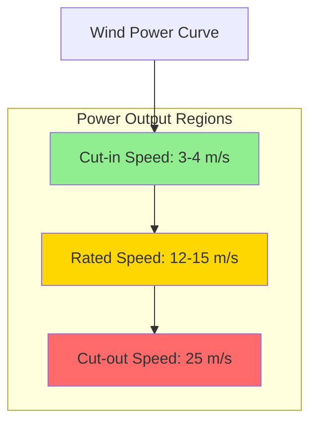

Wind power calculations quantify the energy available from wind resources and predict turbine performance for HVAC applications. Understanding these calculations enables accurate sizing of wind-assisted systems and realistic energy production estimates.

## Fundamental Wind Power Equation

The available power in wind is expressed as:

$$P = \frac{1}{2} \rho A V^3$$

Where:
- $P$ = Power (W)
- $\rho$ = Air density (kg/m³)
- $A$ = Swept area (m²)
- $V$ = Wind velocity (m/s)

This relationship demonstrates that power is proportional to the **cube** of wind velocity, meaning doubling wind speed increases available power by a factor of eight. This cubic relationship makes wind resource assessment highly sensitive to velocity measurements.

### Air Density Effects

Air density varies with altitude and temperature according to:

$$\rho = \frac{P_{atm}}{R \cdot T}$$

Where:
- $P_{atm}$ = Atmospheric pressure (Pa)
- $R$ = Specific gas constant for air (287 J/kg·K)
- $T$ = Absolute temperature (K)

| Altitude (m) | Air Density (kg/m³) | Power Multiplier |
|--------------|---------------------|------------------|
| 0 (sea level) | 1.225 | 1.00 |
| 500 | 1.167 | 0.95 |
| 1000 | 1.112 | 0.91 |
| 1500 | 1.058 | 0.86 |
| 2000 | 1.007 | 0.82 |
| 2500 | 0.957 | 0.78 |

Temperature effects are equally significant. At sea level, air density decreases approximately 0.4% per degree Celsius increase, directly reducing available power.

## Swept Area and Rotor Diameter

The swept area for a horizontal-axis wind turbine is:

$$A = \pi r^2 = \frac{\pi D^2}{4}$$

Where:
- $r$ = Rotor radius (m)
- $D$ = Rotor diameter (m)

| Rotor Diameter (m) | Swept Area (m²) | Power Ratio |
|--------------------|-----------------|-------------|
| 10 | 78.5 | 1.0 |
| 15 | 176.7 | 2.25 |
| 20 | 314.2 | 4.0 |
| 25 | 490.9 | 6.25 |
| 30 | 706.9 | 9.0 |

Doubling rotor diameter quadruples swept area and available power at constant wind speed.

## Betz Limit and Power Coefficient

Albert Betz proved in 1919 that no wind turbine can extract more than 59.3% of kinetic energy from wind. The Betz limit is:

$$C_{p,max} = \frac{16}{27} \approx 0.593$$

The extractable power becomes:

$$P_{turbine} = \frac{1}{2} C_p \rho A V^3$$

Where $C_p$ is the power coefficient (0 ≤ $C_p$ ≤ 0.593).

Modern commercial turbines achieve $C_p$ values of 0.35 to 0.45, representing 60-75% of the theoretical maximum. The power coefficient varies with tip-speed ratio (TSR):

$$TSR = \frac{\omega r}{V}$$

Where:
- $\omega$ = Angular velocity (rad/s)
- $r$ = Rotor radius (m)
- $V$ = Wind velocity (m/s)

## Capacity Factor Analysis

Capacity factor (CF) represents the ratio of actual energy production to theoretical maximum:

$$CF = \frac{E_{actual}}{P_{rated} \times 8760}$$

Where:
- $E_{actual}$ = Actual annual energy (kWh)
- $P_{rated}$ = Rated turbine power (kW)
- 8760 = Hours per year

| Wind Resource Class | Average Wind Speed (m/s) | Capacity Factor (%) | Annual Hours at Rated Power Equivalent |
|---------------------|--------------------------|---------------------|---------------------------------------|
| Class 1 (Poor) | < 5.6 | 10-20 | 876-1,752 |
| Class 2 (Marginal) | 5.6-6.4 | 20-25 | 1,752-2,190 |
| Class 3 (Fair) | 6.4-7.0 | 25-30 | 2,190-2,628 |
| Class 4 (Good) | 7.0-7.5 | 30-35 | 2,628-3,066 |
| Class 5 (Excellent) | 7.5-8.0 | 35-40 | 3,066-3,504 |
| Class 6 (Outstanding) | 8.0-8.8 | 40-45 | 3,504-3,942 |
| Class 7 (Superb) | > 8.8 | 45-50 | 3,942-4,380 |

Offshore installations typically achieve capacity factors of 40-50% due to higher, more consistent wind speeds. Onshore installations average 25-35%.

## Annual Energy Production

Annual energy production (AEP) calculation requires integrating turbine power output over the wind speed distribution:

$$AEP = 8760 \sum_{i=1}^{n} P(V_i) \cdot f(V_i)$$

Where:
- $P(V_i)$ = Power output at wind speed $V_i$
- $f(V_i)$ = Probability of wind speed $V_i$
- 8760 = Hours per year

For simplified estimates using capacity factor:

$$AEP = P_{rated} \times CF \times 8760$$

### Power Density

Power density expresses energy flux per unit area:

$$\frac{P}{A} = \frac{1}{2} \rho V^3$$

| Wind Speed (m/s) | Power Density (W/m²) | Classification |
|------------------|----------------------|----------------|
| 5.0 | 77 | Poor |
| 6.0 | 133 | Marginal |
| 7.0 | 211 | Fair |
| 8.0 | 315 | Good |
| 9.0 | 448 | Excellent |
| 10.0 | 613 | Outstanding |

Power density provides a quick metric for comparing wind resources across sites.

## Practical Considerations

**Turbine Selection**: Match rated power to average wind speeds. Oversized turbines operate below optimal efficiency; undersized turbines leave energy unharvested.

**Energy Storage**: Low capacity factors necessitate battery storage or grid connection for continuous HVAC operation. Size storage for 3-5 days of HVAC load at minimum wind production.

**Hybrid Systems**: Combining wind with photovoltaic systems improves overall capacity factor, as wind and solar resources often complement each other seasonally and diurnally.

**Performance Degradation**: Account for 1-2% annual degradation in capacity factor due to blade erosion, bearing wear, and control system drift.

The cubic relationship between wind speed and power makes accurate wind assessment critical. A 10% error in average wind speed translates to approximately 33% error in predicted energy production, directly impacting economic feasibility of wind-assisted HVAC systems.
