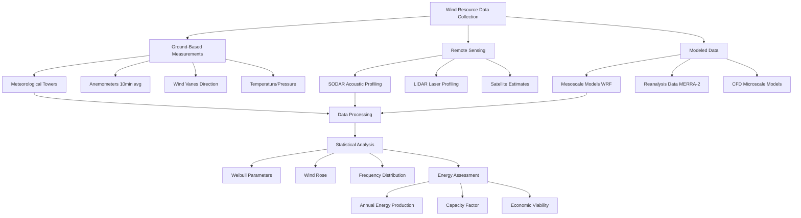

Wind resource data forms the foundation for evaluating wind energy potential at specific sites. Accurate meteorological measurements, regional wind atlases, and statistical analysis methods determine the viability and economic feasibility of wind-assisted HVAC systems and building-integrated wind turbines.

## Wind Resource Maps and Atlases

The National Renewable Energy Laboratory (NREL) maintains comprehensive wind resource maps for the United States at multiple hub heights (30m, 50m, 80m, 100m, 110m, 140m, and 200m). These maps classify wind resources based on annual average wind speed and power density, providing critical planning data for wind energy projects.

Wind atlases compile long-term meteorological data from:

- Ground-based meteorological towers with anemometers and wind vanes
- Remote sensing equipment (SODAR, LIDAR) measuring vertical wind profiles
- Airport weather stations providing historical climate data
- Satellite-derived wind speed estimates for offshore and remote locations
- Mesoscale atmospheric models predicting wind patterns at 1-10 km resolution

Regional wind resource databases integrate multiple data sources to create validated wind speed and direction frequency distributions. The European Wind Atlas, Australian Wind Atlas, and Global Wind Atlas provide international coverage for preliminary site screening.

## Wind Power Classification System

NREL employs a seven-class wind power density system to categorize wind resources. Wind power density (W/m²) represents the energy flux available in the wind stream and correlates directly with potential energy generation.

| Wind Power Class | Wind Power Density at 50m (W/m²) | Wind Speed at 50m (m/s) | Wind Speed at 50m (mph) | Resource Potential |
|------------------|----------------------------------|-------------------------|-------------------------|--------------------|
| Class 1 | 0-200 | <5.6 | <12.5 | Poor |
| Class 2 | 200-300 | 5.6-6.4 | 12.5-14.3 | Marginal |
| Class 3 | 300-400 | 6.4-7.0 | 14.3-15.7 | Fair |
| Class 4 | 400-500 | 7.0-7.5 | 15.7-16.8 | Good |
| Class 5 | 500-600 | 7.5-8.0 | 16.8-17.9 | Excellent |
| Class 6 | 600-800 | 8.0-8.8 | 17.9-19.7 | Outstanding |
| Class 7 | >800 | >8.8 | >19.7 | Superb |

Class 3 and higher (≥300 W/m² or ≥6.4 m/s annual average) generally indicates economically viable wind power potential for utility-scale projects. Building-integrated applications may utilize Class 2 resources when combined with other energy efficiency measures.

The relationship between wind speed and power density follows:

$$P_w = \frac{1}{2}\rho v^3$$

where $P_w$ is wind power density (W/m²), $\rho$ is air density (kg/m³), and $v$ is wind speed (m/s). The cubic relationship means small increases in wind speed yield substantial power gains.

## Weibull Distribution Analysis

Wind speed frequency distributions typically follow a Weibull probability distribution, characterized by two parameters that describe the statistical behavior of wind at a location.

The Weibull probability density function:

$$f(v) = \frac{k}{c}\left(\frac{v}{c}\right)^{k-1}\exp\left[-\left(\frac{v}{c}\right)^k\right]$$

**Parameters:**
- $k$ = shape parameter (dimensionless), typically 1.5-3.0
- $c$ = scale parameter (m/s), related to mean wind speed
- $v$ = wind speed (m/s)

The shape parameter $k$ indicates wind speed variability:
- $k$ < 2: highly variable wind regime
- $k$ = 2: Rayleigh distribution (common approximation)
- $k$ > 2: steady wind regime

The scale parameter $c$ relates to mean wind speed:

$$\bar{v} = c\Gamma\left(1 + \frac{1}{k}\right)$$

where $\Gamma$ is the gamma function.

Average power density from Weibull distribution:

$$\bar{P}_w = \frac{1}{2}\rho c^3\Gamma\left(1 + \frac{3}{k}\right)$$

These statistical parameters enable accurate energy production estimates from limited wind speed measurements.

## Meteorological Measurement Standards

Proper wind resource assessment requires adherence to measurement standards:

**Measurement Duration:**
- Minimum 1 year of continuous data to capture seasonal variations
- Ideally 2-3 years to reduce uncertainty from interannual variability
- 10-minute average wind speeds (standard reporting interval)
- Concurrent temperature, pressure, and humidity measurements

**Measurement Heights:**
- Multiple levels (typically 3-4 heights) to determine wind shear profile
- At or near proposed turbine hub height
- Reference height (10m) for standardized comparisons

**Data Quality Requirements:**
- <10% data loss acceptable
- Anemometer calibration certificates with ±0.1 m/s accuracy
- Wind vane accuracy ±3 degrees
- Sensor mounting to minimize flow distortion

## Site-Specific Assessment Methodology

Transforming regional wind atlas data to site-specific estimates requires:

1. **Terrain Analysis**: Topographic influences on wind flow including hills, valleys, and ridges that accelerate or decelerate wind speeds

2. **Surface Roughness Correction**: Adjustment for local land cover (urban, forest, grassland, water) affecting wind profiles

3. **Obstacle Evaluation**: Buildings, trees, and structures creating turbulence and wake effects

4. **Vertical Extrapolation**: Applying power law or logarithmic profiles to estimate wind speed at different heights

5. **Long-term Correlation**: Comparing short-term on-site measurements with long-term reference data to establish representative annual conditions

The measure-correlate-predict (MCP) method correlates site measurements with nearby long-term reference stations to estimate long-term site conditions from short-term data.

## Uncertainty Analysis

Wind resource assessment uncertainty affects financial projections:

- Interannual variability: ±5-10% from year-to-year climate differences
- Measurement uncertainty: ±3-5% from instrumentation and data processing
- Spatial extrapolation: ±5-15% when applying regional data to specific sites
- Model uncertainty: ±10-20% for mesoscale or CFD predictions without validation

Total uncertainty typically ranges from ±10% for well-instrumented sites to ±30% for preliminary desktop assessments using only atlas data.

## Data Sources and Resources

**Primary Data Sources:**
- NREL Wind Integration National Dataset (WIND) Toolkit
- NASA Modern-Era Retrospective analysis (MERRA-2)
- NOAA National Centers for Environmental Information
- DOE Atmospheric Radiation Measurement (ARM) facilities
- State-specific wind resource maps and databases

**Validation Requirements:**
- Cross-reference multiple data sources
- Ground-truth with site measurements when possible
- Account for elevation and local terrain effects
- Consider data vintage and methodology updates

High-quality wind resource data reduces project risk and enables accurate performance predictions for wind-assisted HVAC systems and building energy applications.
