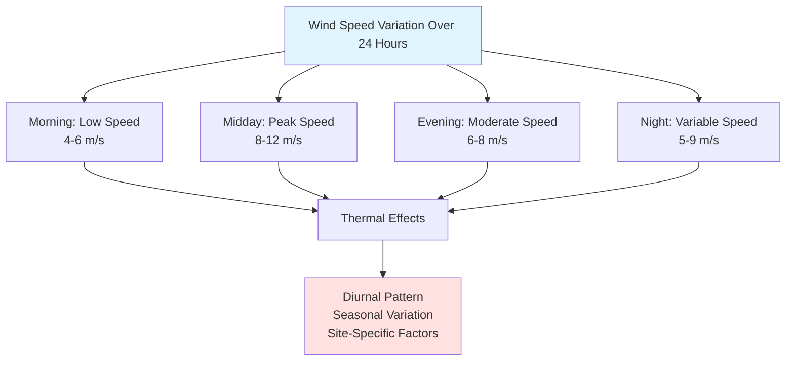

Wind speed characteristics form the foundation of wind resource assessment for renewable energy applications in HVAC systems. Understanding wind behavior at potential turbine sites enables accurate energy production forecasts and optimal system integration with building mechanical systems.

## Mean Wind Speed

Mean wind speed represents the arithmetic average of wind speeds measured over a specific time period, typically one year. This parameter serves as the primary indicator of wind energy potential at a given location.

**Annual mean wind speed** calculation:

$$\bar{V} = \frac{1}{n}\sum_{i=1}^{n}V_i$$

where $\bar{V}$ is the mean wind speed, $V_i$ represents individual measurements, and $n$ is the total number of observations.

The **power-weighted mean wind speed** provides a more accurate representation of energy production potential:

$$\bar{V}_p = \left(\frac{1}{n}\sum_{i=1}^{n}V_i^3\right)^{1/3}$$

This cubic relationship reflects the fact that wind power varies with the cube of wind speed, making higher wind speeds disproportionately valuable for energy generation.

## Wind Speed Distribution

Wind speed frequency distributions at most locations follow the **Weibull probability distribution**, which characterizes the statistical variation of wind speeds:

$$f(V) = \frac{k}{c}\left(\frac{V}{c}\right)^{k-1}\exp\left[-\left(\frac{V}{c}\right)^k\right]$$

where:
- $f(V)$ = probability density function
- $V$ = wind speed (m/s)
- $k$ = shape parameter (dimensionless), typically 1.5-3.0
- $c$ = scale parameter (m/s), approximately 1.13 times mean wind speed

The **cumulative distribution function**:

$$F(V) = 1 - \exp\left[-\left(\frac{V}{c}\right)^k\right]$$

This function determines the probability that wind speed will be less than or equal to a specific value, critical for calculating turbine capacity factors.

## Wind Speed Classes

The National Renewable Energy Laboratory (NREL) classifies wind resources based on wind power density and mean wind speed at standard heights. These classifications guide turbine selection and site feasibility assessment.

| Wind Power Class | Wind Power Density (W/m²) @ 50m | Mean Wind Speed (m/s) @ 50m | Resource Potential |
|------------------|----------------------------------|------------------------------|-------------------|
| Class 1 | 0-200 | 0-5.6 | Poor |
| Class 2 | 200-300 | 5.6-6.4 | Marginal |
| Class 3 | 300-400 | 6.4-7.0 | Fair |
| Class 4 | 400-500 | 7.0-7.5 | Good |
| Class 5 | 500-600 | 7.5-8.0 | Excellent |
| Class 6 | 600-800 | 8.0-8.8 | Outstanding |
| Class 7 | >800 | >8.8 | Superb |

**Note**: Wind power density provides a more accurate assessment than wind speed alone because it accounts for air density variations with temperature and elevation.

## Turbulence Intensity

Turbulence intensity (TI) quantifies the variability of wind speed around the mean value and significantly affects turbine performance, mechanical loading, and longevity:

$$TI = \frac{\sigma_V}{\bar{V}}$$

where $\sigma_V$ is the standard deviation of wind speed and $\bar{V}$ is the mean wind speed.

**Turbulence Classification**:

| Category | Turbulence Intensity | Typical Locations | Impact on Turbines |
|----------|---------------------|-------------------|-------------------|
| Low | <0.10 | Offshore, flat terrain | Minimal fatigue loading |
| Medium | 0.10-0.15 | Rural areas, gentle slopes | Moderate loading |
| High | 0.15-0.20 | Urban areas, complex terrain | Significant fatigue |
| Very High | >0.20 | Dense urban, mountainous | Severe loading, reduced life |

High turbulence intensity reduces energy capture efficiency by 5-20% and accelerates mechanical wear. Sites with TI > 0.18 require turbines specifically designed for high-turbulence environments.

## Wind Shear and Vertical Profile

Wind speed increases with height above ground due to reduced surface friction. The **power law** provides a practical approximation:

$$\frac{V_2}{V_1} = \left(\frac{z_2}{z_1}\right)^\alpha$$

where:
- $V_1$, $V_2$ = wind speeds at heights $z_1$, $z_2$
- $\alpha$ = power law exponent (typically 0.14-0.25)

**Typical Power Law Exponents**:

| Terrain Type | Surface Roughness (m) | Power Law Exponent (α) |
|--------------|----------------------|------------------------|
| Water surface | 0.0001-0.001 | 0.10-0.12 |
| Open grassland | 0.01-0.05 | 0.14-0.16 |
| Agricultural land | 0.05-0.10 | 0.16-0.18 |
| Suburban areas | 0.20-0.40 | 0.20-0.25 |
| Urban centers | 0.40-1.00 | 0.25-0.40 |

The **logarithmic wind profile** provides a more theoretically rigorous approach for neutral atmospheric conditions:

$$V(z) = \frac{u_*}{\kappa}\ln\left(\frac{z-d}{z_0}\right)$$

where:
- $u_*$ = friction velocity (m/s)
- $\kappa$ = von Kármán constant (0.40)
- $d$ = zero-plane displacement height (m)
- $z_0$ = surface roughness length (m)

## Application to HVAC Systems

For wind-assisted HVAC applications:

1. **Turbine Hub Height Selection**: Optimize based on local wind shear characteristics to maximize energy capture while minimizing structural costs
2. **Energy Storage Integration**: Account for wind speed variability and turbulence in battery sizing and control algorithms
3. **Grid-Interactive Systems**: Use wind speed forecasting to coordinate renewable generation with building loads
4. **Hybrid System Design**: Combine wind data with solar resource assessment for complementary renewable energy systems

Wind resource assessment using NREL databases, combined with on-site measurements at proposed turbine heights, enables accurate prediction of annual energy production and economic feasibility for building-integrated renewable energy systems.

## Components

- Wind Speed Height Relationship
- Power Law Exponent 1 7 Typical
- Logarithmic Wind Profile
- Surface Roughness Length
- Wind Shear Vertical Gradient
- Turbulence Intensity
- Wind Direction Frequency Rose
