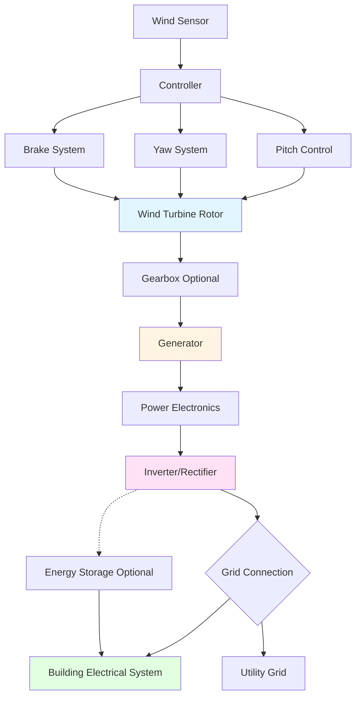

Wind turbine systems convert kinetic energy from moving air into electrical power for HVAC applications, offering building-integrated renewable energy solutions. Understanding turbine configurations, sizing methodology, and integration requirements enables effective wind energy utilization.

## Wind Turbine Power Fundamentals

Wind turbine power extraction follows fundamental fluid mechanics principles. The theoretical maximum power available in the wind stream passing through a turbine rotor area is:

$$P_{\text{wind}} = \frac{1}{2} \rho A V^3$$

where:
- $\rho$ = air density (typically 1.225 kg/m³ at sea level)
- $A$ = swept area of rotor (m²)
- $V$ = wind velocity (m/s)

Actual turbine power output incorporates the power coefficient $C_p$, representing extraction efficiency:

$$P_{\text{turbine}} = \frac{1}{2} \rho A V^3 C_p \eta_{\text{system}}$$

The Betz limit establishes the theoretical maximum power coefficient at $C_p = 0.593$ (59.3% efficiency). Real turbines achieve $C_p$ values of 0.35-0.50 depending on design and operating conditions.

## Horizontal Axis Wind Turbines (HAWT)

HAWT configurations dominate both utility-scale and small wind applications due to superior efficiency and performance characteristics. The rotor axis aligns parallel to wind direction, with blades rotating in a vertical plane perpendicular to wind flow.

### HAWT Design Characteristics

**Upwind Configuration:** Rotor positioned ahead of tower, requiring active yaw control to maintain wind alignment. Eliminates tower shadow effects on blades, maximizing power production and reducing fatigue loading.

**Downwind Configuration:** Rotor positioned behind tower, allowing passive yaw alignment through aerodynamic forces. Tower interference creates periodic blade loading, increasing mechanical stress and noise generation.

### Rotor Swept Area Calculation

For three-bladed HAWT designs, the swept area relationship determines power capacity:

$$A = \pi R^2 = \pi \left(\frac{D}{2}\right)^2$$

where $R$ is blade radius and $D$ is rotor diameter. A 10 m diameter turbine provides swept area:

$$A = \pi (5)^2 = 78.5 \text{ m}^2$$

## Vertical Axis Wind Turbines (VAWT)

VAWT configurations orient the rotor axis perpendicular to wind direction, offering advantages for building integration despite lower overall efficiency. Two primary VAWT architectures exist:

**Darrieus Turbines:** Utilize aerodynamic lift forces on curved airfoil blades. Higher efficiency than drag-based designs but require external starting mechanism. Eggbeater or H-rotor configurations common.

**Savonius Turbines:** Employ drag forces on semicircular cups or buckets. Self-starting capability and omnidirectional operation compensate for lower power coefficients (typically $C_p$ = 0.15-0.20).

### VAWT Advantages for Buildings

- Omnidirectional operation eliminates yaw control requirements
- Lower noise and vibration transmission to structure
- Generator placement at ground level simplifies maintenance access
- Reduced visual impact and regulatory constraints
- Performance less sensitive to turbulent urban wind conditions

## Turbine Type Comparison

| Parameter | HAWT | Darrieus VAWT | Savonius VAWT |
|-----------|------|---------------|---------------|
| **Power Coefficient** | 0.35-0.50 | 0.25-0.35 | 0.15-0.20 |
| **Starting Wind Speed** | 3-4 m/s | 4-5 m/s (external start) | 2-3 m/s |
| **Rated Wind Speed** | 12-14 m/s | 10-12 m/s | 8-10 m/s |
| **Noise Level** | Moderate-High | Moderate | Low |
| **Turbulence Tolerance** | Low | Moderate | High |
| **Yaw Control** | Required | Not required | Not required |
| **Structural Loading** | Unidirectional | Cyclic | Cyclic |
| **Efficiency** | Highest | Medium | Lowest |

## Small Wind Systems for Buildings

Small wind turbines (rated < 100 kW) integrate with building electrical and HVAC systems to offset energy consumption. Rooftop and building-mounted installations require careful structural and aerodynamic analysis.

### Building Integration Considerations

**Wind Flow Modification:** Buildings create complex flow patterns including acceleration zones, separation regions, and turbulent wakes. Rooftop edges and corners exhibit local velocity increases of 1.5-2.5× freestream values.

**Structural Loading:** Dynamic turbine loads combine with wind loads on building structure. Foundation design must accommodate:

$$F_{\text{thrust}} = \frac{1}{2} \rho A V^2 C_T$$

where $C_T$ is the thrust coefficient (typically 0.7-0.9 at rated power).

**Vibration Isolation:** Turbine-induced vibration requires isolation systems preventing transmission to occupied spaces. Natural frequencies must avoid resonance with building structural modes.

### Power Production Estimation

Annual energy production for small wind systems follows:

$$E_{\text{annual}} = 8760 \times P_{\text{rated}} \times CF$$

where $CF$ is the capacity factor (typical values 0.10-0.25 for building installations). A 10 kW turbine with CF = 0.20 produces:

$$E_{\text{annual}} = 8760 \times 10 \times 0.20 = 17,520 \text{ kWh/year}$$

## Grid Integration and System Components

### Electrical System Integration

**Grid-Connected Operation:** Synchronous or asynchronous generators with power conditioning enable utility grid connection. Grid-tie inverters match voltage, frequency, and phase requirements while providing anti-islanding protection.

**Battery Storage Integration:** Energy storage buffers intermittent wind production, improving load matching and enabling limited grid-independent operation. Battery sizing depends on desired autonomy period and load profile.

**Power Quality Considerations:** Variable-speed operation with power electronics provides superior power quality compared to fixed-speed induction generators. Harmonic filtering and power factor correction may be required.

## Wind Turbine Sizing Methodology

Proper turbine selection balances energy production with site constraints and economic factors. The sizing process involves:

1. **Wind Resource Assessment:** Characterize site wind speeds using anemometer data or wind atlases. Calculate mean wind speed and Weibull distribution parameters.

2. **Energy Demand Analysis:** Quantify building HVAC and electrical loads on hourly or sub-hourly basis. Identify critical loads requiring high reliability.

3. **Turbine Selection:** Match turbine power curve to site wind distribution. Optimize rated power and cut-in speed for local conditions.

4. **Production Estimation:** Calculate expected annual energy production using turbine power curve and site wind distribution:

$$E = \sum_{i=1}^{n} P(V_i) \times f(V_i) \times 8760$$

where $P(V_i)$ is turbine power output at wind speed $V_i$ and $f(V_i)$ is the frequency of occurrence.

## Performance Characteristics

| Operating Parameter | Typical Values | Notes |
|---------------------|----------------|-------|
| **Cut-in Wind Speed** | 3-4 m/s | Minimum speed for power production |
| **Rated Wind Speed** | 12-17 m/s | Speed at rated power output |
| **Cut-out Wind Speed** | 25 m/s | Safety shutdown threshold |
| **Survival Wind Speed** | 50-60 m/s | Maximum design wind speed |
| **Capacity Factor (Building)** | 10-25% | Actual production vs. rated capacity |
| **Capacity Factor (Utility)** | 25-45% | Open terrain installations |
| **Capacity Factor (Offshore)** | 35-50% | Higher sustained wind speeds |

## Turbine Control Strategies

Modern wind turbines employ sophisticated control systems optimizing power extraction while protecting mechanical components:

**Power Limiting Above Rated Speed:** Pitch control (blade angle adjustment) or stall control (passive aerodynamic stall) prevents generator overload at high wind speeds.

**Maximum Power Point Tracking:** Variable-speed turbines adjust rotational speed to maintain optimal tip-speed ratio across varying wind conditions:

$$\lambda = \frac{\omega R}{V}$$

where $\lambda$ is tip-speed ratio, $\omega$ is rotational speed (rad/s), $R$ is blade radius, and $V$ is wind speed. Optimal $\lambda$ ranges from 6-8 for most three-bladed HAWTs.

**Safety Systems:** Multiple protection layers including emergency braking, over-speed detection, vibration monitoring, and extreme weather shutdown ensure reliable long-term operation.

Wind turbine integration with building HVAC systems provides renewable energy generation reducing grid electricity consumption and operating costs. Proper system design accounting for site-specific conditions, turbine characteristics, and electrical integration requirements maximizes performance and return on investment.
